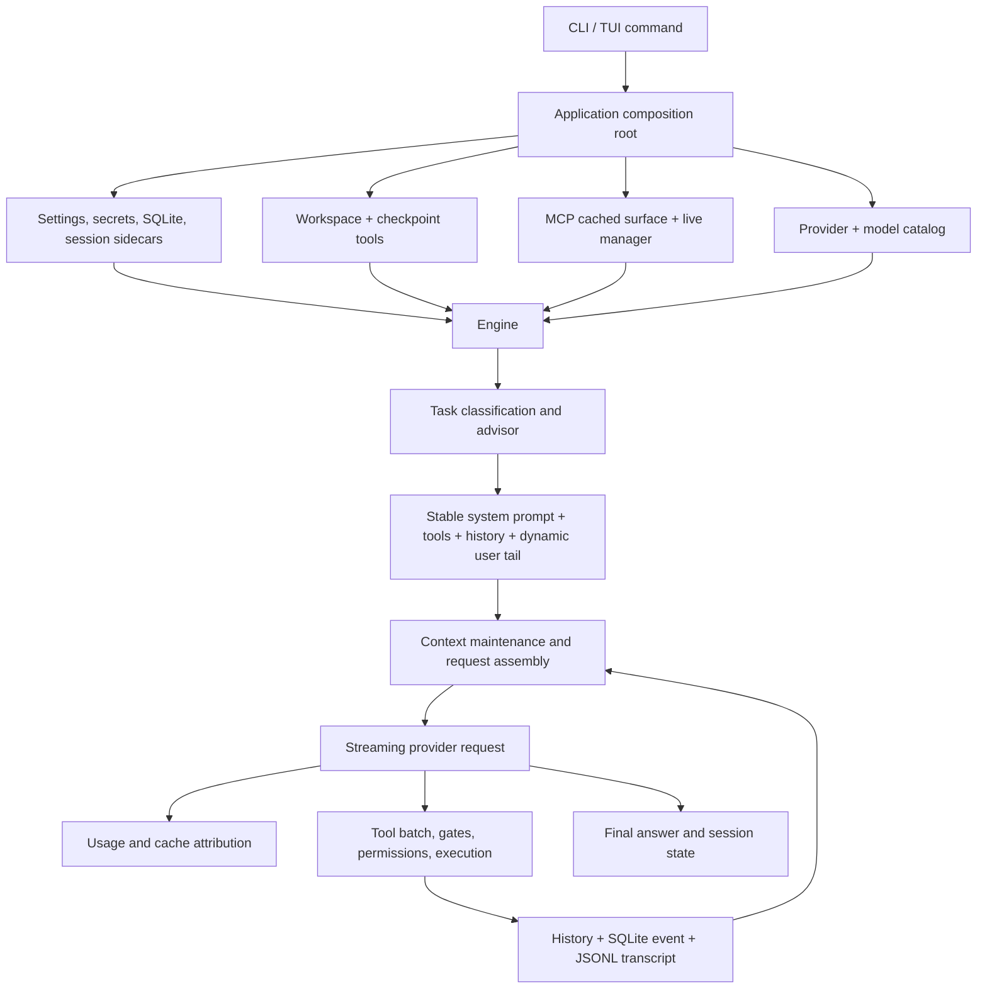
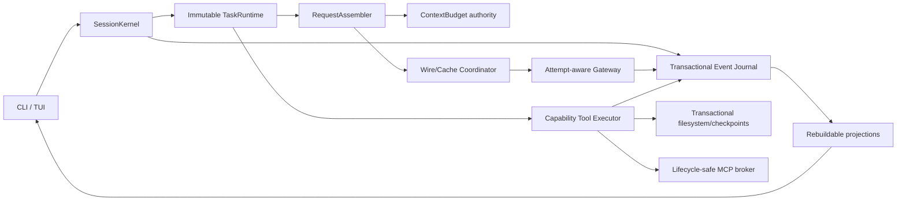

# MuhiyaCode full agent-system audit and overhaul plan

**Audit baseline:** `origin/main` at `52591f5` (merged implementation content from `42cbe2c`)  
**Audit date:** 2026-07-21  
**Scope:** CLI/TUI composition, orchestration, prompts, request assembly, context management, prompt caching, provider streaming, usage accounting, persistence, workspace tools, MCP, memory/skills, safety, testing, packaging, installation, and release.

## Implementation checkpoint — 2026-07-22

The current working tree executes the release-critical overhaul slice described by this audit. It fixes the installer identity and repository hygiene; session-wide preflight model selection; unified context/output/tool budgeting; rewrite-versioned provider measurements; bounded replacement compaction; retry-safe prefix persistence; streamed-attempt reset; affinity rejection classification; successful-response telemetry isolation; patch/checkpoint mode and binary preservation; strict patch parsing and rollback reporting; complete-search diagnostics; credential-file enforcement; live output caps; MCP surface/account fingerprints and connect-swap-close refresh; prompt contradictions; dead production support code; reproducible local checks; CI static/vulnerability analysis; and the vulnerable Go toolchain floor.

The prompt change is one deliberate cache epoch, with all instruction and exact-wire goldens updated together. Local sign-off passes the unified preflight, full Go suite, vet, build, staticcheck, dead-code budget, `govulncheck`, npm syntax/audit, and diff hygiene under Go 1.26.5.

The long-horizon architectural items remain a separate migration rather than being disguised as a safe one-pass refactor: replacing SQLite plus JSON/JSONL sidecars with one transactional journal/projection system; an OS-enforced cross-platform sandbox; a provider-native route-ID/cache-TTL contract; transactional multi-file filesystem manifests with symlink-race protection; and paid live-provider/cache, real OAuth/MCP, crash/power-loss, race, and multi-OS release-candidate gauntlets. Those require migration compatibility or external infrastructure and remain explicitly tracked in Phases 2, 3, 5, 6, and 7 below.

## 1. Executive verdict

The system is buildable and its normal-path test quality is stronger than the defect count alone suggests. The full Go suite, `go vet`, and `staticcheck` pass; the npm production dependency audit reports no known vulnerability; CI exercises Linux race tests and normal tests/builds on Linux, Windows, and macOS. The implementation also has several valuable foundations worth preserving: deterministic tool ordering, explicit cache-usage nullability, append-only usage/invalidation logs, atomic JSON replacement, cached MCP schemas, history rewrite versions, pressure-driven maintenance, provider-aware reasoning replay, bounded tool results, and a large fault/acceptance test suite.

It is not yet safe to describe the agent as fully reliable. The audit found release-blocking correctness defects in five clusters:

1. **Durability is not atomic.** Important in-memory state is mutated before persistence, several persistence errors are discarded, and the same logical message is written to SQLite, JSONL, and history as separate commits. A disk or process failure can produce mutually inconsistent session truth.
2. **Context arithmetic is internally inconsistent.** Request assembly always reserves 12,000 output tokens while the gateway can request 16,000 to 384,000. Model-switch fit arithmetic then adds an output budget and subtracts the fixed reserve again. Context pressure can therefore be understated, overstated, or rejected using different formulas.
3. **Streaming retries are not presentation-safe.** A mid-stream retry discards the partial response internally, but tokens have already been sent to the UI callbacks. The retried answer can be displayed twice.
4. **Cache-affinity state is only partially trustworthy.** Compaction uses the main route while recording auxiliary affinity, warm-cache state has no lease/TTL, prefix sidecar writes can fail permanently and silently, and several cache metrics mix cache-eligible streams with intentionally cold one-shot calls.
5. **Tool and integration safety has correctness gaps.** Patch operations lose file modes, rollback failures are hidden, recursive searches silently truncate or skip errors, workspace `.env` files are not technically blocked despite the prompt rule, live shell output bypasses its storage cap, MCP cached-surface detection is broken, and full MCP refresh leaks prior connections.

The recommended overhaul is therefore not a prompt rewrite. It is a staged redesign around one transactional session journal, one context-budget authority, immutable task snapshots, an exact wire-prefix ledger, attempt-aware streaming, and capability-enforced tools. Prompt changes should happen only after those foundations are in place and should deliberately increment a cache epoch.

## 2. Method and evidence

The audit used the merged `origin/main` tree as the reference even while the local branch moved during inspection. It covered 690 tracked paths, including 144 non-test Go files and 173 Go test files under `internal/`. The main execution path and every mutable state boundary were traced from command startup to final persistence.

Executed gates:

| Gate | Result |
|---|---|
| `go test ./... -count=1` | Pass |
| `go vet ./...` | Pass |
| `staticcheck ./...` | Pass |
| `npm audit --omit=dev --json` | Pass, 0 reported vulnerabilities |
| Local `go test -race ./internal/...` | Not runnable on this Windows host because CGO/C compiler is unavailable |
| Repository coverage profile | Reports 68.3% statement coverage, but is a tracked generated artifact and is not a trustworthy current gate |

The audit is static plus local test execution. It did not make paid live-provider calls, exercise real OAuth/MCP servers, simulate disk-full/power-loss at the filesystem layer, or independently verify a release installation from GitHub. Those are explicit sign-off gates in the plan rather than assumed successes.

## 3. Current architecture and execution flow



The intended prompt-cache topology is sound in principle: a session-stable system prompt and sorted tool definitions precede append-only settled history, while the task brief, current date, and project-memory updates ride the newest user tail. The implementation problem is not the basic topology; it is that exact wire identity, context capacity, persistence, routing affinity, and cache reporting are owned by different components with different assumptions.

## 4. Findings

Severity meanings: **P0** can corrupt state, expose data, or make a normal supported workflow fail; **P1** materially harms reliability/correctness/cost; **P2** causes degraded behavior, misleading reporting, or significant maintainability risk; **P3** is cleanup or hardening.

### 4.1 Persistence, recovery, and state ownership

| ID | Sev. | Finding and evidence | Required correction |
|---|---:|---|---|
| PER-01 | P0 | A logical message is committed separately to SQLite and `transcript.jsonl` in `internal/orchestrator/turnhelpers.go:93-104`; history is appended only afterward. Failure of the second or third step leaves incompatible sources of truth. | Make one transactional event journal canonical. Build transcript, history, usage, and UI views as versioned projections that can be rebuilt idempotently. |
| PER-02 | P0 | History, inspection, and knowledge mutate memory and discard save failures (`history.go:655`, `inspection.go:292`, `knowledge.go:282`). The process can continue using state that cannot survive resume. | Mutation APIs must return persistence status. On failure, rollback the mutation or mark the session read-only/degraded, retry with backoff, and visibly block claims of durable completion. |
| PER-03 | P0 | Maintenance and compaction rewrite history before recording the corresponding invalidation (`maintenance.go:16-33`, `155-177`, `turnloop.go:343-355`). A ledger write failure leaves a changed prefix with no authorized cause and can make the next prefix guard fail. | Use a write-ahead mutation transaction: prepare event and prior snapshot, persist new state, commit event, then publish in memory; recover or roll back incomplete transactions on startup. |
| PER-04 | P1 | `persistPrefixShapeOnce` sets `prefixShapeSaved=true` before an ignored write (`cacheresilience.go:191-202`). A transient failure suppresses every retry and makes resume attribution stale. | Set the flag only after durable success; store last error, retry at safe boundaries, and expose sidecar health. |
| PER-05 | P1 | Resume-drift invalidation errors are ignored (`cacheresilience.go:108`, `:115`), and model drift is only added when no other dimension changed. Multi-cause cold starts are under-reported. | Collect every changed dimension, append one complete event, propagate errors, and retain a pending event until committed. |
| PER-06 | P1 | Project-context cursor writes are ignored and the in-memory cursor advances anyway (`turnhelpers.go:164-177`; startup write in `runtime_build.go:486` is also ignored). A resume can re-inject updates or restore stale context. | Persist through the same journal/sidecar coordinator and advance the cursor only after commit. |
| PER-07 | P1 | Final-answer persistence deliberately degrades to a warning. That preserves UX, but the successful answer may be visible and absent from future history while an earlier SQLite write already exists. | Return the answer, but retain an unsynced event in a local recovery queue and show a persistent “session not fully saved” state until replay succeeds. |
| PER-08 | P2 | Corrupt history/inspection/knowledge files are renamed and replaced with defaults without a durable user-visible recovery event. Resume may look successful after losing context. | Record recovery events in the canonical journal, report which projection was rebuilt/reset, and provide a repair/export command. |
| PER-09 | P2 | JSONL readers cap one record at 2 MiB. An unusually large user message or future richer record can make resume fail even though writes allow it. | Define and enforce record-size limits before writing, chunk large payloads, and include versioned framing/checksums. |
| PER-10 | P2 | Checkpoint metadata and checkpoint JSON are separate commits. Failure after the file write leaves an orphan; failure/restoration mid-sequence is non-transactional. | Journal checkpoint manifests, write a pre-restore checkpoint, restore through staged files, and atomically commit the whole set where the OS permits. |

### 4.2 Context windows, compaction, and prompt caching

| ID | Sev. | Finding and evidence | Required correction |
|---|---:|---|---|
| CTX-01 | P0 | Request assembly always reserves 12,000 tokens (`engine.go:15`, `turnloop.go:366`) while the actual request uses the model output budget (`turnloop.go:385`), which can be 16k–384k (`gateway/model.go`). On shared context windows, an assembled request can exceed the model limit. | Introduce a single `ContextBudget` value derived from resolved model, provider semantics, configured cap, tool overhead, safety margin, and the exact requested output. Both assembly and gateway must consume it. |
| CTX-02 | P1 | Model-fit calculation adds `profile.OutputBudget(0)` and then compares against `limit-outputReserveTokens` (`switchcost.go:132-133`), double-reserving output with a different value than the live request. | Replace all independent arithmetic with `ContextBudget.CanFit(input, growthAllowance)` and property-test boundary cases. |
| CTX-03 | P1 | Token calibration divides provider prompt tokens by system+history characters but omits serialized tool definitions and protocol framing (`turnloop.go:488-490`). Large MCP schemas inflate the ratio and trigger premature maintenance. | Calibrate exact wire components separately: system, tool JSON, messages, and provider framing. Prefer a model tokenizer; use provider usage only to reconcile the complete encoded request. |
| CTX-04 | P1 | `latestPromptTokens` remains authoritative after a history rewrite. Pressure, model-fit, and reports can use a stale pre-compaction measurement until another successful request. | Tag every measurement with history rewrite version, model, toolset epoch, and wire epoch; invalidate it immediately on any mismatch. |
| CTX-05 | P1 | Request assembly always keeps the newest unit even if it alone exceeds the available budget. The code can knowingly return an over-limit request instead of a typed error. | Detect oversized user/tool units, truncate only with an explicit reversible policy, or fail with a targeted remediation before calling the provider. |
| CTX-06 | P1 | `History.CompactTo` appends every new digest to every prior digest (`history.go:462-487`). Long-running sessions grow summaries monotonically until compaction stops reclaiming useful space. | Use bounded hierarchical checkpoints: immutable detailed archive, bounded current-state summary, explicit superseded-fact removal, and summary version/hash. |
| CTX-07 | P1 | Compaction sends the active model on `sessionID:main` with the main upstream pin but records it as auxiliary `:aux` (`maintenance.go:60-83`). An upstream flip is not adopted by `recordMainUsage`, so the next main turn can pin the stale route and the usage label lies. | Give requests separate `Purpose` and `AffinityRoute`. Any call on the main affinity route must update route state; accounting can still label its purpose `compaction`. |
| CTX-08 | P1 | Warm-model state is `(model, rewriteVersion)` only. It has no provider/upstream, timestamp, TTL, or uncertainty, so a model may be called “warm” after the provider cache has expired. | Store a bounded cache lease `(model, route, wireEpoch, rewriteVersion, observedAt, providerTTL)` and treat expired/unknown entries as uncertain, never warm. |
| CTX-09 | P1 | Pin-rejection fallback triggers on any non-retryable status for a pinned request (`gateway/provider.go:115-131`), including bad credentials, unknown models, and unrelated schema errors. It retries a doomed request and permanently disables affinity. | Disable the pin only for a recognized provider-field error code/message (normally 400/422), or negotiate affinity capability once and cache that result by gateway fingerprint. |
| CTX-10 | P1 | The first route-discovering request omits `provider`; later requests add it. This request-level shape change is not represented in `PrefixShape`, even though some providers may include routing/config fields in cache identity. | Prefer the already-stable session routing header or a gateway-side sticky route. If a request field can affect cache identity, include its canonical bytes in the wire epoch/hash. |
| CTX-11 | P1 | Cross-resume prefix shape persists only system, tools, model, and upstream. It omits replay/serializer/profile version, normalized history hash/count, gateway capability epoch, and request parameters that may affect cache identity. | Persist a versioned `WirePrefixDescriptor` with canonical serializer version, message-prefix root hash, toolset epoch, model/route, and cache-relevant parameters. |
| CTX-12 | P2 | System prompt and tool definitions are deterministically recomputed and re-marshaled each task; prefix guard re-hashes the full history each request. Local work therefore trends toward O(n²) over a long conversation and future nondeterminism can enter unnoticed. | Render and store exact immutable prefix bytes once per epoch. Cache encoded messages and maintain an incremental/Merkle prefix digest. Assert byte identity before send. |
| CTX-13 | P2 | The earliest supposedly reusable prefix contains workspace path, shell, model display name/addendum, skills, and project context. It is stable within a session but prevents useful cross-session cache reuse. | Use a two-tier topology: global product/rules/tool prefix, then a session boot block, then append-only conversation. Confirm provider cache matching rules before changing order. |
| CTX-14 | P2 | `PerPairingRates` drops the first cache-reporting request for every `(model,pin)`, including isolated advisor/onboarding/compaction streams whose prompts are not append-only. Their “steady-state” rate has no coherent meaning. | Label every request with cache policy: append-only eligible, deliberate cold one-shot, or unknown. Calculate steady-state only for eligible chains; show all-stream billing separately. |
| CTX-15 | P2 | Missing usage is logged as “recorded as estimated” (`gateway/provider.go:340-349`) even when the client does not construct an estimate. This conflicts with the otherwise careful nullable accounting model. | Log “usage unavailable” unless an explicit estimator produced a value, and persist the estimator name/version/confidence when it does. |
| CTX-16 | P1 | A raw-usage observer failure after a successful stream turns the entire provider call into an error (`gateway/provider.go:340-356`). The user may have seen all tokens, then receive a task failure because benchmark telemetry could not write. | Make telemetry best-effort or spool it durably outside the request result. Never let an observer invalidate a completed model response. |
| CTX-17 | P2 | The degraded prefix-guard log is process-global by reason, not session-local (`maintenance.go:224+`), and it clears the last shape. Later affected sessions can degrade silently. | Track guard health per session, persist a diagnostic event, and require the next successful exact comparison to clear it. |
| CTX-18 | P2 | Window dropping can remove old units without first producing a compact durable summary. The invalidation is recorded, but semantic continuity can still be lost. | Make un-summarized drop an emergency-only typed event. Compact before dropping and retain a durable archive pointer in the active summary. |
| CTX-19 | P2 | There is no required live cache-signoff test on release. Static byte-determinism tests cannot prove provider TTL, cache namespace, routing, or usage-field interpretation. | Add a paid, opt-in nightly/release-candidate cache gauntlet with repeated identical prefixes, route-flip injection, resume, model switch, compaction, and provider ledger reconciliation. |

### 4.3 Gateway streaming and accounting

| ID | Sev. | Finding and evidence | Required correction |
|---|---:|---|---|
| GW-01 | P0 | Stream chunks immediately invoke UI callbacks (`gateway/sse.go:144-158`). A later transport error triggers a full request retry (`provider.go:142-160`) whose answer starts again, so the user receives duplicated partial text even though internal accumulation was discarded. | Introduce attempt IDs and a `Begin/Append/Commit/ResetAttempt` sink. Buffer until commit or let the TUI replace the active assistant frame on retry. Add a regression test over the real callback path. |
| GW-02 | P1 | Retry policy exists in both provider and orchestrator layers. Combined attempts and backoff are not represented by one budget and can amplify latency and requests. | Centralize an explicit retry budget by failure class, idempotency, stream state, elapsed time, and user cancellation. Emit one structured recovery event per attempt. |
| GW-03 | P1 | Cache/upstream identity is inferred from a free-form provider string and heuristic candidate generation. If the provider omits the field, affinity acceptance and route changes are unknowable. | Extend the gateway contract to return a stable route ID, affinity-accepted flag, cache namespace/TTL where available, and structured error codes. |
| GW-04 | P2 | SSE scanner frames are capped at 2 MiB. A large reasoning detail or tool-call argument can fail mid-stream without a protocol-specific diagnostic. | Use a streaming SSE decoder with an explicit, documented event limit and a typed oversized-frame error; enforce smaller tool arguments before generation where possible. |
| GW-05 | P2 | Completion, cache, and cost fields come from multiple provider dialects, but the persisted record has no parser/profile version. A future parser change makes historical comparisons ambiguous. | Persist gateway/provider dialect and parser version with each usage record and provide migration-free version-aware aggregation. |

### 4.4 Orchestration, prompts, and workflow logic

| ID | Sev. | Finding and evidence | Required correction |
|---|---:|---|---|
| ORC-01 | P1 | `Engine` owns provider routing, persistence, usage aggregation, cache state, context maintenance, project memory, checklist state, duplicate prevention, effort, review, retries, and UI callbacks behind several mutexes. This is a high-risk implicit state machine. | Split into `SessionKernel`, `TaskRuntime`, `RequestAssembler`, `CacheCoordinator`, `Journal`, `ToolExecutor`, and `TaskGovernor` with explicit events and invariants. |
| ORC-02 | P1 | Mutable `*contract.Settings` is shared across application, provider, TUI, and engine. Only selected fields use dedicated locks; assumptions about “boundary-only” mutation are not encoded in the type system. | Use immutable versioned settings snapshots and typed update events. A task captures one snapshot or explicitly subscribes to a documented live subset. |
| ORC-03 | P1 | Effort is partially live: reasoning and turn limits read the current value, while maintenance and auto-review use the task-start profile and final stats can report the initial level. | Choose one semantic. Recommended: immutable per-task effort snapshot; changes apply to the next task and UI says so. |
| ORC-04 | P1 | The failure breaker appends a “report blocker” instruction and immediately finalizes without another model turn. The instruction is never consumed, and a partial tool-call response may become the final answer. | Force a bounded no-tools synthesis turn or generate a deterministic blocker report from structured failed outcomes. |
| ORC-05 | P1 | Static prompt says questions/conversation require no tools and checklists are for 3+ steps, but every class—including chat—gets `tools~3` and `keep tasks.md current` (`classify.go:196`). | Generate class-specific briefs. Chat must omit tool/checklist directives; only multi-step actionable classes should receive checklist requirements. |
| ORC-06 | P2 | The prompt says every past read/search is “current truth” and commands never to reread it. External file changes are possible, and the ledger’s fingerprint invalidation does not make that categorical prompt true. | Say “reuse while its fingerprint remains current”; let tools return a structured stale signal and allow a targeted reread. |
| ORC-07 | P2 | PowerShell guidance states `&&` and `||` do not work for both `pwsh` and Windows PowerShell (`instructions/prompt.go:147-159`). They work in PowerShell 7. | Render distinct guidance for `pwsh` and legacy `powershell.exe`; cover both in tests. |
| ORC-08 | P2 | “Never add a runtime, dependency, config, or scratch harness in order to test” is over-broad and can conflict with an explicit user request or a legitimate missing test dependency. | Limit the prohibition to unapproved, ad-hoc verification artifacts and preserve explicit user/project requirements. |
| ORC-09 | P2 | Classifier logic/comments still escalate explicit “subagent” requests and describe delegation after the unified session removed that capability. Legacy `UsageStreamSubagent`, comments, settings, and historical behavior remain interleaved with active logic. | Remove active stale logic, isolate backward-compatible data fields in a `legacy` layer, and add a migration/removal ledger. |
| ORC-10 | P2 | The root `tasks.md` is loaded as checklist state even when it is an unrelated project file. Completion disclosure can report another workflow’s open items. | Use an explicit checklist state/tool or a session marker and selected path. Never infer ownership from a generic filename alone. |
| ORC-11 | P2 | “Checks run” is inferred from shell command regexes. A successful command containing words such as `test` can overstate relevant verification. Diff counts are similarly heuristic. | Record structured verification actions with target, exit status, affected revision/hash, and evidence. Derive stats from those events. |
| ORC-12 | P2 | The task advisor adds a model call/cost to broad task boundaries and depends on a catalog that can be stale for 24 hours. Catalog reconciliation errors can be ignored and a removed model may fail later. | Deterministically bypass the advisor for trivial continuations; refresh/revalidate catalog at safe boundaries; surface failed substitutions; cache advisor decisions only by stable task features. |
| ORC-13 | P2 | Done criteria are extracted from assistant text and checklist updates rely on model-authored files. Both are easy to omit or misclassify. | Represent task state in a typed harness object; render a human-readable checklist projection only when useful. |
| ORC-14 | P3 | Comments and metrics still refer to subagents and old gates, obscuring actual ownership and increasing audit errors. | Complete the unified-session migration cleanup before further architecture changes. |

### 4.5 Workspace tools, permissions, and checkpoints

| ID | Sev. | Finding and evidence | Required correction |
|---|---:|---|---|
| TOOL-01 | P0 | Unified patch writes and rollbacks always use mode `0644` (`workspace/patch.go:92`, `:109`). Editing a script can remove its executable bit; rollback also fails to restore the original mode. | Snapshot and preserve original mode/metadata for every existing file. Apply and rollback through the same metadata-aware primitive. |
| TOOL-02 | P0 | Patch rollback errors are discarded. A multi-file patch can partially commit while returning only the original error and implying rollback succeeded. | Return a compound error with committed/rolled-back/failed paths, retain a recovery manifest, and block further writes until recovery is resolved. |
| TOOL-03 | P1 | The patch parser does not reject hunks whose declared old/new counts remain nonzero; the new start/count is not validated. Malformed diffs can be partially interpreted. | Implement a strict unified-diff parser with count/start validation, path rules, binary rejection, and fuzz/property tests. |
| TOOL-04 | P1 | Recursive grep/file collection stops at 20,000 files and glob stops at result limits without a `truncated` signal. Walk/read errors are frequently skipped. The model can conclude absence from an incomplete search. | Return scan count, match count, truncation, skipped paths/categories, and errors. Require the orchestrator to treat an incomplete negative search as unknown. |
| TOOL-05 | P1 | Prompt forbids reading `.env` values, keys, and `~/.muhiya`, but the guard only technically denies selected home roots. Workspace `.env`, `.npmrc`, `.netrc`, cloud credentials, and shell-based reads remain possible. | Enforce secret-file deny patterns and environment filtering below every read path, including shell and MCP; add redaction at the tool-output boundary. Allow explicit, narrowly scoped override only when safe and necessary. |
| TOOL-06 | P1 | `run_shell` invokes `OnOutput` before the bounded writer applies its cap (`workspace/shell.go:206-223`). Live output can flood UI/memory and expose data even when the stored result is truncated. | Apply byte/rate caps, redaction, backpressure, and cancellation before callbacks; report dropped bytes. |
| TOOL-07 | P1 | Regex-based shell risk checks explicitly are not a sandbox. Obfuscation, subprocesses, and interpreters can bypass path and secret rules, especially in auto-accept mode. | Add an OS-level execution sandbox/capability profile, filtered environment, workspace-scoped filesystem view, network policy, resource limits, and audit record. Keep regexes as UX hints only. |
| TOOL-08 | P1 | A partial `read_file` marks a file as read and permits whole-file `write_file`; the warning admits the limitation. This can overwrite unseen content. | Require full-read coverage or an expected full-file hash for replacement. Prefer edit operations and optimistic concurrency preconditions. |
| TOOL-09 | P1 | File edits/checkpoint creation/approval do not re-check the source hash immediately before atomic replace. A user or process edit in the interval can be lost. | Add expected hash/inode/mtime preconditions and fail with a merge/re-read response on conflict. |
| TOOL-10 | P1 | Checkpoints silently skip files above 2 MB and store/restore all included files as text with mode `0644`. Restore can therefore be partial and corrupt modes/binary data. | Store byte content plus metadata, list every omitted file in a machine-readable manifest, align edit and snapshot limits, and refuse “protected” claims when coverage is incomplete. |
| TOOL-11 | P2 | Checkpoints retain full plaintext file content under the session directory with no evident quota/pruning. Sensitive content may persist indefinitely and storage can grow without bound. | Add retention, total-size quotas, secure deletion policy, optional encryption, and secret-aware exclusion/redaction with explicit non-restorable warnings. |
| TOOL-12 | P2 | Tool-output head/tail truncation and shell byte slicing can split UTF-8 sequences (`orchestrator/registry.go:219+`, `workspace/shell.go`). | Cut on valid UTF-8 boundaries or transport raw bytes with encoding metadata. |
| TOOL-13 | P2 | `read_file` truncates individual lines at 500 runes with no column/byte-range follow-up, so exact edits of long minified/generated lines may be impossible. | Add bounded byte/column reads and hashes; classify minified/binary/generated files explicitly. |
| TOOL-14 | P2 | `Registry.ReplacePrefix` calls `Definition()` before filtering/validating nil tools. A malformed boundary update can panic. | Validate the complete replacement set before locking or mutation; reject nil/duplicate/invalid schemas atomically. |
| TOOL-15 | P2 | Path authorization is check-then-open. Symlink/path replacement between approval and I/O remains a TOCTOU risk. | Use no-follow handle-relative operations (`openat`/Windows handle equivalents) for sensitive mutations and validate the opened object. |

### 4.6 MCP, skills, memory, and external integrations

| ID | Sev. | Finding and evidence | Required correction |
|---|---:|---|---|
| INT-01 | P0 | `AllConfiguredServersHaveSurface` calls `surfaceForCurrent(false)`, but that branch never populates `known`; `len(known)==0` therefore returns false (`mcpclient/surface.go:106-149`). Cached servers always trigger the eager startup refresh that the code intends to skip. | Populate one status entry for every enabled server and test zero/one/mixed cached servers through the public method. |
| INT-02 | P0 | A full MCP refresh saves `previous`, clears `m.connections`, but never closes the prior sessions (`mcpclient/manager.go:198-214`). Repeated refreshes leak HTTP sessions and stdio child processes; `Close` cannot reach them. | Connect replacements first, atomically swap, then close all retired sessions with bounded waits. Add process-count/leak tests. |
| INT-03 | P1 | MCP surface fingerprint omits server name and OAuth identity/scope (`state/toolcache.go:75-105`). Identical endpoints/commands under different names can share a snapshot whose exposed tool names belong to the other server; account-scoped tools can become stale/wrong. | Include logical server ID, auth principal/scope hash, transport/protocol version, and schema capability version without storing raw secrets. |
| INT-04 | P1 | MCP schema snapshots have no TTL/ETag/server-version refresh. Config-stable servers can change tools indefinitely without adoption, while the current INT-01 bug accidentally hides this by refreshing every boot. | Define a TTL and conditional background refresh. Compare canonical surfaces and adopt changes only at a task boundary with an explicit cache epoch event. |
| INT-05 | P1 | Timeout returns do not prove a refresh goroutine/transport exited. `refreshMu` and `Close` can remain blocked if a transport ignores cancellation. | Own every transport process/client, enforce hard termination after grace, and test cancellation with deliberately non-cooperative transports. |
| INT-06 | P1 | MCP confirmation shows only the exposed tool name, not arguments, server, target, or read/write risk. Cached forwarders also fail closed as mutating until connected, but the user cannot make an informed decision. | Render server, operation, normalized arguments/target, declared risk, and trust provenance. Persist approvals only at an appropriately narrow scope. |
| INT-07 | P1 | Remote tool descriptions and schemas enter the stable tool prefix without explicit size limits or trust labeling. A configured server can bloat context or insert adversarial instructions into a high-priority surface. | Canonicalize and size-limit schemas/descriptions, reject invalid recursion/extremes, identify untrusted provenance, and require trust before advertising. |
| INT-08 | P2 | Skills and project context are frozen into the system prefix for the session; updates are partly surfaced in the user tail, but skill install/removal is invisible until restart. | Make this an explicit session contract, offer a boundary refresh command that creates a new prefix epoch, and show the active catalog/version. |
| INT-09 | P2 | Project/user instruction and memory content is treated as lower-priority text but lacks a strong machine-enforced trust/provenance boundary. Repository-controlled content can attempt prompt injection. | Wrap each source with immutable provenance, size/hash, trust level, and explicit “data/instructions below user/system” semantics; add adversarial fixtures. |

### 4.7 Packaging, CI, release, and repository hygiene

| ID | Sev. | Finding and evidence | Required correction |
|---|---:|---|---|
| REL-01 | P0 | `scripts/install.sh` and `scripts/install.ps1` default to `muhiya/muhiyacode`, while `package.json`, npm installer, and workflows use `muhiyatools/MuhiyaCode`. Standalone installation can query/download from the wrong repository. | Define repository identity once and test installers against the release manifest on all platforms. |
| REL-02 | P1 | A 571 KB generated root file named `coverage` is tracked, while `.gitignore` ignores only `coverage.out`. Historical raw benchmark files exceed 1 MB each. This bloats clones/search/context and invites stale metrics. | Remove generated coverage, ignore all agreed coverage artifacts, move bulky benchmark evidence to release artifacts/object storage, and retain compact manifests/summaries in Git. |
| REL-03 | P1 | The local quality script invokes `golang.org/x/tools/cmd/deadcode@latest`, making a release gate network-dependent and non-reproducible. CI does not run this same gate. | Pin the tool version/checksum in a tools module or container and make local/CI/release use one script. |
| REL-04 | P1 | CI has race coverage on Linux, but local Windows race execution is unavailable; there is no required `govulncheck`, fuzz budget, coverage threshold, persistence fault injection, or live cache/integration lane. | Add reproducible security, fuzz, race, fault, integration, and coverage lanes with appropriate required/nightly separation. |
| REL-05 | P2 | GitHub Actions are version-tag pinned rather than commit-SHA pinned. Release has checksum attestation, but installer verification trusts a checksum downloaded from the same release and does not verify the attestation/provenance. | Pin actions by reviewed SHA and optionally verify Sigstore/GitHub provenance in installers, especially for automated npm postinstall. |
| REL-06 | P2 | The tracked 68.3% coverage profile is not freshness-bound and there is no subsystem threshold. Critical persistence/cache/tool paths can regress while aggregate coverage appears acceptable. | Generate coverage in CI, publish it as an artifact, and enforce higher branch/statement thresholds for critical packages and changed code. |
| REL-07 | P2 | Historical plans/specs contain active-looking obsolete subagent claims and old verdicts that contradict current code. Repository-wide searches can feed stale design facts back into the agent. | Archive or clearly version historical artifacts, generate an authoritative architecture index, and exclude bulky/stale evidence from default agent search unless explicitly requested. |

## 5. Prompt-cache and context redesign

This is the highest-leverage part of the overhaul. It should be implemented as a data/transport architecture, not a collection of prompt instructions.

### 5.1 One canonical wire model

Create a `WireRequest` object before each provider call:

```text
WireRequest
  model/profile version
  cache route + affinity lease
  global-prefix epoch + exact encoded bytes/hash
  session-prefix epoch + exact encoded bytes/hash
  settled-history root hash + message count + rewrite version
  dynamic tail bytes/hash
  canonical tool bytes/hash + toolset epoch
  cache-relevant request parameters
  input budget + requested output budget + safety margin
```

The gateway must send the exact bytes represented by this object. Prefix diagnostics, persisted shape, context reports, and cache attribution must all consume the same object—never independently reconstruct the request.

### 5.2 Stable prefix tiers

1. **Global invariant prefix:** identity, safety contract, generic workflow, and stable built-in tool schemas. No workspace path, date, task class, active model display text, or project content.
2. **Session boot prefix:** workspace identity, environment, frozen skills/MCP catalog, trusted project instructions, and cache epoch. Render once and persist exact bytes.
3. **Settled history:** immutable encoded message nodes. Append is cheap; any rewrite increments `rewriteVersion` and creates a new root.
4. **Dynamic task tail:** user request, task brief, current date, one-shot project updates, and transient warnings. Never insert dynamic text before settled history.

Do not dynamically remove tools per task to save tokens; that would destroy prefix stability. If tool-schema size becomes excessive, use a deliberately designed two-tier discovery protocol whose small discovery tool remains globally stable and whose expanded schema begins a named new epoch.

### 5.3 Unified context budget

Resolve once per task/request:

```text
available_input = model_context_limit
                - actual_requested_output
                - provider_protocol_margin
                - explicit_growth_margin

assembled_input <= available_input
```

The model profile must state whether output shares the context window. Catalog overrides and gateway clamps must be reconciled before assembly, not after. Every pressure threshold, model-switch check, compaction decision, `/context` display, and provider call must use this same budget object.

### 5.4 Cache attribution and reporting

Each request receives:

- a stable request ID and attempt ID;
- purpose (`main`, `advisor`, `compaction`, `onboarding`, etc.);
- cache policy (`append-only-eligible`, `deliberate-cold`, `unknown`);
- model, route ID, affinity acceptance, wire epoch, and prior eligible request ID;
- exact provider-reported read/miss/prompt/completion/cost values with dialect/version;
- client-side prefix-changed reasons derived from exact wire objects;
- attribution confidence (`proven`, `inferred`, `unknown`).

Never classify a miss as provider-caused merely because no known client reason was recorded. Without a stable route ID and exact cache semantics, the honest result is `unknown`. Report at least three views: billing totals over all requests, cache health over eligible chains, and deliberate-cold overhead.

### 5.5 Invalidation protocol

Every prefix-affecting action must be an event with `beforeEpoch`, `afterEpoch`, exact reason(s), task/request ID, and transaction state. Supported reasons should be closed and testable: system template version, toolset change, model/profile change, route change, history rewrite, serializer change, project/session refresh, and explicit user compact. Unknown changes fail closed before a paid request.

## 6. Target architecture



Key ownership rules:

- The journal is the only durable authority; files such as transcript/history/usage are projections or exports.
- `TaskRuntime` is immutable except for an event-fed task state machine. Settings changes create a new snapshot.
- `RequestAssembler` alone decides message order and size.
- `ContextBudget` alone performs token/window/output arithmetic.
- `WireCacheCoordinator` alone owns exact prefix bytes, epochs, affinity leases, and cache attribution.
- The gateway owns attempts and presentation-safe stream commit/reset.
- The tool executor owns permissions, sandbox, output limits, optimistic concurrency, and mutation transactions.
- UI reads projections and never infers truth from regexes or generic filenames.

## 7. Dependency-ordered overhaul execution plan

### Phase 0 — Freeze, baseline, and observability

**Work**

1. Tag the audited baseline and remove ambiguity between feature/main histories.
2. Add architecture decision records for durability, cache identity, context-window semantics, and trust boundaries.
3. Create failing regression tests for every P0/P1 finding before changing behavior.
4. Add stable request/task/attempt/event IDs and structured logs without changing prompt bytes.
5. Record current golden prompt bytes, tool JSON, provider request payloads, cache benchmark results, startup latency, token totals, and repository size.

**Exit gate:** all existing tests remain green; each release blocker has a reproducing test; observability contains no prompt/tool secrets.

### Phase 1 — Immediate release blockers

**Work**

1. Correct installer repository identity and add install smoke tests.
2. Preserve file modes in patch/checkpoint/restore; surface rollback failure.
3. Fix MCP cached-surface detection and close retired sessions on refresh.
4. Make stream retry reset/replace the active UI attempt.
5. Restrict upstream-pin fallback to explicit affinity-field rejection.
6. Stop raw telemetry failures from failing successful model responses.
7. Make all currently ignored core persistence failures visible and retryable.
8. Remove the generated `coverage` file and prevent recurrence.

**Exit gate:** cross-platform installer, patch executable-bit, partial rollback, MCP process-leak, and streamed-retry integration tests pass.

### Phase 2 — Transactional session journal

**Work**

1. Design a versioned SQLite event schema with monotonic sequence, event type, payload version, task/request/attempt IDs, and checksum.
2. Journal user, assistant, tool, usage, invalidation, settings, project cursor, checklist, checkpoint, and recovery events in transactions.
3. Build idempotent projections for history, transcript, usage, inspection, knowledge, and TUI events.
4. Add startup recovery for prepared/incomplete mutations and projection rebuild.
5. Migrate existing sessions read-only first, verify parity, then cut over. Retain export compatibility.
6. Add disk-full, permission-denied, truncated-write, corrupt-record, crash-at-each-commit-step, and repeated-resume tests.

**Exit gate:** no in-memory durable mutation can exist without a committed or explicitly pending journal event; arbitrary crash-point testing restores one coherent state.

### Phase 3 — Context and cache core

**Work**

1. Introduce model/provider `ContextBudget` and delete every independent reserve formula.
2. Pre-resolve the actual output cap before request assembly and verify shared/separate-window semantics per provider.
3. Build exact immutable encoded global/session prefixes, cached tool JSON, encoded message nodes, and incremental root hashes.
4. Persist `WirePrefixDescriptor`; version the serializer and cache-relevant parameters.
5. Version prompt-token measurements by wire/rewrite/tool/model epoch.
6. Replace unbounded digest accumulation with bounded hierarchical state summaries and archive pointers.
7. Add cache-affinity leases with route, timestamp, TTL/confidence; separate request purpose from route.
8. Rebuild reporting around eligible cache chains and provider-faithful nullable usage.
9. Add tokenizer/component calibration and typed oversized-tail handling.

**Exit gate:** property tests prove no assembled shared-window request exceeds its budget; exact-prefix golden tests prove zero unintended byte changes; cache metrics reconcile to provider logs on the live gauntlet.

### Phase 4 — Orchestrator state machine and prompt rationalization

**Work**

1. Split `Engine` along the target ownership boundaries.
2. Replace shared mutable settings with immutable task/session snapshots.
3. Define explicit task states and legal transitions, including steering, retry, tool execution, blocked finalization, and cancellation.
4. Replace regex verification/checklist inference with typed state and evidence.
5. Resolve chat/checklist/tool brief conflicts and make effort semantics task-immutable.
6. Remove stale subagent logic/comments/metrics from active code; keep only isolated migration compatibility.
7. Fix failure-breaker synthesis and stale-file reread language.
8. Perform one reviewed prompt rewrite, update a named prompt/cache epoch once, and re-run cache baselines.

**Exit gate:** state-machine transition/property tests cover cancellation and every terminal path; prompt registry reports no contradictory rules or unintended dynamic prefix text.

### Phase 5 — Tool transaction and safety overhaul

**Work**

1. Implement metadata-aware, optimistic, multi-file transactions with recovery manifests.
2. Replace the patch parser or harden it with strict parsing and fuzzing.
3. Make every search result declare completeness and errors.
4. Enforce secret roots/patterns and output redaction across dedicated tools, shell, MCP, persistence, and UI.
5. Add a cross-platform sandbox/capability layer for shell and child processes.
6. Apply live output quotas/backpressure before callbacks and use UTF-8-safe truncation.
7. Add checkpoint quota, retention, encryption option, binary support, and transactional restore.
8. Add content-hash preconditions and full-read coverage for destructive replacement.

**Exit gate:** adversarial path/symlink/secret/shell tests pass on every OS; no tool can claim a complete search or checkpoint when it was partial.

### Phase 6 — Integrations and external trust

**Work**

1. Rebuild MCP refresh as connect-swap-close with hard transport ownership.
2. Correct/version surface fingerprints and add schema TTL/conditional refresh.
3. Bound and trust-label remote schemas/descriptions/results.
4. Enrich approvals with operation, arguments, target, server, and risk.
5. Define boundary refresh behavior for MCP, skills, project instructions, provider probes, and model catalog.
6. Add contract tests against mock OpenAI-compatible, OpenRouter-like, DeepSeek-like, MiniMax-like, OAuth, HTTP MCP, and stdio MCP servers.

**Exit gate:** no leaked process/goroutine after repeated refresh/cancel/close; schema/account changes cannot reuse an incompatible cache entry; boundary adoption creates exactly one explained epoch.

### Phase 7 — Verification, rollout, and release hardening

**Work**

1. Unify local, CI, and release checks in a pinned hermetic toolchain.
2. Require format, vet, staticcheck, `govulncheck`, tests, race tests, package smoke tests, changed-code coverage, fuzz smoke, and artifact verification.
3. Add nightly long-session soak, crash/fault injection, memory/file-descriptor/process leak checks, cache gauntlet, and real MCP/provider canaries.
4. Pin Actions by SHA, publish SBOM/provenance, and verify release provenance in installers where practical.
5. Roll out journal/cache schemas behind migration flags, with automatic backup and one-command rollback.
6. Remove compatibility paths only after telemetry shows successful migrations across supported versions.

**Exit gate:** two consecutive release-candidate gauntlets pass on Linux/Windows/macOS; no unexplained prefix mutation, state divergence, leaked resource, secret fixture, or context overflow is observed.

## 8. Required test matrix

| Area | Required cases |
|---|---|
| Persistence | disk full; permission loss; process kill before/after every journal step; duplicate replay; corrupt checksum; truncated last record; projection rebuild; repeated resume |
| Context | every model/profile limit; output clamp; shared/separate windows; oversized user/tool tail; CJK/emoji/minified text; huge tool schemas; post-rewrite stale measurement |
| Cache | first turn; second turn hit; resume; model switch cold/warm/expired; route flip; pin rejection vs auth/model errors; compaction; toolset boundary; serializer epoch |
| Streaming | failure before bytes; after visible text; during reasoning; during tool arguments; reset/commit UI behavior; cancellation during backoff; duplicate prevention |
| Filesystem | executable modes; CRLF/LF/no-final-newline; binary; large files; concurrent external edit; symlink swap; partial multi-file failure; restore failure |
| Search | >20k files; permission-denied subtree; sensitive files; ignored files; result cap; invalid UTF-8; complete-negative semantics |
| MCP | zero/one/mixed cached server; same endpoint/different names/accounts; schema change; hung transport; repeated refresh; server crash/reconnect; close leak |
| Security | `.env`/credential fixtures via every tool and shell; redaction variants; malicious MCP description/result; project instruction injection; approval scope |
| Release | clean install/upgrade/uninstall; npm and standalone installers; all OS/architectures; checksum/provenance failure; offline doctor; rollback |

## 9. Operational metrics and service objectives

The overhauled system should publish structured, privacy-safe metrics with these release objectives:

- **State coherence:** zero projection mismatches in fault-injection runs; 100% recoverable committed events.
- **Prefix stability:** 100% of prefix changes carry a committed reason and before/after epoch; zero unexplained client-side mutations.
- **Context safety:** zero requests above the resolved input budget; zero post-gateway output clamps caused by client disagreement.
- **Cache honesty:** 100% of reported hit rates use paired provider operands; deliberate-cold traffic excluded from eligible-chain KPIs; unknown attribution stays unknown.
- **Stream correctness:** exactly one committed visible assistant stream per request result; retries never duplicate visible output.
- **Tool integrity:** zero silent partial search/checkpoint/rollback outcomes; all file replacements preserve metadata or explicitly report unsupported metadata.
- **Secret containment:** zero seeded secret values in model-bound output, transcript, logs, checkpoints configured to exclude them, or crash reports.
- **Resource stability:** bounded goroutines, child processes, descriptors, memory, checkpoint storage, and history-summary size during soak tests.
- **Reproducibility:** one pinned gate produces the same result locally, in CI, and in release jobs.

## 10. Definition of done

The overhaul is complete only when all of the following are true:

1. Every P0/P1 finding has a regression test and is closed without an undocumented compatibility exception.
2. One canonical journal can rebuild every session projection after injected crashes.
3. One `ContextBudget` and one exact `WireRequest` drive assembly, gateway send, reporting, and cache diagnostics.
4. Every prefix mutation is intentional, versioned, durable, and attributable; provider-side uncertainty is reported honestly.
5. Streaming attempts are transactional from the UI’s perspective.
6. Filesystem operations are metadata-preserving, optimistic, recoverable, and explicit about incomplete coverage.
7. Secrets and external-tool trust are enforced below the prompt layer.
8. MCP refresh/cancellation/close is leak-free and cached surfaces are correctly versioned.
9. Active prompts, classifier briefs, workflow state, and capability descriptions are mutually consistent.
10. Cross-platform CI, fault injection, fuzzing, live cache checks, release installation, and long-session soak tests all meet the stated objectives.

## 11. Recommended first implementation slice

Do not start by editing the entire prompt or replacing the engine wholesale. The safest first slice is:

1. Add regression tests for CTX-01/02, GW-01, PER-01/02/03/04, INT-01/02, TOOL-01/02, and REL-01.
2. Fix the independently deployable release blockers in Phase 1.
3. Introduce request/task/attempt IDs and the journal schema behind a disabled migration flag.
4. Introduce `ContextBudget` alongside existing arithmetic, assert equality in shadow mode, then cut callers over.
5. Introduce exact `WireRequest` shadow hashing and compare it with current prefix diagnostics before changing prompt bytes.

That sequence reduces immediate user risk while creating measurement points for the deeper redesign. It also avoids invalidating provider caches repeatedly during the overhaul: prompt and tool bytes can remain frozen until the new cache coordinator is ready, then move once under a deliberate epoch.
