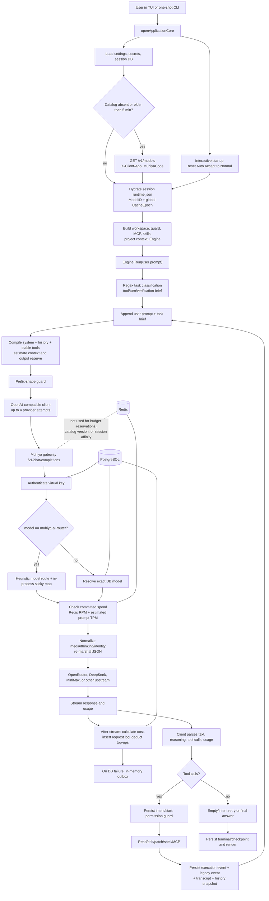
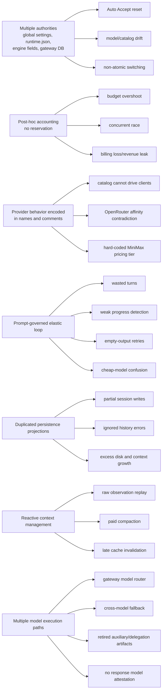
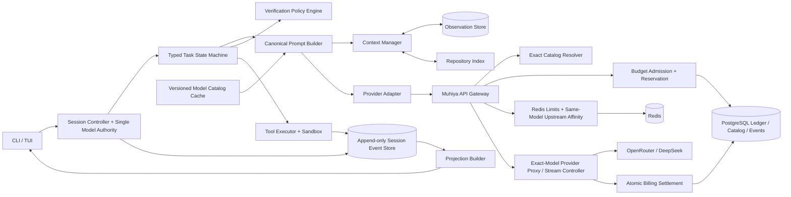
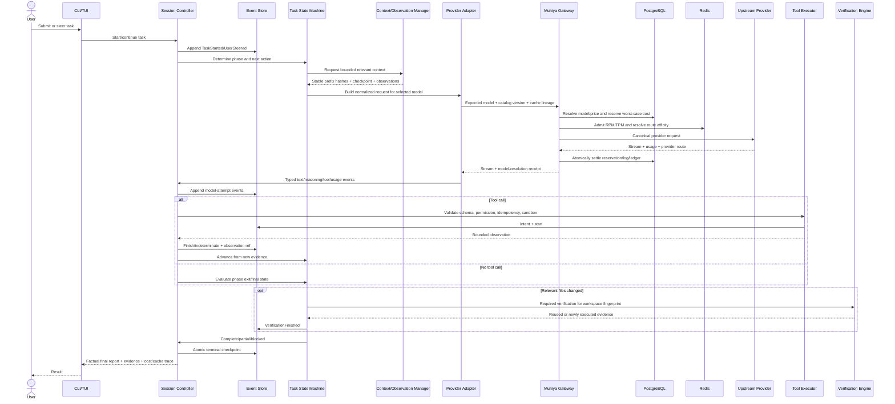
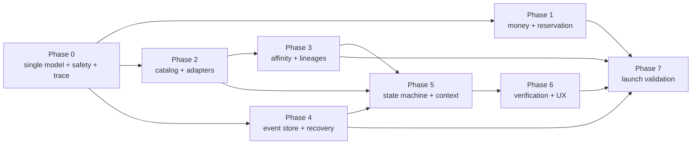

# Ultimate MuhiyaCode Improvement Plan

**Audit date:** 2026-07-28  
**Client repository:** `F:\MuhiyaCode Agent Go`  
**Gateway repository:** `F:\MuhiyaWorkspace\MuhiyaWorkspace`  
**Audit type:** read-only architecture, execution-flow, reliability, token-efficiency, caching, gateway, Redis, PostgreSQL, and product audit  
**Implementation status:** plan only; no production code was modified as part of this audit

---

## 0. Execution contract for GLM 5.2 in OpenCode

This document is the implementation specification for **GLM 5.2 running as the selected model in OpenCode**. The executor should implement it phase by phase rather than produce another broad audit.

### 0.1 Non-negotiable single-active-model invariant

MuhiyaCode must have exactly one active LLM for a session:

> Every LLM-generated token associated with a session—planning, coding, tool-call decisions, recovery, user-requested review, and final response—must be generated by the model explicitly selected for that session.

This means:

- no automatic model chooser in the client;
- no `muhiya-ai-router` or gateway model-selection router;
- no model fallover from the selected model to a different model;
- no subagent, delegated task, reviewer, planner, summarizer, title generator, or “cheap helper” using another model;
- no tool that silently sends a task, repository content, or transcript to another LLM;
- no model chosen from task complexity, effort, media type, cost, latency, or availability;
- no hidden background or maintenance LLM calls;
- no special “auxiliary model” configuration.

Deterministic code must perform context compaction, repository indexing, token estimation, verification selection, task tracking, checkpointing, recovery reporting, and title derivation. If a feature genuinely requires generation, it uses the current session model through the same request controller, budget, adapter, event store, cache lineage, and trace as the main loop.

The only permitted model change is an explicit user action such as `/model`. It is applied atomically at a safe turn boundary. After the switch, the newly selected model becomes the sole model for every later LLM call. In-flight work must never be split across models.

Provider failover may change a network endpoint only when it still serves the exact same immutable model record and target-model identifier. The model-resolution receipt must prove this before any output or tool call is accepted. Availability failure must be reported instead of silently substituting a different model.

### 0.2 Required code removals for that invariant

The implementation must delete—not merely disable—the alternate-model architecture after compatibility handling is defined:

- gateway `proxy/router.go` and its automatic selection/fallback logic;
- gateway `muhiya-ai-router` branches in `proxy/handler.go`, including cross-model candidate failover;
- gateway `proxy/stickysession.go` model-choice stickiness; replace it only with same-model upstream-provider affinity;
- router-only tests, seed data, admin options, documentation, and model rows;
- client/request concepts that partition work into subagent or auxiliary model streams;
- stale `run_subagent`, `UsageStreamSubagent`, `SubagentRequests`, `:sub:*`, retired agent-view, and subagent lifecycle artifacts;
- any optional LLM summarizer/compactor and any review/planning path capable of selecting another model;
- task-complexity signals used for model selection. Complexity may size a bounded action budget, but it cannot choose a model.

For backward compatibility, requests naming `muhiya-ai-router` must fail with a clear migration error; they must not silently resolve to a default model.

### 0.3 How GLM 5.2 should execute this plan in OpenCode

1. Read this document once, then inspect only the files needed by the current work package.
2. Preserve the existing dirty worktree. Never reset, overwrite, or delete unrelated user changes.
3. Create an execution-status ledger when implementation begins. Track phase, package, affected files, migrations, tests, blockers, and remaining dependencies.
4. Implement phases in dependency order. Phase 1 and Phase 2 may overlap only where Section 10 explicitly permits it.
5. Use OpenCode’s direct read/search/patch/shell tools. Do not invoke subagents, delegated tasks, alternate model sessions, reviewer agents, or LLM-backed tools.
6. Keep one bounded objective per change set. Verify the exact behavior being changed before broad cleanup.
7. Run focused package tests during implementation. Run repository-wide suites only at phase gates or before release; do not burn time/tokens rerunning unchanged broad checks.
8. When changing a wire/schema contract, add its golden/contract test in the same package.
9. When changing persistent state, add migration, rollback/recovery behavior, compatibility reader, and fault test before making it authoritative.
10. Do not mark a work package complete because code compiles. Its listed gate, failure cases, and observability must pass.
11. If blocked by an unknown product decision, record the exact decision and continue with independent work; do not redesign the entire project.
12. At each phase gate, report: completed packages, exact files, migrations, focused tests, full-suite result if required, remaining risks, and the next dependency.

### 0.4 Implementation discipline for GLM 5.2

GLM 5.2 should receive compact, concrete work-package context:

- current phase and one package;
- invariant(s) being enforced;
- exact affected files and existing behavior;
- acceptance tests;
- compatibility and migration constraints;
- explicit non-goals.

Do not feed the full 2,000-line plan back into every implementation turn. Store the phase/package state in the execution ledger and provide only the relevant section plus durable project constraints. This preserves accuracy while avoiding repeated context cost.

GLM 5.2 is the OpenCode execution model for this overhaul. That does not by itself require adding GLM 5.2 to MuhiyaCode’s public model catalog; catalog inclusion is a separate operator/product decision.

### 0.5 Execution ledger format

When implementation begins, create `docs/ULTIMATE_MUHIYACODE_EXECUTION_STATUS.md` with this structure:

```markdown
# Ultimate MuhiyaCode Execution Status

- Executor: GLM 5.2 in OpenCode
- Active session model: GLM 5.2
- Delegation/alternate models: prohibited
- Active phase:
- Active work package:
- Last verified commit/worktree fingerprint:
- Current blocker:

| Work package | Status | Files/migrations | Focused tests | Gate evidence | Remaining risk |
|---|---|---|---|---|---|
| P0-W1 | pending | | | | |

## Decisions

## Compatibility migrations

## Failed/indeterminate actions

## Next exact action
```

Use only `pending`, `in_progress`, `blocked`, or `complete`. Exactly one work package may be `in_progress`. Mark `complete` only after its acceptance evidence exists. Before a context reset or resumed OpenCode session, update `Next exact action`; after resuming, read this ledger and only the relevant plan section.

### 0.6 OpenCode starter instruction

Use this instruction to begin implementation:

```text
Execute docs/ULTIMATE_MUHIYACODE_IMPROVEMENT_PLAN.md as GLM 5.2 in this OpenCode session.

Hard rules:
- You are the only model allowed to perform this work. Do not delegate, spawn a subagent, invoke a reviewer/planner model, or use any LLM-backed tool.
- MuhiyaCode must use exactly the model selected in its session for every LLM call. Remove all automatic routing, cross-model fallback, subagent/auxiliary model paths, and hidden model maintenance calls.
- Preserve unrelated worktree changes.
- Start with P0-W1. Create/update docs/ULTIMATE_MUHIYACODE_EXECUTION_STATUS.md.
- Inspect only the current package's relevant code, implement it completely, run focused tests, and satisfy its gate.
- Run full repository suites only at phase gates.
- Continue through dependency-ordered packages until blocked by a genuinely missing product decision or external dependency.
- Do not replace architectural work with prompt reminders or feature flags that leave conflicting code alive.
- At every phase gate, report exact files, migrations, tests, invariant evidence, remaining risks, and next package.
```

---

## 1. Executive summary

MuhiyaCode has improved materially since its earlier architecture audit. The current client now keeps the user-selected model authoritative, persists the session model and a cache epoch, uses a compact 1,354-character production system prompt, advertises a stable core tool set, preserves MiniMax reasoning replay, has bounded shell output and process-tree cancellation, detects interrupted mutations, and passes its current Go test suite. The gateway also has explicit HTTP timeouts, graceful streaming shutdown, PostgreSQL migrations under an advisory lock, Redis-backed atomic RPM/TPM admission, usage parsing for cache tokens, and a passing unit suite.

It is not ready for a public production launch yet.

The largest remaining problems are not prompt wording. They are cross-system correctness defects:

1. **The selected session model is not yet a complete end-to-end invariant.** The client keeps its selected model authoritative, but the gateway still contains `muhiya-ai-router`, cross-model candidate failover, model-choice sticky state, and retired subagent/auxiliary stream artifacts remain in the client. Those paths must be removed so no internal component can assign work to another model.
2. **A configured spending limit is not a hard limit.** The gateway checks already-committed spend before the request, does not reserve the request's maximum cost, and writes cost only after streaming finishes. Concurrent requests can all pass the same check. A `$0.05` limit can therefore admit and complete a request costing more than `$0.05`.
3. **OpenRouter upstream cache affinity is internally contradictory and currently ineffective.** The gateway correctly documents that `X-Session-Id` is trace-only and that the request body must select an upstream. The client, however, deliberately sends no upstream preference; `ChatRequest.PinUpstream` is unused. MuhiyaCode can observe an upstream change only after it has paid for a cold request. This is a plausible root cause of isolated `R:114` cache-read events inside otherwise warm MiniMax sessions.
4. **The gateway model catalog is not a complete product contract.** PostgreSQL stores cache prices, context limits, output limits, media capabilities, and the MuhiyaCode visibility flag, plus a legacy task-routing tier that should be removed with the model router. `/v1/models` omits prices, exact target/provider metadata, supported parameters, cache policy, and catalog version. The client contract cannot represent most of those fields and falls back to name-based model profiles.
5. **Auto Accept is intentionally reset at interactive startup.** Its state is global settings state, not session runtime state, and the reset is locked in by a test. This directly violates the requested “preserve Auto Accept for the entire session” behavior.
6. **Client recovery and context control remain reactive.** A task may expand to as many as 168 model turns at max effort, progress is measured mainly by changed lines and checks, empty-output recovery spends more model turns, raw tool observations are persisted in several projections, and structured compaction can add two extra active-model calls.
7. **Billing truth is split across non-atomic paths.** A request-log insert commits before top-up deduction; deduction failure is only logged. Failed inserts enter an in-memory queue that is lost on process restart and can overflow. Redis completion-token writes are best-effort and runtime Redis failures fail open to per-process counters.
8. **The current green tests do not prove the production properties that matter.** Both `go test ./...` commands passed, but no live PostgreSQL or Redis environment was configured. There is no concurrent hard-budget test, two-replica affinity test, gateway/client catalog conformance test, crash-recovery matrix, or trace-replay cache benchmark.

### Release verdict

**Do not launch publicly until the Section 0 single-active-model invariant and findings UMI-01 through UMI-05 are complete.** A public beta without hard monetary guarantees would still require UMI-03 through UMI-12, structured “best effort” budget wording, mandatory production encryption, and explicit operational alerts.

### Highest-value sequence

The correct implementation order is:

1. Enforce one selected session model and remove gateway cross-model routing, cross-model fallback, auxiliary model calls, and retired delegation artifacts.
2. Introduce integer monetary accounting and a PostgreSQL reservation/settlement ledger.
3. Establish one versioned model-catalog contract shared by gateway and client.
4. Make same-model OpenRouter upstream affinity gateway-owned, Redis-backed, observed, and safely recoverable.
5. Move permission mode and cache lineages into atomic session runtime state.
6. Replace the elastic prompt-governed loop with a typed task state machine and progress ledger.
7. Replace duplicated conversation projections with one append-only event journal and rebuildable views.
8. Make context compilation observation-aware, deterministic, and budget-aware.
9. Add production integration, fault-injection, and cache-trajectory release gates.

### What should be preserved

The overhaul should retain these current strengths:

- Explicit session model authority in `internal/orchestrator/turnloop.go:57-64`.
- Durable session model and cache epoch in `internal/state/session_runtime.go`.
- The compact production prompt shown in `internal/orchestrator/testdata/prefix_bytes_wire.golden`: 1,354 system-prompt characters.
- Stable core tool definitions and the `integration_tools` broker in `internal/orchestrator/definitions.go` and `tool_hydration.go`.
- Prefix-shape and invalidation diagnostics in `prefixshape.go`, `invalidation.go`, and `cacheresilience.go`.
- MiniMax reasoning preservation and family-specific request normalization in `internal/gateway`.
- Shell timeout, process-tree termination, `WaitDelay`, bounded output, and background-process ownership in `internal/workspace/shell.go:107-217`.
- Mutation intent/tool-start journaling and indeterminate-side-effect reporting in `internal/orchestrator/execution.go` and `turnloop.go:603-610`.
- PostgreSQL migration locking and transactional migration application in `db/migrations.go`.
- Gateway stream-idle watchdogs, graceful shutdown, and request body preservation.

---

## 2. Audit scope, method, and evidentiary limits

### Code inspected

The audit traced the following live paths rather than relying on old design documents:

- Client startup, settings, model discovery, session hydration, runtime construction, TUI actions, and model switching.
- System prompt, tool definitions, task classification, turn loop, request assembly, provider adapter, streaming parser, retries, tool dispatch, permission guard, file editing, shell execution, verification helpers, context maintenance, compaction, usage records, and finalization.
- Gateway HTTP startup, authentication boundary, model resolution, automatic router path, OpenAI/Anthropic translation, OpenRouter forwarding, streaming, usage extraction, cache accounting, rate limiting, budget checks, model discovery, sticky sessions, request logging, credit deduction, outbox behavior, PostgreSQL access, Redis use, migrations, and shutdown.

### Validation performed

- `go test ./...` passed in `F:\MuhiyaCode Agent Go`.
- `go test ./...` passed in `F:\MuhiyaWorkspace\MuhiyaWorkspace`.
- `DATABASE_URL`, `TEST_DATABASE_URL`, and `REDIS_URL` were absent, so database-backed and Redis-backed integration behavior was **not** exercised by this audit run.
- The gateway repository was clean before and after the read-only audit.
- The client repository already contained extensive unrelated/in-progress changes; this audit did not alter production code.

### Competitor evidence boundary

Competitor comparisons use documented product behaviors as architectural benchmarks, not claims about private implementations:

- [Claude Code permissions](https://code.claude.com/docs/en/permissions), [tools](https://code.claude.com/docs/en/tools-reference), and [hooks](https://code.claude.com/docs/en/hooks).
- [OpenAI guidance on running Codex safely](https://openai.com/index/running-codex-safely/) and [Codex CLI overview](https://help.openai.com/en/articles/11096431).
- [Gemini CLI tools](https://google-gemini.github.io/gemini-cli/docs/tools/), [configuration](https://google-gemini.github.io/gemini-cli/docs/get-started/configuration.html), and [checkpointing](https://google-gemini.github.io/gemini-cli/docs/cli/checkpointing.html).
- [OpenCode permissions](https://opencode.ai/docs/permissions), [tools](https://opencode.ai/docs/tools), and [compaction](https://opencode.ai/v2/docs/compaction).
- [Aider repository map](https://aider.chat/docs/repomap.html) and [advanced model settings](https://aider.chat/docs/config/adv-model-settings.html).

---

## 3. Current system architecture and execution flow



### Important live behavior

- The coding client no longer automatically selects a different model per task. `turnloop.go:60-64` treats the session model as authoritative.
- The gateway still contains an automatic router and cross-model fallback for requests naming `muhiya-ai-router` (`proxy/handler.go:623-802` and the analogous Anthropic path). This is current behavior to remove, not a target feature.
- A direct model request is checked against current spend, then sent upstream. No maximum-cost reservation is created.
- The client sends `X-Session-Id` and `X-Muhiya-Session`, but no `provider.order` or `provider.only` request body. The gateway says the header does not provide OpenRouter stickiness.
- The final cost is calculated only after usage is received or estimated and is persisted after the stream.
- The client may execute up to four transport attempts inside `OpenAICompatible.Chat`; the outer turn loop can retry a recoverable failed turn again.

---

## 4. Root-cause map



The plan must remove these root causes, not add more prompt reminders around them.

---

## 5. Finding index

| Priority | ID | Severity | Category | Affected component | Complexity |
|---:|---|---|---|---|---|
| 0 | UMI-15 | Critical | Single-model correctness | Client session authority + gateway router/fallback + retired alternate streams | L |
| 1 | UMI-01 | Critical | Budget enforcement | Gateway admission, PostgreSQL billing | XL |
| 2 | UMI-02 | Critical | Monetary correctness | Gateway DB schema and cost math | L |
| 3 | UMI-03 | Critical | Prompt caching/routing | Client provider + gateway OpenRouter path | L |
| 4 | UMI-04 | Critical | Billing durability | Request logs, top-ups, outbox | XL |
| 5 | UMI-05 | Critical | Model contract | Gateway catalog + client model metadata | XL |
| 6 | UMI-06 | High | Permissions/session state | Interactive startup and runtime state | M |
| 7 | UMI-07 | High | Session continuity | Client event/history/transcript persistence | XL |
| 8 | UMI-08 | High | Retry/cost control | Client provider and turn loop | M |
| 9 | UMI-09 | High | Token budgeting | Client preflight and output caps | L |
| 10 | UMI-10 | High | Gateway token accounting | Prompt estimator and TPM | L |
| 11 | UMI-11 | High | Agent loop/liveness | Turn loop and progress tracking | L |
| 12 | UMI-12 | High | Recovery/completion | Empty, truncated, and stalled outputs | M |
| 13 | UMI-13 | High | Context/memory | History, observation storage, pruning | XL |
| 14 | UMI-14 | High | Context compaction | Maintenance and compaction | L |
| 16 | UMI-16 | High | Provider compatibility | Model profiles and adapter registry | L |
| 17 | UMI-17 | High | Distributed limits | Redis runtime behavior and completion tokens | L |
| 18 | UMI-18 | High | Pricing | MiniMax tier rules and catalog pricing | M |
| 19 | UMI-19 | High | Security/operations | Provider-key encryption and production boot | M |
| 20 | UMI-20 | Medium | Planning/token use | Task classifier and task brief | M |
| 21 | UMI-21 | Medium | Tool surface | Core schemas and deferred tools | L |
| 22 | UMI-22 | Medium | Verification | Verification discovery and task evidence | M |
| 23 | UMI-23 | Medium | Model switching | Global epoch and per-model cache lineages | L |
| 24 | UMI-24 | Medium | Catalog distribution | Polling, ETag, version, active-client sync | L |
| 25 | UMI-25 | Medium | Gateway scale | Per-request DB query pattern and sticky map | L |
| 26 | UMI-26 | Medium | Observability/UX | TUI/CLI request, cache, and budget traces | M |
| 27 | UMI-27 | Medium | Maintainability | Dead fields, stale comments, legacy prompts | M |
| 28 | UMI-28 | Low | Prompt efficiency | Project/skill/instruction prefix hygiene | S |

---

## 6. Detailed findings

### UMI-01 — Spending limits are post-paid checks, not hard real-time limits

**Severity:** Critical  
**Category:** Budget enforcement  
**Affected component:** Gateway admission, PostgreSQL billing, streaming proxy  
**Root cause:** No reservation ledger or maximum-cost preflight  
**Implementation complexity:** XL  
**Priority:** 1

1. **Current problem.** `RateLimiter.CheckLimit` reads current committed spending and rejects only when `spending >= budget` and no top-up remains. It does not price the pending request, subtract in-flight requests, clamp `max_tokens`, or reserve money. `proxy/handler.go` calculates and saves cost only after the upstream response finishes.
2. **Why it happens.** Budget enforcement was added onto request logs, which are accounting history, rather than modeled as an admission-and-settlement transaction. Redis protects RPM/TPM counters, not money.
3. **Evidence.** `proxy/limiter.go:269-300`; `proxy/handler.go:697-708`; streaming `finish` at `proxy/handler.go:1162-1188`; `db/db.go:1219-1229`. Multiple requests can read the same spend before any request log exists.
4. **Recommended architecture.** Add a PostgreSQL-backed **Budget Authority** with `reserve -> stream -> settle/release`. Reservations must be visible to concurrent requests and must use a pricing snapshot plus a worst-case uncached input and output bound.
5. **Implementation steps.**
   - Add `budget_reservations` and `account_ledger` migrations.
   - Normalize the final provider request first, including thinking fields and the final `max_tokens`.
   - Count or conservatively bound the complete serialized input: messages, reasoning replay, tool definitions, media, and gateway-injected fields.
   - In one transaction under a per-user advisory lock, expire stale reservations, calculate settled plus active reserved spend in every applicable window, calculate shared top-up availability, and create a reservation with a unique request ID.
   - Clamp `max_tokens` to the maximum affordable output. Reject before contacting the upstream if input alone is unaffordable or the remaining output allowance is below a documented minimum.
   - Share one reservation across allowed pre-stream retries; reserve additional attempt exposure before a retry whose cost is uncertain.
   - During streaming, stop before the reserved ceiling using reported usage when available and a conservative local output counter otherwise.
   - Settle actual usage, request log, ledger debit, top-up consumption, and reservation release in one idempotent transaction.
6. **Risks and edge cases.** Cache hits are not guaranteed, usage may arrive only at the end, a provider may ignore `max_tokens`, a disconnect may happen after upstream billing but before usage, overlapping windows share top-ups, and failover may change pricing. Reserve the most expensive valid outcome; never assume a cache hit; keep a safety margin; settle an estimated upper bound on unknown partial delivery; prohibit post-byte failover.
7. **How to test.** Run 10,000 randomized concurrent requests against a `$0.05` budget; prove `settled + active reservations <= 0.05 USD` at every transaction boundary. Test streams, disconnects, stale reservation expiry, cache hit/miss, retry, different windows, top-ups, and provider-ignored token caps.
8. **Expected impact.** Correctness and financial safety become deterministic. Cost overruns become impossible within the chosen accounting precision. Users receive immediate structured “remaining budget” errors instead of discovering an overage after completion.

### UMI-02 — Floating-point money prevents an exact hard-budget guarantee

**Severity:** Critical  
**Category:** Monetary correctness  
**Affected component:** Gateway schema, Go DB types, budget math, pricing  
**Root cause:** `float64` and PostgreSQL `DOUBLE PRECISION` represent money and credits  
**Implementation complexity:** L  
**Priority:** 2

1. **Current problem.** Budgets, model rates, request cost, top-up credits, charge watermarks, and aggregates use binary floating point.
2. **Why it happens.** The initial schema optimized for simple cost display, not exact concurrent authorization.
3. **Evidence.** `db/migrations/001_initial.sql` defines `budget_usd`, all model prices, request `cost`, and credits as `DOUBLE PRECISION`; `db/db.go` exposes them as `float64`; `proxy/handler.go:2062-2084` calculates floats.
4. **Recommended architecture.** Store and compute money as `int64 nanoUSD` (`1 USD = 1,000,000,000 nanoUSD`) or a fixed-scale PostgreSQL `NUMERIC`, with one checked conversion boundary for API display. Prefer integer nanoUSD in Go and DB ledger columns. Store per-million-token rates as integer nanoUSD.
5. **Implementation steps.**
   - Add integer price/budget/cost/credit columns and backfill using a versioned migration.
   - Create a `money` package with checked add, subtract, multiply-divide-ceil, format, and JSON conversion.
   - Calculate `ceil(tokens * rateNanoUSDPerMillion / 1_000_000)` with overflow checks.
   - Dual-read/dual-write during migration, compare values in telemetry, then retire floats.
   - Express the reservation safety margin in nanoUSD.
6. **Risks and edge cases.** Historical float rows require deterministic rounding; very high token counts can overflow naive multiplication; UI credit units currently use `100 credits/USD`. Use 128-bit/big integer intermediate math and publish a migration rounding policy.
7. **How to test.** Property-test cost monotonicity, no negative cost, round-trip formatting, boundary rates, MiniMax tier thresholds, and one nanoUSD below/at/above a budget.
8. **Expected impact.** Enables a literal hard ceiling, prevents drift between services, makes settlement idempotent, and removes a class of fractional overcharge/undercharge bugs.

### UMI-03 — OpenRouter cache affinity is detected after failure, not enforced before request

**Severity:** Critical  
**Category:** Prompt caching and routing  
**Affected component:** Client `OpenAICompatible`, gateway OpenRouter forwarding, Redis  
**Root cause:** Contradictory ownership and unused `PinUpstream` contract  
**Implementation complexity:** L  
**Priority:** 3

1. **Current problem.** The client records which upstream served a response but never asks for that upstream on the next request. A same-model session may move among OpenRouter upstreams and cold-start its prefix cache.
2. **Why it happens.** The gateway comment says the client owns affinity, while client tests intentionally prohibit manual pinning. `ChatRequest.PinUpstream` survived the earlier design but is never consumed by the live provider.
3. **Evidence.**
   - `proxy/handler.go:1032-1047` correctly states `X-Session-Id` is trace-only and upstream selection requires the body `provider` object.
   - `internal/gateway/provider.go:189-231` builds the request body without `provider.order`, `provider.only`, or `allow_fallbacks`.
   - `rg PinUpstream` finds the contract, tests, and docs but no production consumer.
   - `internal/orchestrator/upstream_test.go:117` asserts the session does not manually pin.
4. **Recommended architecture.** Make the **gateway** the single owner of routing affinity for gateway traffic. It sees the authenticated user/session, selected virtual model, target provider, and actual response upstream. Store `virtual-key + session + model-lineage -> canonical upstream` in Redis with TTL. Inject a provider preference before forwarding to OpenRouter.
5. **Implementation steps.**
   - Define canonical OpenRouter provider identifiers and validate observed response names before using them.
   - Add a Redis affinity record with version, model ID, catalog revision, last success, failure count, and expiry.
   - On a warm request, inject strict affinity (`provider.only` or equivalent) while retaining a controlled pre-stream fallback path.
   - If the pinned provider rejects before any output, atomically evict/degrade the pin, retry once without it if the reservation permits, record the newly successful upstream, and expose the event in response metadata.
   - Never reroute after response bytes begin.
   - For direct-to-OpenRouter client configuration, implement the same logic in the client adapter; do not have both client and gateway inject conflicting rules.
   - Remove or implement `ChatRequest.PinUpstream`; do not leave a false contract.
6. **Risks and edge cases.** OpenRouter provider names may not equal routing slugs; strict pins may reduce availability; a provider can disappear; two replicas may race. Normalize identifiers, use Redis CAS/Lua, bound fallback to one pre-stream attempt, and keep provider preference outside the cached message prefix.
7. **How to test.** Use a fake OpenRouter with two upstreams and two gateway replicas. Verify 100 sequential turns, process restarts, and load-balancer changes retain one upstream; simulate a pin outage and prove exactly one safe fallback with no duplicate visible stream. Replay the Snake trajectory and require no unexplained `R:114` event.
8. **Expected impact.** Large MiniMax/DeepSeek sessions stop paying accidental full-prefix misses. Latency and cost variance fall sharply. Cache misses become attributable rather than mysterious.

### UMI-04 — Billing settlement is split, non-atomic, and backed by a volatile outbox

**Severity:** Critical  
**Category:** Billing durability and recovery  
**Affected component:** `InsertRequestLog`, top-up deduction, outbox, health  
**Root cause:** Request logs were treated as both telemetry and financial ledger  
**Implementation complexity:** XL  
**Priority:** 4

1. **Current problem.** `InsertRequestLog` commits the request log, then calls `DeductExtraCreditsIfExceeded`. A deduction failure is logged but not returned. If the log insert fails, the record is placed into an in-memory channel; restart or channel overflow loses it permanently.
2. **Why it happens.** Telemetry persistence was made asynchronous to protect response latency, but financial settlement needs durable atomicity.
3. **Evidence.** `db/db.go:1141-1158`; `proxy/handler.go:153-163`; `proxy/outbox.go:23-82`. The outbox comment calls it durable, but it is a process-memory `chan db.RequestLog` with capacity 4,096.
4. **Recommended architecture.** Move successful request settlement into the Budget Authority transaction. The request log becomes a projection of an authoritative reservation/ledger settlement. Use an idempotent request ID as the transaction key.
5. **Implementation steps.**
   - Implement `SettleRequest(tx, reservationID, usage, status)` to insert/update request facts, debit ledger/top-ups, and close the reservation atomically.
   - Make settlement synchronous for financial state; keep non-financial analytics asynchronous.
   - If asynchronous telemetry is required, use a PostgreSQL outbox table committed with settlement and drained by workers with `FOR UPDATE SKIP LOCKED`.
   - Delete the volatile billing outbox after migration.
   - Make health report unsettled reservations, oldest outbox age, settlement failures, and ledger reconciliation drift.
6. **Risks and edge cases.** Streaming responses should not wait on slow analytics, repeated settlement may occur after client retry, and DB may fail at stream end. Use a short authoritative transaction, idempotent upserts, and an expiring reservation that a durable reconciler can settle.
7. **How to test.** Kill the gateway after upstream completion but before response finalization, during settlement, and during outbox drain. Restart and prove exactly one charge/log, no lost reservation, and no duplicate top-up debit.
8. **Expected impact.** Eliminates silent revenue loss, makes usage trustworthy, and creates a sound base for hard budgets and refunds.

### UMI-05 — The model catalog cannot synchronize the metadata clients need

**Severity:** Critical  
**Category:** Model contract and distribution  
**Affected component:** Gateway DB and `/v1/models`; client `contract.Model` and discovery  
**Root cause:** The endpoint is an OpenAI-compatible display list, not a versioned MuhiyaCode capability contract  
**Implementation complexity:** XL  
**Priority:** 5

1. **Current problem.** PostgreSQL contains input/output/cache read/cache write prices, exact provider/target data, context/output limits, thinking and media flags, attachment limits, and MuhiyaCode visibility. It also contains legacy model-routing metadata that must disappear with the router. The endpoint returns identity, context/output limits, and media flags but omits price fields, exact target/provider behavior, supported request parameters, cache semantics, operational output defaults, and catalog version. The client model type cannot store most of them.
2. **Why it happens.** MuhiyaCode reuses generic `/v1/models` shapes and patches unknown behavior with `ResolveModelProfile(name)`.
3. **Evidence.**
   - Rich gateway model: `db/db.go:92-142`.
   - Thin endpoint: `proxy/handler.go:1722-1900` and `proxy/media.go:376-389`.
   - Thin client contract: `internal/contract/types.go:86-100`.
   - Client parser reads only two prices and a few display fields: `internal/gateway/provider.go:568-632`.
4. **Recommended architecture.** Add a versioned MuhiyaCode catalog schema, either under `/v1/muhiyacode/models` or as a documented extension to `/v1/models`. The gateway is the authoritative source; clients must not infer critical behavior from names.
5. **Implementation steps.**
   - Replace the boolean-only visibility concept with `tags[]`, retaining `muhiyacode_visible` as a compatibility projection during migration.
   - Publish `schema_version`, monotonic `catalog_version`, ETag, immutable model ID/display name, exact target-model identifier, provider family, adapter version, context geometry, hard and operational output limits, tool/reasoning/media capabilities, accepted parameters, cache policy, same-model upstream-affinity policy, pricing rules, rate limits, health, deprecation, and compatibility epoch.
   - Do not publish task-complexity tiers, candidate models, fallback models, or any field that invites the client to choose a model automatically.
   - Generate Go DTOs or a shared JSON schema used by both repositories.
   - Expand `contract.Model` into typed nested metadata; keep UI-only display fields separate from wire-affecting adapter metadata.
   - Validate every tagged model before publication; reject incomplete or contradictory rows.
   - Store the catalog in a dedicated client cache file, not inside general settings.
6. **Risks and edge cases.** Old clients must continue to work; sensitive provider/target details must not leak; a metadata edit during a task must not silently change request bytes. Version the endpoint, expose only safe routing identifiers, and apply wire-affecting changes only at a task boundary with a compatibility-epoch event.
7. **How to test.** Contract-test one generated fixture through DB -> endpoint -> client parser -> adapter. Fuzz unknown fields/versions. Require every model tagged `muhiyacode` to round-trip all mandatory metadata and reject malformed catalog entries.
8. **Expected impact.** New gateway models become usable without a client release, MiniMax/DeepSeek behavior becomes data-driven, model switching becomes reliable, and price/context UI becomes accurate.

### UMI-06 — Auto Accept is deliberately reset and stored at the wrong scope

**Severity:** High  
**Category:** Permissions and session state  
**Affected component:** Interactive startup, TUI permission toggle, runtime construction, MCP approvals  
**Root cause:** Permission mode is global settings state with an ad-hoc startup safety reset  
**Implementation complexity:** M  
**Priority:** 6

1. **Current problem.** Enabling Auto Accept writes global settings. The next interactive launch calls `resetInteractivePermission`, changes the in-memory value to Normal before hydration, and tells the user to enable it again.
2. **Why it happens.** The implementation tried to prevent unsafe global persistence but did not create a session-scoped permission authority.
3. **Evidence.** `internal/command/root.go:100,134-139`; `internal/command/callbacks_test.go:39-47` locks the reset; `internal/command/actions.go:47-60` persists the global field; `runtime_build.go:430-498` copies that field into workspace and MCP policy. `SessionRuntimeConfig` stores only model and epoch.
4. **Recommended architecture.** Put `PermissionMode` in the durable session runtime record. The session is the authority for engine, workspace guard, MCP manager, sandbox bypass, TUI indicator, and resume. Global settings provide only the default for a **new** session.
5. **Implementation steps.**
   - Version `SessionRuntimeConfig` and add permission mode.
   - On a new session, default to Normal unless the user has explicitly configured a trusted default.
   - When Shift+Tab changes mode, atomically update the runtime record and all live consumers.
   - Resume the same session with its saved mode; remove `resetInteractivePermission`.
   - Keep one-shot non-interactive full access gated by `--unsafe-full-access`.
   - Display “Auto Accept for this session” and the trust/sandbox state in the footer.
6. **Risks and edge cases.** A copied/imported session must not silently inherit dangerous authority; stale TUI/guard state can diverge; runtime-file corruption must fail safe. Reset imported/forked sessions to Normal unless explicitly requested, validate modes, and update consumers through one coordinator.
7. **How to test.** Enable Auto Accept, restart, resume the same session, and prove edit/shell/MCP policy stays Auto Accept. Start/fork/import a different session and prove the documented default. Race mode changes during a tool boundary under `-race`.
8. **Expected impact.** Removes repeated prompts and user frustration without making unsafe authority global.

### UMI-07 — Conversation truth is written to several projections without one commit boundary

**Severity:** High  
**Category:** Session continuity and recovery  
**Affected component:** Execution events, legacy events, transcript, history snapshot  
**Root cause:** Multiple persistence systems evolved independently  
**Implementation complexity:** XL  
**Priority:** 7

1. **Current problem.** One assistant/tool result may be appended to an execution journal, legacy event table, transcript JSONL, and history snapshot. Failure after an earlier write leaves partial durable state. `History.saveLocked` discards persistence errors entirely.
2. **Why it happens.** New recovery features were layered beside old UI/session projections rather than making them projections of one event log.
3. **Evidence.** `internal/orchestrator/turnhelpers.go:94-118`; `turnhelpers.go:150-161`; `history.go:758-761`; wiring in `internal/command/runtime_build.go:597-630`.
4. **Recommended architecture.** Use one append-only, checksummed, sequence-numbered **Session Event Store** as canonical truth. Build transcript, history window, usage, task status, and UI rows as rebuildable projections.
5. **Implementation steps.**
   - Define versioned events for user input, assistant item, tool intent/start/result, approval, model/permission change, context checkpoint, usage, steering, task terminal, and recovery.
   - Append an event atomically with a monotonic session sequence and idempotency key.
   - Replace per-message multi-writes with one event append.
   - Rebuild sidecars on startup; treat them as caches with checksums and source sequence.
   - Add periodic compact projection checkpoints without deleting source events.
   - Surface append failure before dispatching a mutation; after a completed mutation, write a durable indeterminate/recovery record using a cancellation-independent context.
6. **Risks and edge cases.** Migration of existing sessions, journal growth, partial final records, and secret retention. Add importers, bounded checkpoints, encrypted/redacted sensitive fields, and corruption quarantine.
7. **How to test.** Fault-inject every write boundary, truncate the journal, duplicate an event, reorder projection writes, and crash during mutation. On resume, prove deterministic reconstruction and no duplicate side effect.
8. **Expected impact.** Strong session continuity, simpler code, fewer disk writes, reliable rewind/resume, and auditable task state.

### UMI-08 — Layered retries can multiply one failed model turn into many expensive requests

**Severity:** High  
**Category:** Retry and cost control  
**Affected component:** Client provider and turn loop  
**Root cause:** Independent retry owners have no shared attempt/cost budget  
**Implementation complexity:** M  
**Priority:** 8

1. **Current problem.** `OpenAICompatible.Chat` defaults `MaxRetries` to three, meaning up to four attempts. The turn loop can then retry a recoverable `Chat` error again. Empty responses, trailing-intent responses, and output truncation have separate retries.
2. **Why it happens.** Each layer added local resilience without a request-level retry ledger.
3. **Evidence.** `internal/gateway/provider.go:81-82,96-159`; `internal/orchestrator/turnloop.go:445-493,536-584`.
4. **Recommended architecture.** Introduce a per-task **Attempt Budget** owned by the task controller. Every provider call declares reason, bytes seen, estimated/reserved cost, idempotency class, and remaining attempts.
5. **Implementation steps.**
   - Default to one initial attempt plus one pre-byte retry for transient transport/429 conditions.
   - Permit one post-header retry only when no tool call/visible output was committed and budget reservation covers it.
   - Remove the outer duplicate provider retry or have it consume the same ledger.
   - Use exponential backoff bounded by a task deadline and `Retry-After`.
   - Record all attempts under one logical request ID and expose them to the UI.
6. **Risks and edge cases.** Too few retries reduce availability; a dropped stream may have produced hidden provider cost; cache affinity may make a retry cheap but not free. Classify by bytes/usage, reserve pessimistically, and allow policy overrides per model/provider.
7. **How to test.** Enumerate 400/401/404/408/409/429/500, connect reset before headers, reset after partial text, malformed SSE, and user cancellation. Assert exact attempt counts and maximum reserved cost.
8. **Expected impact.** Lower tail latency and token burn, clearer failures, and predictable budget behavior.

### UMI-09 — Client token preflight and output limits are not production budget controls

**Severity:** High  
**Category:** Token budgeting  
**Affected component:** Request assembler, provider capability, output budgeting  
**Root cause:** Exact counting is optional and no live provider implements it; output caps are model-static  
**Implementation complexity:** L  
**Priority:** 9

1. **Current problem.** The exact preflight runs only if the provider implements `requestTokenCounter`; the production OpenAI-compatible provider does not. The fallback is a calibrated character estimate. `outputBudget` chooses a catalog/profile maximum independent of task stage, remaining monetary budget, and expected response type.
2. **Why it happens.** Model context protection and financial output control are conflated, and the exact tokenizer seam was implemented only in tests.
3. **Evidence.** `internal/orchestrator/request_tokens.go:10-74`; production search finds `CountRequestTokens` only in tests; `engine.go:606-613`; profile defaults in `internal/gateway/model.go:100-160`.
4. **Recommended architecture.** Separate:
   - **context preflight**: final serialized prompt + tools + output reserve;
   - **task output allowance**: adaptive cap by action type;
   - **financial allowance**: gateway-authoritative clamp.
5. **Implementation steps.**
   - Add a gateway token-count/preflight endpoint or tokenizer service keyed by catalog tokenizer ID.
   - Until exact counting exists, use conservative per-family coefficients measured from actual usage and include complete serialized tools/body.
   - Set output defaults by state: short control/tool turn, code generation, compaction, final report.
   - Let the gateway lower `max_tokens` to the affordable amount and return the applied cap in metadata.
   - Reject context overflow before transmission and compact once if permitted.
6. **Risks and edge cases.** Tokenizers may be proprietary; reasoning tokens may share completion limits; tool JSON can dominate; overly small tool-turn caps can truncate arguments. Maintain provider-calibrated upper bounds and a one-time truncated-call continuation protocol.
7. **How to test.** Compare local/gateway estimates to reported prompt tokens across MiniMax M3, DeepSeek V4 Flash/Pro, long tools, Unicode, images, reasoning replay, and 1M-token boundaries. Require no context-overflow request in the conformance corpus.
8. **Expected impact.** Fewer oversized requests, less unused output headroom, lower latency, and lower risk of truncated tool JSON.

### UMI-10 — Gateway prompt-token estimation ignores much of the actual request

**Severity:** High  
**Category:** Gateway token accounting  
**Affected component:** TPM admission and preflight pricing  
**Root cause:** Estimation concatenates only message text  
**Implementation complexity:** L  
**Priority:** 10

1. **Current problem.** The gateway estimates prompt tokens from `GetMessageContentString` across messages. Tool schemas, tool calls, reasoning metadata, request wrappers, media, and injected identity/thinking fields are not counted. The result feeds TPM admission and initial request-log input tokens.
2. **Why it happens.** The limiter was built for chat text, before coding-agent requests carried a 10KB tool schema and structured history.
3. **Evidence.** `proxy/handler.go:697-705`; similar admission paths at `proxy/handler.go:913` and `proxy/agent.go:81`; `estimateTokens` is a text heuristic.
4. **Recommended architecture.** Run budget/TPM preflight over the **final normalized wire body**. Use exact tokenizer metadata from the model catalog where available and a conservative serialized-byte bound otherwise.
5. **Implementation steps.**
   - Move admission after normalization but before upstream dispatch.
   - Count tool definitions, calls/results, reasoning replay, media descriptors/tokens, and gateway additions.
   - Reserve prompt plus allowed output TPM atomically in Redis; release/adjust at settlement.
   - Mark estimates with method/version and compare them to upstream usage.
6. **Risks and edge cases.** Moving admission later must not expose provider secrets or perform side effects; media token math varies. Keep normalization pure and use model-specific counters.
7. **How to test.** Send identical message text with 0KB and 100KB tool schemas; TPM admission must differ. Calibrate against provider usage and alert on systematic undercount.
8. **Expected impact.** Accurate rate limiting, safer budget reservation, and trustworthy usage before final provider telemetry.

### UMI-11 — The turn loop can run far too long while measuring the wrong kind of progress

**Severity:** High  
**Category:** Agent loop quality and liveness  
**Affected component:** Task classification, governor, loop breakers  
**Root cause:** Elastic turn runway and progress counters based mainly on file diffs/checks  
**Implementation complexity:** L  
**Priority:** 11

1. **Current problem.** The absolute ceiling is 120 turns scaled by effort; max effort uses `AgentTurnScale: 1.4`, allowing 168 turns. The loop escalates task class whenever files changed and allows two exploration escalations without changes. “Stalled progress” increments whenever changed-line and check counters do not move, even if the agent discovers decisive facts, narrows a search, receives user steering, or resolves a blocker.
2. **Why it happens.** Task progress is inferred from side effects instead of represented as typed state.
3. **Evidence.** `internal/orchestrator/engine.go:19`; `taskledger.go:26-31`; `effort.go:52-57`; `turnloop.go:229-296,692-704`.
4. **Recommended architecture.** Replace the open-ended loop with a typed state machine: `Understand -> Inspect -> Change -> Verify -> Finalize`, with `AwaitUser`, `Recover`, and `Blocked` branches. Maintain a **Progress Ledger** of new evidence, resolved questions, changed artifacts, verification evidence, and remaining actions.
5. **Implementation steps.**
   - Define phase-specific allowed actions and bounded default turn budgets.
   - Count progress when a new observation/fingerprint/evidence item is added, not only on mutation.
   - Require an explicit remaining-work record to extend a phase.
   - Use a much lower unconditional ceiling, with user-visible continuation checkpoints for genuinely long work.
   - Make steering an event that can replan without resetting all safety counters.
6. **Risks and edge cases.** Large migrations legitimately need many turns; a rigid phase model can block opportunistic fixes. Permit transitions backward with a reason and checkpoint, and allow resumable task segments instead of one 168-turn request.
7. **How to test.** Replay read-only audits, multi-file changes, long migrations, “Go” continuations, steering, repeated searches, and no-op tasks. Assert convergence, no false stall, and bounded turns.
8. **Expected impact.** Cheaper models receive clearer control structure, wasted turns fall, and “stuck without output” behavior becomes diagnosable.

### UMI-12 — Empty/truncated recovery spends turns but still ends with an unhelpful generic answer

**Severity:** High  
**Category:** Recovery and task completion  
**Affected component:** Turn loop, fallback answer, finalization  
**Root cause:** Recovery is prompt-based and final status is not synthesized from durable task evidence  
**Implementation complexity:** M  
**Priority:** 12

1. **Current problem.** MuhiyaCode retries an initial empty response once, a post-tool empty response twice, and a trailing-intent response twice. When breakers fire without assistant content, it returns “No final response was produced” or only a changed-file count.
2. **Why it happens.** The model is the only producer of a useful final report; the harness does not render its own task ledger.
3. **Evidence.** `turnloop.go:520-586`; `turnhelpers.go:164-179,284-291`.
4. **Recommended architecture.** Make recovery typed. After one targeted continuation attempt, the controller must either resume a known action, ask the user, or generate a deterministic **Harness Final Report** from task events.
5. **Implementation steps.**
   - Classify empty response as provider-empty, tool-continuation, truncated-call, or model-stopped.
   - Retry once with a small output allowance and explicit expected result.
   - If still empty, render changed files, executed commands, test outcomes, failed actions, indeterminate mutations, model/provider attempts, and remaining task state from the event store.
   - Mark task status `partial` or `failed`, never implicit success.
6. **Risks and edge cases.** A mechanical report may expose sensitive tool output or be too verbose. Render redacted summaries and links/IDs to detailed trace records.
7. **How to test.** Script empty first turn, empty after tools, repeated `finish_reason=length`, malformed tool JSON, provider disconnect, and breaker termination. Every case must produce a factual non-empty final status with correct task state.
8. **Expected impact.** Users never receive a blank or misleading finish; wasted recovery calls are bounded.

### UMI-13 — Raw tool observations and duplicated histories dominate the growing prompt

**Severity:** High  
**Category:** Context and token efficiency  
**Affected component:** Tool-result handling, conversation history, transcript persistence  
**Root cause:** Full tool output is treated simultaneously as model context, durable history, and user-visible transcript  
**Implementation complexity:** L  
**Priority:** 13

1. **Current problem.** Successful shell and file-read results are appended in full to the active conversation and persisted. They remain in subsequent requests until pressure-based trimming or compaction. The same logical event can also be represented in the execution journal and transcript.
2. **Why it happens.** MuhiyaCode has no separate observation store. The OpenAI-compatible message list has become the database, recovery log, display transcript, and working memory at once.
3. **Evidence.** `internal/orchestrator/turnhelpers.go:94-161` writes journal events, legacy events, conversation messages, and transcript records; `internal/orchestrator/history.go` performs late, age-based tool-result trimming and deliberately pins some error results.
4. **Recommended architecture.** Introduce a content-addressed **Observation Store**. The full bounded result is stored once; the model receives a compact typed observation containing an ID, source, exit state, salient lines, byte/token counts, and a retrieval hint. Retain full inline output only when it is small or needed by the next action.
5. **Implementation steps.**
   - Define `Observation{id, kind, command/path, status, summary, excerpts, blobRef, createdAt, sensitivity}`.
   - Hash and deduplicate identical reads and command results.
   - Add a deterministic reducer per core tool: file reads preserve requested line ranges; searches preserve matched paths/lines; shell results preserve exit code and head/tail around failures.
   - Give the model `read_observation(id, range)` or extend existing read tools with observation references instead of adding multiple overlapping tools.
   - Keep the last action result inline for one decision turn, then replace it with its summary unless pinned by a typed dependency.
   - Build the TUI transcript from event projections, not from the exact message payload sent to the model.
6. **Risks and edge cases.** A reducer can omit the line that explains a failure. Always preserve error neighborhoods, allow explicit raw retrieval, and never discard the underlying bounded blob before session retention expires.
7. **How to test.** Run repetitive file reads, 100 KB build output, identical searches, binary/noisy output, and errors whose cause is near the middle. Compare agent success with raw-output baselines and assert bounded prompt growth.
8. **Expected impact.** Long tasks should use substantially fewer replay tokens, repeated reads become cheap, and session recovery gains a canonical source of truth.

### UMI-14 — Compaction is a paid, lossy model call and creates a cold cache branch

**Severity:** High  
**Category:** Context compression and caching  
**Affected component:** Session maintenance and history compaction  
**Root cause:** The active model is asked to summarize a character-truncated tail instead of compacting typed state deterministically  
**Implementation complexity:** L  
**Priority:** 14

1. **Current problem.** Compaction digests only the latest messages after truncating each to a small character budget, can make two additional model calls with a 90-second timeout and 1,600-token output allowance, and falls back to a mechanical summary. The compaction call itself has a different prompt shape and does not advance the coding task.
2. **Why it happens.** Compaction operates on unstructured messages because task decisions, file facts, changes, test evidence, and open questions are not first-class state.
3. **Evidence.** `internal/orchestrator/maintenance.go:47-100` constructs the digest from the recent message tail, invokes the selected provider, retries, and then applies a fallback.
4. **Recommended architecture.** Make compaction fully deterministic: fold typed events into a versioned checkpoint containing user intent, constraints, selected model, permission mode, file facts with fingerprints, applied changes, verification evidence, failures, unresolved work, and observation references. Compaction must never call an LLM.
5. **Implementation steps.**
   - Define `SessionCheckpointV1` with strict size limits per field.
   - Fold it incrementally after meaningful events rather than rebuilding from the last 60 messages.
   - Preserve user instructions verbatim by reference/hash where semantics matter.
   - Place the checkpoint in a stable history position and append only the recent action tail.
   - Delete the LLM compaction request path and its retry/timeout/output budget. Do not replace it with a cheaper or separate model.
   - If user-facing prose is needed, render it deterministically from the typed checkpoint. A user-requested narrative summary is ordinary session work and therefore uses only the active session model.
   - Record compaction reason, before/after tokens, dropped observation IDs, and restore version.
6. **Risks and edge cases.** Schema evolution and over-aggressive fact replacement can damage continuity. Version checkpoints, migrate them explicitly, and retain source event IDs until the checkpoint is verified.
7. **How to test.** Resume sessions after repeated compactions, model switches, crashes, steering, and large tool outputs. Assert retained constraints, exact changed-file state, test evidence, and deterministic byte-identical checkpoints from the same events.
8. **Expected impact.** Compaction stops burning coding-model tokens, becomes reproducible, and improves cache stability and session fidelity.

### UMI-15 — The selected session model is not enforced as the only model end to end

**Severity:** Critical  
**Category:** Model correctness and observability  
**Affected component:** Client request envelope, gateway router/fallback, response metadata, model switching, retired auxiliary streams  
**Root cause:** Model authority is split: the client selects a model, but the gateway can select/fail over models and the protocol has no end-to-end assertion  
**Implementation complexity:** L  
**Priority:** 0

1. **Current problem.** The client selects a model, but the gateway still supports `muhiya-ai-router`, builds cross-model fallback candidates, and can replace a failed model with another one. The response also lacks a strong client-validated receipt containing the requested model, immutable resolved record/target, catalog version, and compatibility epoch. Retired subagent/auxiliary accounting concepts keep alternate execution streams representable even though the live product should be single-model.
2. **Why it happens.** Model selection and model execution are separated across processes without one enforced authority, while obsolete routing/delegation structures were retained for compatibility.
3. **Evidence.** Client selection is authoritative in `internal/orchestrator/turnloop.go:57-64`; gateway router and candidate failover are in `proxy/handler.go:623-802` and `proxy/router.go`; model-choice stickiness is in `proxy/stickysession.go`; client response parsing in `internal/gateway/provider.go` does not enforce a resolved-model attestation; retired stream types remain in `internal/contract/cache.go`.
4. **Recommended architecture.** `SessionRuntime.SelectedModelRecordID` is the sole model authority. Delete the gateway model router and cross-model fallback. Add a server-authenticated **Model Resolution Receipt** to every response and stream prelude/trailer: `request_id`, `requested_model_record_id`, `resolved_model_record_id`, `target_model`, `catalog_version`, `compatibility_epoch`, `provider_family`, `upstream_provider`, and `price_snapshot_id`. The client must reject a mismatch before accepting text, reasoning, or tool calls.
5. **Implementation steps.**
   - Delete `proxy/router.go`, router-only tests, router branches/candidate loops in both OpenAI and Anthropic handler paths, and model-choice sticky state.
   - Remove/deprecate the `muhiya-ai-router` model row, admin UI choice, docs, and seeds. Return a clear migration error to legacy callers.
   - Permit transport/provider retry only for the same immutable model record and exact target-model identifier.
   - Send `X-Muhiya-Expected-Model-Record`, target-model assertion, and catalog version/epoch on every request.
   - Return receipt headers before the SSE body and include them in persisted request logs.
   - Validate the receipt before exposing response content or dispatching tools; surface a specific `model_mismatch` recovery state.
   - Remove subagent/auxiliary model stream types and collapse all model requests onto the active session lineage.
   - On an explicit `/model` switch, apply new metadata at a safe turn boundary, cancel or finish the old in-flight turn, start/restore the new selected model’s lineage, and display the confirmed served model.
6. **Risks and edge cases.** Aliases and provider endpoint failover may be legitimate, but they cannot change the immutable model or target identifier. Resolve aliases before the request snapshot and compare immutable IDs rather than display names. Existing router users need a migration message, never a silent default.
7. **How to test.** Deliberately submit the retired router ID, misroute aliases, stale catalogs, cross-model fallback candidates, provider endpoint failover, and switched sessions. No mismatched response content may reach history or the tool executor.
8. **Expected impact.** Every task is provably executed by the user-selected session model. Wrong-model incidents and hidden delegation become impossible by construction rather than inferred from logs.

### UMI-16 — Provider compatibility is inferred from model-name substrings

**Severity:** High  
**Category:** Provider adapters and protocol compatibility  
**Affected component:** Request serialization, reasoning replay, caching flags, tool-call parsing  
**Root cause:** Provider-family behavior is scattered and selected by names instead of catalog capabilities  
**Implementation complexity:** L  
**Priority:** 16

1. **Current problem.** DeepSeek, MiniMax, and generic OpenAI-compatible behavior can drift when a new model ID or provider alias is introduced. Substring tests cannot safely express support for reasoning content, cache controls, streaming usage, strict tools, parallel calls, or unsupported parameters.
2. **Why it happens.** The catalog contract is thin and there is no explicit provider-adapter interface owning normalization and response reconstruction.
3. **Evidence.** `internal/gateway/provider.go` builds the shared request body and contains model/provider-specific behavior; `internal/contract/types.go:86-100` cannot describe protocol features; gateway model records in `db/db.go:92-142` have richer but still incomplete capability data.
4. **Recommended architecture.** Add versioned `ProviderAdapter` implementations selected by explicit `provider_family` and `adapter_version` metadata. Each adapter owns parameter filtering, message normalization, reasoning replay, cache-control semantics, tool-call ID normalization, stream parsing, usage extraction, and retry classification.
5. **Implementation steps.**
   - Define a common normalized `AgentRequest` and `AgentResponseEvent`.
   - Implement `OpenRouterMiniMaxAdapter`, `DeepSeekAdapter`, and a conservative generic adapter.
   - Add capability flags for reasoning replay, cache mode, minimum cacheable prefix, cache TTL/scope, supported request fields, stream usage, tool-call dialect, and known output quirks.
   - Move all model-name conditionals into adapter compatibility tables and fail closed for unknown combinations.
   - Golden-test exact wire bytes and reconstructed messages for MiniMax M3, DeepSeek V4 Flash, and DeepSeek V4 Pro.
6. **Risks and edge cases.** Providers change undocumented behavior. Version adapters, collect protocol conformance telemetry, and make safe server-side metadata updates without silently changing an active request.
7. **How to test.** Provider fixture suites must cover tool calls, reasoning fields, empty deltas, truncated JSON, Unicode, cache usage, provider errors, retry-after, and multi-turn replay.
8. **Expected impact.** Cheap models can receive the exact protocol shape they need without contaminating the stable prefix or relying on fragile naming conventions.

### UMI-17 — Redis failure can silently weaken financial enforcement

**Severity:** High  
**Category:** Distributed rate limits and resilience  
**Affected component:** Gateway limiter, Redis degradation, completion accounting  
**Root cause:** Runtime Redis errors fall back to process-local state even when distributed enforcement is required  
**Implementation complexity:** M  
**Priority:** 17

1. **Current problem.** Redis performs atomic RPM/TPM admission, but a runtime Redis error can fall back to an in-memory limiter. In a multi-replica deployment every replica then owns a different view. Completion tokens are recorded later and errors can be ignored.
2. **Why it happens.** Availability-oriented rate-limit fallback is mixed with financial and contractual enforcement.
3. **Evidence.** `proxy/limiter.go:406-416` falls back at runtime; `proxy/limiter.go:229-300` uses committed spend; completion-token recording occurs after response handling in `proxy/handler.go:1162-1188`.
4. **Recommended architecture.** Split controls into three authorities:
   - PostgreSQL money reservation: always fail closed.
   - Redis distributed RPM/TPM and route affinity: fail closed when configured as required; optionally degrade only in explicitly single-replica development.
   - Local circuit/load shedding: process-local and non-financial.
5. **Implementation steps.**
   - Introduce `REDIS_DEGRADATION_MODE=fail_closed|single_replica_local` with production default `fail_closed`.
   - Report Redis readiness separately from liveness and reject requests with a retryable 503 when required Redis is unavailable.
   - Reserve estimated total tokens atomically, then settle actual prompt/completion usage.
   - Reconcile abandoned reservations with bounded leases and request IDs.
   - Alert on any fallback activation or settlement lag.
6. **Risks and edge cases.** Failing closed reduces availability during Redis incidents. That is preferable to silently violating tenant limits; a documented emergency mode may be operator-controlled, never automatic.
7. **How to test.** Kill Redis before admission, during streaming, and during settlement across two gateway replicas. Assert no cross-replica over-admission and correct lease recovery.
8. **Expected impact.** Distributed limits become predictable and cannot silently weaken under partial failure.

### UMI-18 — Pricing logic is partly hard-coded and cannot support exact budget guarantees

**Severity:** High  
**Category:** Pricing and billing  
**Affected component:** Gateway cost calculation, model catalog, cache pricing  
**Root cause:** Price rules are split between database fields and handler code, without immutable effective-dated snapshots  
**Implementation complexity:** L  
**Priority:** 18

1. **Current problem.** MiniMax pricing tiers above 512K tokens are embedded in handler logic. Model rows expose base input/output/cache rates, but complex tiers and effective dates are not a versioned pricing contract. A price change during or between retries can make reserve and settle disagree.
2. **Why it happens.** Pricing began as display metadata rather than a financial rule engine.
3. **Evidence.** Hard-coded MiniMax thresholds/rates are in `proxy/handler.go:2050-2084`; model price columns are in `db/db.go:92-142`; existing migrations use floating-point monetary columns.
4. **Recommended architecture.** Store immutable, effective-dated `pricing_rule_set` records using integer nano-USD units. A request snapshots one rule-set ID at admission; reservation and settlement use the same pure evaluator.
5. **Implementation steps.**
   - Model input, output, cache read/write, long-context tiers, minimum charges, and provider markups as data.
   - Validate that tier ranges are exhaustive and non-overlapping.
   - Publish the active price snapshot in catalog v2 and the model-resolution receipt.
   - Use checked integer multiplication and ceiling division.
   - Prevent deletion/mutation of rule sets referenced by usage or reservations.
6. **Risks and edge cases.** Rounding at tiny token counts and retroactive provider corrections require policy. Specify customer-favorable or gateway-favorable rounding explicitly and record adjustments as separate ledger entries.
7. **How to test.** Boundary-test every tier, cache combination, zero tokens, extreme context, retries, and price-rollover time. Property tests must prove non-negative monotonic costs.
8. **Expected impact.** Pricing becomes testable, auditable, synchronizable, and compatible with hard caps.

### UMI-19 — Production can boot while provider credentials are stored without encryption

**Severity:** High  
**Category:** Security and operations  
**Affected component:** Gateway configuration and provider-key storage  
**Root cause:** Missing encryption is treated as a warning rather than a production invariant  
**Implementation complexity:** S  
**Priority:** 19

1. **Current problem.** If the encryption key is absent, the gateway can continue with plaintext provider secrets. A public multi-tenant coding gateway should not have a silent insecure mode.
2. **Why it happens.** Development convenience is not separated from production policy.
3. **Evidence.** `db/db.go:267-270` warns but continues when provider encryption is unavailable.
4. **Recommended architecture.** Fail startup in production unless a valid versioned encryption key provider is configured. Support explicit development-only plaintext mode and key rotation with ciphertext version prefixes.
5. **Implementation steps.**
   - Add an environment/profile check and fail readiness/startup in production.
   - Validate key length and algorithm at boot.
   - Encrypt existing plaintext records in a migration command with dry-run and audit output.
   - Decrypt only in the narrow provider-resolution path and redact all logs/errors.
   - Add key-version rotation and re-encryption tooling.
6. **Risks and edge cases.** A bad rollout can make existing keys unreadable. Back up ciphertext, support previous+current key versions during rotation, and validate every row before cutover.
7. **How to test.** Boot matrices for dev/prod/missing/invalid/rotated keys; log scanning for credential leakage; round-trip and migration tests.
8. **Expected impact.** Removes a launch-blocking secret-management risk with low code complexity.

### UMI-20 — Regex classification injects ceremony and can mis-budget real coding work

**Severity:** Medium  
**Category:** Planning and prompt construction  
**Affected component:** Task classifier, effort profiles, dynamic task brief  
**Root cause:** Coarse lexical heuristics are used as both planner and resource allocator  
**Implementation complexity:** M  
**Priority:** 20

1. **Current problem.** A regex-based classifier assigns tool budgets from 3 to 100 and turn budgets from 6 to 64, then emits a recurring brief containing estimated tools/turns, reasoning, verification, `DONE` guidance, and `tasks.md` guidance. Short wording can underclassify hard work; verbose wording can overclassify easy work.
2. **Why it happens.** The system tries to improve cheap-model discipline before it has observed repository scope or task state.
3. **Evidence.** `internal/orchestrator/classify.go:146-191`; `internal/orchestrator/effort.go:52-57`; dynamic escalation in `internal/orchestrator/turnloop.go:229-296`.
4. **Recommended architecture.** Keep a minimal deterministic initial envelope—read-only vs mutation intent, obvious risk, user constraints—and let the typed state machine allocate the next action from observed scope. Do not expose fictitious exact turn/tool budgets to the model.
5. **Implementation steps.**
   - Replace many regex categories with a small risk/intent classifier.
   - Remove recurring “declare DONE” and generic `tasks.md` instructions; the harness owns completion and task state.
   - Allocate a rolling action budget per phase and extend only on evidence of progress.
   - Record classifier confidence and compare its prediction with actual files/tools/tests for tuning.
6. **Risks and edge cases.** Cheap models still benefit from concise structure. Preserve one stable phase/action contract, but keep it factual and small.
7. **How to test.** Build a labeled corpus of terse complex requests, verbose trivial requests, audits, debugging, refactors, and user steering. Measure unnecessary turns and premature stops.
8. **Expected impact.** Lower dynamic prompt noise, more accurate work allocation, and less ceremony in every request.

### UMI-21 — Stable core tool definitions still impose a roughly 10 KB cold-prefix tax

**Severity:** Medium  
**Category:** Tool calling and token efficiency  
**Affected component:** Core tool schema, MCP exposure, provider request prefix  
**Root cause:** Every request advertises a broad, verbose schema regardless of the current phase  
**Implementation complexity:** M  
**Priority:** 21

1. **Current problem.** The stable core tool JSON is approximately 10,084 bytes, much larger than the 1,354-character system prompt. Caching makes warm turns cheap, but the first request, a route miss, a compatibility-epoch change, or an uncached provider pays the full schema cost.
2. **Why it happens.** Tool descriptions and parameter schemas optimize model comprehension independently rather than as one constrained protocol vocabulary.
3. **Evidence.** `internal/orchestrator/testdata/prefix_bytes_wire.golden` records the current production system prompt and tool bytes; core tools are assembled in `internal/orchestrator/integration_tools.go` and related workspace tool definitions.
4. **Recommended architecture.** Preserve one byte-stable core tool prefix, but minimize it empirically. Use seven or fewer orthogonal primitives where feasible—search, read, patch, shell, inspect state, manage plan, and fetch deferred integration tool—without removing capabilities needed by cheap models.
5. **Implementation steps.**
   - Measure token count per schema field for each supported tokenizer.
   - Shorten descriptions, field names, enums, and duplicated safety prose; safety enforcement remains in code.
   - Consolidate overlapping read/search variants while keeping patch and shell semantics explicit.
   - Defer MCP/integration schemas behind a stable discovery/broker tool and cache each discovered schema by hash.
   - Golden-test exact canonical JSON ordering and bytes.
   - A/B test cheap-model tool selection before accepting any reduction.
6. **Risks and edge cases.** Over-compression makes weaker models call tools incorrectly. Set a quality floor and optimize schema bytes only when tool-call success is non-inferior.
7. **How to test.** Compare first-turn input, warm-turn cache reads, malformed tool calls, task success, and recovery on MiniMax and DeepSeek. Add provider-specific tokenizer snapshots.
8. **Expected impact.** Lower cold-start cost and latency while preserving a cache-friendly stable prefix.

### UMI-22 — Verification exists both as unused deterministic code and repeated model behavior

**Severity:** Medium  
**Category:** Verification efficiency  
**Affected component:** Workspace verification, task brief, completion policy  
**Root cause:** Verification ownership is unclear between the harness and the model  
**Implementation complexity:** M  
**Priority:** 22

1. **Current problem.** `VerifyWorkspaceChanges` can discover scoped project manifests and run verification, but production orchestration does not call it. Meanwhile the prompt asks the model to verify, allowing repeated tests, overly broad tests, or no reliable evidence.
2. **Why it happens.** Verification was added as a helper rather than as a completion-state transition.
3. **Evidence.** `internal/orchestrator/verification.go` contains the helper and manifest discovery; repository references show tests/self-use but no normal turn-loop invocation; verification guidance is emitted by `internal/orchestrator/classify.go`.
4. **Recommended architecture.** Add one **Verification Policy Engine** owned by the harness. The model proposes or triggers relevant checks; the harness deduplicates by `(workspace fingerprint, command, scope)`, records evidence, and decides whether completion requirements are met.
5. **Implementation steps.**
   - Map changed files to the narrowest known build/test/lint commands.
   - Let project configuration override defaults.
   - Cache successful verification by input fingerprint; invalidate only affected checks after changes.
   - Distinguish required, recommended, unavailable, and user-skipped evidence.
   - Run a check once per stable code state; repeat only after relevant mutation or transient failure.
   - Show the final evidence matrix to the user.
6. **Risks and edge cases.** Monorepos and generated code can make scope discovery wrong. Prefer explicit repository config and provide a visible explanation of selected checks.
7. **How to test.** Fixtures for Go, Node, Python, monorepos, no-manifest folders, flaky tests, timeouts, and changes after a successful test. Assert no duplicate verification on unchanged state.
8. **Expected impact.** Higher confidence with fewer tool calls, less latency, and lower token replay.

### UMI-23 — One global cache epoch discards reusable per-model lineages

**Severity:** Medium  
**Category:** Model switching and cache continuity  
**Affected component:** Session runtime, engine cache-session construction  
**Root cause:** Cache identity is session-wide rather than keyed by model and wire-compatibility state  
**Implementation complexity:** M  
**Priority:** 23

1. **Current problem.** Every model switch increments a single session cache epoch and constructs `session:model:purpose:e<epoch>`. Switching MiniMax → DeepSeek → MiniMax creates a new MiniMax lineage even if its stable prefix and adapter version are unchanged.
2. **Why it happens.** Epoch is used as a universal invalidation hammer.
3. **Evidence.** `internal/orchestrator/engine.go:502-575`; `internal/state/session_runtime.go:11-19`; `internal/command/runtime_build.go:627-630` persists a fresh runtime model/epoch value.
4. **Recommended architecture.** Store `cache_lineages[model_record_id] = {lineage_id, compatibility_epoch, prefix_hash, route_affinity_id}`. Return to a compatible model by restoring its lineage. Invalidate only when the canonical prefix, adapter, catalog compatibility epoch, permission-visible tool set, or provider cache rules change.
5. **Implementation steps.**
   - Version and merge-update the session runtime rather than replacing the whole struct.
   - Compute a canonical `prefix_hash` from system bytes, canonical tools, adapter version, and stable policy—not from volatile history.
   - Remove purpose-based model cache identities (`:sub:*`, `:aux`, compaction/review model streams). Task phase is event metadata, not a separate model authority or cache session.
   - Preserve a bounded number of model lineages per session with LRU expiry.
   - Explain model-switch cost before switching and display restored vs cold lineage.
   - Never reuse a lineage across incompatible provider credentials or tenant cache scope.
6. **Risks and edge cases.** Reusing a stale provider route can fail after deployment/provider maintenance. Store leases/TTL and allow one safe pre-stream rebind.
7. **How to test.** A→B→A switches, catalog updates, system/tool changes, client restart, fork/import, credential changes, and route expiry. Assert lineage reuse only for byte-compatible prefixes.
8. **Expected impact.** Active-session model switching becomes cheaper and more predictable without sacrificing correctness.

### UMI-24 — Model discovery is startup/TTL based, not a coherent live catalog

**Severity:** Medium  
**Category:** Model synchronization  
**Affected component:** Gateway model endpoints, client catalog cache, settings  
**Root cause:** Model discovery is treated as a list fetch rather than versioned configuration distribution  
**Implementation complexity:** L  
**Priority:** 24

1. **Current problem.** The client fetches a thin catalog at startup and uses a roughly five-minute TTL. Active clients do not have a guaranteed safe-boundary update path, and discovery can be written into user settings, mixing server state with user preferences.
2. **Why it happens.** There is no catalog version, ETag, compatibility epoch, or dedicated persisted server-cache object.
3. **Evidence.** Client fetch/use is in `internal/command/runtime_build.go:118-138,769-785`; gateway `/v1/models` is implemented in `proxy/handler.go:1722-1900`.
4. **Recommended architecture.** Add `/v1/muhiyacode/models` with a versioned schema and ETag. The client keeps a separate atomic catalog cache, polls with `If-None-Match` at task boundaries (optional SSE invalidation), validates the whole document, and swaps it only after success.
5. **Implementation steps.**
   - Implement catalog v2 and retain `/v1/models` for generic compatibility.
   - Add tags and select all records tagged `muhiyacode`; keep `muhiyacode_visible` as a temporary compatibility projection.
   - Persist last-known-good catalog, ETag, fetched time, and signature.
   - Poll in the background, but apply wire-affecting changes only before a new task/turn lineage.
   - Separate server model metadata from user aliases/default selection.
   - Warn on stale catalogs and block only when a required compatibility rule is unavailable.
6. **Risks and edge cases.** Mid-stream catalog changes must not mutate an active request. Requests bind to one immutable catalog version and price snapshot.
7. **How to test.** Add/update/remove tags and capabilities while clients are running, serve malformed/partial catalogs, return 304s, run offline, and roll back a catalog. Verify atomic last-known-good behavior.
8. **Expected impact.** Every tagged gateway model reaches every client with consistent limits, pricing, caching, and capabilities.

### UMI-25 — Some gateway coordination remains process-local and request paths are database-heavy

**Severity:** Medium  
**Category:** Scale and performance  
**Affected component:** Sticky sessions, request admission, database lookups  
**Root cause:** The gateway grew from a single-process service and lacks a unified request snapshot/cache layer  
**Implementation complexity:** L  
**Priority:** 25

1. **Current problem.** Sticky state is explicitly in process and disappears on restart or across replicas. Request admission/resolution performs multiple database reads whose combined latency and consistency are not represented as one immutable snapshot.
2. **Why it happens.** Routing, key/user policy, model metadata, pricing, and usage enforcement are loaded independently.
3. **Evidence.** `proxy/stickysession.go:33-37` documents in-memory stickiness; request resolution and model queries span `proxy/handler.go` and `db/db.go`.
4. **Recommended architecture.** Use Redis for short-lived route/session affinity and immutable cached catalog/policy snapshots, while PostgreSQL remains authoritative for identity, money, models, and ledger. Build one request context after authentication with IDs/versions for all resolved policy.
5. **Implementation steps.**
   - Instrument query count and latency per request before optimizing.
   - Batch or join stable identity/key/model lookups where consistency boundaries match.
   - Cache public catalog and non-financial immutable records by version.
   - Store affinity with TTL and compare-and-set semantics in Redis.
   - Never cache mutable available credit as the financial authority.
6. **Risks and edge cases.** Caching authorization or revocation data too long is dangerous. Use short TTLs/version invalidation and keep financial admission transactional.
7. **How to test.** Two-replica load tests, rolling restarts, revocation, model updates, cache eviction, Redis latency, and DB failover. Track P50/P95 query counts and end-to-first-byte.
8. **Expected impact.** More stable cache routing and lower gateway latency under load without weakening correctness.

### UMI-26 — Users cannot diagnose why a turn was expensive, cold, retried, or incomplete

**Severity:** Medium  
**Category:** CLI/TUI and product observability  
**Affected component:** Request logs, context dialog, status display, recovery UX  
**Root cause:** Aggregate counters are shown without a per-request execution and cache trace  
**Implementation complexity:** M  
**Priority:** 26

1. **Current problem.** The context dialog shows aggregate tokens/cache/cost/model, but not canonical prefix hash, cache lineage, selected adapter, gateway catalog version, resolved upstream, retry chain, output cap, context reductions, verification deduplication, or final task state.
2. **Why it happens.** Runtime observability follows provider usage fields rather than the agent lifecycle.
3. **Evidence.** The supplied context screenshots show aggregate session totals; request logs expose per-call cache reads but the client does not explain anomalous `R:114` events. Related request metadata is assembled across `internal/orchestrator/engine.go`, `internal/gateway/provider.go`, and gateway proxy logging.
4. **Recommended architecture.** Add `/requests` or a TUI trace pane with one compact row per model attempt and expandable detail. Keep it off the model prompt.
5. **Implementation steps.**
   - Show request/turn/attempt IDs, task phase, requested/resolved model, catalog and adapter versions.
   - Show prefix hash/bytes, history/tool/attachment estimated and provider-reported tokens, cache lineage, affinity result, cache read/write, and cold reason.
   - Show retries with a single causal chain and whether bytes had streamed.
   - Show context actions (observation elision/compaction) and verification cache hits.
   - Add `/doctor` checks for gateway, catalog, Redis readiness, cache-affinity support, and provider conformance.
   - Add explicit session permission mode and model-switch lineage status to the header.
6. **Risks and edge cases.** Traces can leak prompts, paths, or credentials. Default to metadata, redact data, and require explicit local opt-in for payload inspection.
7. **How to test.** Golden UI tests for warm/cold, retry, mismatch, compaction, tool failure, budget rejection, and offline states; redaction tests for secrets.
8. **Expected impact.** Cost and reliability regressions become actionable for users and maintainers instead of guesswork.

### UMI-27 — Stale concepts, comments, and compatibility paths obscure the real architecture

**Severity:** Medium  
**Category:** Technical debt and maintainability  
**Affected component:** Model switching, prompt budgets, persistence compatibility, routing fields  
**Root cause:** Earlier architecture iterations were superseded without an explicit deletion phase  
**Implementation complexity:** M  
**Priority:** 27

1. **Current problem.** The code still contains stale “advisor” terminology, a mostly unused switch-cost subsystem, an unused `PinUpstream` field, a test budget/comment that no longer describes the 1,354-character prompt, legacy persistence writes, gateway comments claiming preference behavior the client does not implement, and many retired subagent/auxiliary model artifacts. Examples include `UsageStreamSubagent`, `SubagentRequests`, `:sub:*` cache pins, `run_subagent` targeting helpers, subagent-specific tests, and dead TUI/comments.
2. **Why it happens.** Compatibility code and partial redesigns were added incrementally without ownership/deprecation tracking.
3. **Evidence.** `internal/orchestrator/switchcost.go`; `internal/gateway/provider.go` (`PinUpstream`); `internal/orchestrator/prompt_budget_test.go`; `internal/orchestrator/turnhelpers.go:94-118`; `internal/contract/cache.go`; `internal/contract/tooltarget.go`; `internal/contract/allstream_rate_test.go`; stale subagent comments throughout `internal/orchestrator`, `internal/instructions`, and `internal/tui`; gateway `proxy/handler.go:1032-1047`.
4. **Recommended architecture.** Maintain an architecture decision/deprecation ledger. Every superseded path gets an owner, compatibility deadline, telemetry gate, and deletion test.
5. **Implementation steps.**
   - Use compiler/static analysis plus focused code search to inventory dead fields/functions/branches.
   - Keep switch-cost information only as a user-visible estimate for an explicit `/model` change; delete any adviser or automatic-selection behavior.
   - Remove all subagent/auxiliary usage enums, counters, pins, targets, views, fixtures, classifiers, comments, and compatibility code after confirming no persisted session reader still requires them.
   - Collapse model usage accounting to one session stream plus attempt metadata; tool executions remain events, not model streams.
   - Replace stale prose assertions with executable invariants and golden tests.
   - Remove legacy write paths only after migration telemetry proves no supported session requires them.
   - Ban “durable” comments for in-memory structures and document actual failure semantics.
6. **Risks and edge cases.** Removing compatibility too early can break old sessions/configs. Add readers/migrators first, collect version telemetry, then remove writers.
7. **How to test.** Migration fixtures for every supported session/settings version, `go vet`, static analysis, unreachable/dead-field checks, and repository-wide references before deletion.
8. **Expected impact.** Smaller cognitive surface, fewer contradictory fixes, and safer future optimization.

### UMI-28 — Project instructions, skill discovery, and prompt additions need deterministic hygiene

**Severity:** Low  
**Category:** Prompt hygiene and extensibility  
**Affected component:** Workspace context, project instructions, skills/MCP discovery  
**Root cause:** Useful extensibility can introduce volatile or oversized prefix material without one normalization policy  
**Implementation complexity:** M  
**Priority:** 28

1. **Current problem.** Repository instructions and discovered integrations are necessary, but they can change prompt bytes, duplicate guidance, or add schemas during a session. Without clear placement and hashing, harmless changes can invalidate cache or confuse cheap models.
2. **Why it happens.** Prefix assembly is stable at the serializer level but not expressed as versioned segments with explicit volatility.
3. **Evidence.** Workspace and integration tools are assembled in `internal/command/runtime_build.go` and `internal/orchestrator/integration_tools.go`; exact wire bytes are guarded only by `internal/orchestrator/testdata/prefix_bytes_wire.golden`.
4. **Recommended architecture.** Define canonical prompt segments:
   - immutable client protocol;
   - canonical core tools;
   - repository instructions hash/content;
   - model adapter contract;
   - volatile task/history tail.
   Stable segments must be ordered and byte-normalized; deferred integrations are fetched after intent requires them.
5. **Implementation steps.**
   - Normalize line endings, JSON ordering, whitespace, and path representation.
   - Deduplicate overlapping instruction blocks and enforce per-segment budgets.
   - Calculate and expose a segment hash tree.
   - Invalidate only the affected model lineage when a stable segment changes.
   - Add an instruction-conflict diagnostic with precedence rules.
6. **Risks and edge cases.** Hiding important workspace instructions to save tokens damages correctness. Optimize duplication and placement, not required semantics.
7. **How to test.** Windows/Linux line endings, path case changes, reordered JSON/maps, added MCP servers, edited instruction files, and equivalent whitespace. Assert expected hash stability/invalidation.
8. **Expected impact.** Predictable prefix caching and safer extensibility with modest implementation cost.

---

## 7. Competitor gap analysis

This comparison uses publicly documented behavior, not private implementation assumptions. The relevant sources are [Claude Code permissions](https://code.claude.com/docs/en/permissions), [Claude Code tools](https://code.claude.com/docs/en/tools-reference), [Claude Code hooks](https://code.claude.com/docs/en/hooks), [Claude Code execution model](https://code.claude.com/docs/en/how-claude-code-works), [OpenAI’s Codex safety architecture](https://openai.com/index/running-codex-safely/), [Codex overview](https://help.openai.com/en/articles/11096431), [Gemini CLI checkpointing](https://google-gemini.github.io/gemini-cli/docs/cli/checkpointing.html), [Gemini CLI tools](https://google-gemini.github.io/gemini-cli/docs/tools/), [Gemini CLI configuration](https://google-gemini.github.io/gemini-cli/docs/get-started/configuration.html), [OpenCode permissions](https://opencode.ai/docs/permissions), [OpenCode compaction](https://opencode.ai/v2/docs/compaction), [OpenCode tools](https://opencode.ai/docs/tools), [Aider repository maps](https://aider.chat/docs/repomap.html), and [Aider model settings](https://aider.chat/docs/config/adv-model-settings.html).

### 7.1 Summary matrix

| Competitor | What it does better | MuhiyaCode gap | Why it matters | Equal-or-better MuhiyaCode response |
|---|---|---|---|---|
| Claude Code | Mature permission modes/rules, hooks, and coherent tool loop | Permission resets at launch; no first-class lifecycle hook contract; task state is message-driven | Long sessions need predictable autonomy and extensibility without bloating context | Session-scoped permission state, typed lifecycle/event hooks, and state-machine orchestration while retaining one active model |
| Codex CLI | Strong sandbox/approval separation and explicit safety boundary | MuhiyaCode has a good guard but permission state and persistence are mixed; shell recovery is not part of one durable task transaction | Coding agents execute untrusted repository content; authorization must survive crashes correctly | Keep the existing process-tree and guard strengths, move permission into session events, add OS-level sandbox profiles and mutation checkpoints |
| Gemini CLI | User-visible checkpoints and restoration workflow, broad configurable tools | MuhiyaCode journals mutations but lacks a simple complete “restore this task” experience | Recovery confidence encourages capable autonomous use | Automatic pre-mutation checkpoints, `/checkpoint`, `/restore`, and event-sourced recovery with indeterminate-state handling |
| OpenCode | Granular allow/ask/deny rules and explicit compaction/pruning controls | Auto Accept resets; compaction is opaque, paid, and lossy | Users need predictable policy and context behavior | Hierarchical session permissions plus deterministic typed compaction, visible token/observation pruning |
| Aider | Token-aware repository map and explicit per-model behavior settings | MuhiyaCode repeatedly discovers files through tools and infers provider behavior from names | Cheap models need a compact structural map and exact model quirks | Incremental symbol/file map with token budget; server-synced adapter capabilities and wire goldens |

### 7.2 Claude Code

1. **What Claude Code does better.**
   - It exposes documented permission modes and granular permission rules rather than resetting an interactive autonomy choice on launch.
   - Its hooks are explicit lifecycle extension points rather than arbitrary prompt additions.
   - Its documented execution model gives users a clearer mental model of how tools and context participate in the loop.
2. **What MuhiyaCode lacks or handles poorly.**
   - `resetInteractivePermission` erases the chosen Auto Accept mode (`internal/command/root.go:100,134-139`).
   - The model-visible task brief and history carry responsibilities that should belong to a typed controller.
   - MCP/skill extensibility exists, but lifecycle behavior, prompt placement, and failure semantics are not one stable extension contract.
   - MuhiyaCode deliberately requires one active session model; task isolation must come from typed context selection, not delegated model runs.
3. **Why the difference matters.** A long refactor may span hours, crashes, and user steering. If autonomy changes unexpectedly or extension output is dumped into the main history, users either babysit the tool or pay a growing context tax. Cheap models are especially sensitive to noisy control prompts.
4. **How MuhiyaCode should equal or exceed it.**
   - Persist permission in the session event stream and show it continuously.
   - Expose typed `BeforeTool`, `AfterTool`, `BeforeRequest`, `AfterRequest`, `BeforeCheckpoint`, and `TaskComplete` hooks with timeouts, output limits, redaction, and explicit mutation authority.
   - Use typed observation/repository/checkpoint context to isolate phases without creating another model execution stream.
   - Exceed Claude Code on cost transparency by exposing per-turn prefix hash, cache lineage, provider affinity, reservation, and verification reuse.

### 7.3 OpenAI Codex CLI

1. **What Codex does better.** Codex emphasizes a distinct execution sandbox and approval layer. Its safety posture treats model reasoning as untrusted relative to the operating-system boundary.
2. **What MuhiyaCode lacks or handles poorly.** MuhiyaCode’s centralized permission guard and process-tree cancellation are solid, but permission persistence is wrong-scoped, shell actions and session projections do not share one atomic recovery boundary, and there is no documented OS sandbox profile comparable to a mature least-privilege runtime.
3. **Why the difference matters.** Repository scripts can be malicious or merely surprising. String-level command checks cannot replace filesystem/network/process isolation, especially in Auto Accept mode.
4. **How MuhiyaCode should equal or exceed it.**
   - Keep `internal/workspace/permissions.go` as policy and add platform sandbox executors as enforcement.
   - Define read-only, workspace-write, and unrestricted profiles; make network and sensitive paths explicit capabilities.
   - Record the effective sandbox profile in each tool event.
   - Couple automatic pre-mutation checkpoints with the existing mutation-intent journal so a crash yields either a known result or an explicit indeterminate recovery action.

### 7.4 Gemini CLI

1. **What Gemini CLI does better.** Gemini CLI documents checkpointing/restoration as a user-facing workflow and exposes a broad configurable tool/config system.
2. **What MuhiyaCode lacks or handles poorly.** MuhiyaCode has useful low-level mutation journaling, but the user cannot easily name, inspect, restore, or branch a complete checkpoint containing files plus agent state.
3. **Why the difference matters.** Autonomous edits become safer and faster when the user trusts rollback. Without a simple recovery surface, good internal logs do not translate into product confidence.
4. **How MuhiyaCode should equal or exceed it.**
   - Create a checkpoint automatically before the first mutation of a task segment.
   - Store repository fingerprint, patch/base state, session checkpoint, permission, model lineage, and task status.
   - Add `/checkpoint list|show|create`, `/restore`, and `/fork`.
   - Refuse blind restore onto a diverged workspace; offer a three-way recovery patch and preserve user changes.

### 7.5 OpenCode

1. **What OpenCode does better.** It documents granular permission decisions and user-visible compaction/pruning behavior.
2. **What MuhiyaCode lacks or handles poorly.** Permission mode resets, while compaction invokes the model over a lossy tail with minimal explanation. Users cannot see what facts were retained or elided.
3. **Why the difference matters.** Permission unpredictability is a safety/UX failure; opaque compaction can silently erase constraints and force repeated exploration.
4. **How MuhiyaCode should equal or exceed it.**
   - Use layered rules: global default → workspace policy → session override → one-action decision, with deny always dominant.
   - Store session overrides only in session runtime/events.
   - Display checkpoint fields and observation references before/after compaction.
   - Make compaction deterministic and reversible while retained events remain available.

### 7.6 Aider

1. **What Aider does better.** Aider’s repository map supplies a token-budgeted structural view of relevant symbols, and its model settings make per-model behavior explicit rather than relying solely on generic protocol assumptions.
2. **What MuhiyaCode lacks or handles poorly.** MuhiyaCode has capable search/read tools but no persistent incremental repository structure summary, so cheap models may rediscover topology repeatedly. Provider quirks are inferred from names and distributed conditionals.
3. **Why the difference matters.** For tasks spanning unfamiliar repositories, a compact map reduces searches, file reads, and mistaken edits. Explicit model configuration prevents subtle tool/reasoning incompatibilities.
4. **How MuhiyaCode should equal or exceed it.**
   - Build an incremental, language-aware repository index keyed by file fingerprints; provide a small relevant slice, not the whole map.
   - Combine lexical search, import/dependency edges, symbol references, recent files, and task terms.
   - Keep map generation deterministic and outside the stable system/tool prefix.
   - Fetch provider/adaptor configuration from the tagged gateway catalog and validate it with conformance fixtures.

### 7.7 Competitive position after the proposed overhaul

MuhiyaCode’s strongest differentiator should not be “more autonomous turns.” It should be **reliable capability on lower-cost models**:

- one stable, measurable prompt prefix;
- exact provider adapters rather than generic compatibility guesses;
- durable typed task state that a cheap model can follow;
- observation and repository maps that avoid rediscovery;
- hard, real-time monetary reservation;
- cross-replica route affinity and visible cache lineage;
- one evidence-driven verification pass per stable code state;
- complete user-facing traceability without putting telemetry into the prompt.

That architecture would be meaningfully differentiated from merely copying a competitor’s commands or prompt.

---

## 8. Proposed improved architecture

### 8.1 Target component diagram



### 8.2 Architectural boundaries

#### A. Session Controller

Owns task/session lifecycle, cancellation, steering, explicit user model-switch boundaries, permission mode, and final status. It is also the sole **Session Model Authority**: every model request must obtain its immutable selected-model snapshot from this controller. It never edits messages directly. It emits events and asks the task state machine for the next action.

Key types:

```text
SessionRuntimeV2 {
  session_id
  permission_mode
  selected_model_record_id
  selected_catalog_version
  cache_lineages[model_record_id]
  active_task_id
  checkpoint_version
}
```

#### B. Append-only Session Event Store

The canonical local truth. Events have monotonic sequence, schema version, timestamp, task/request/action IDs, payload checksum, and optional idempotency key. Conversation history, transcript, usage, changed files, verification state, and TUI views are projections.

Minimum event families:

- `TaskStarted`, `UserSteered`, `PermissionChanged`, `ModelSelected`;
- `PhaseChanged`, `PlanItemChanged`, `ObservationRecorded`;
- `ToolIntentRecorded`, `ToolStarted`, `ToolFinished`, `ToolIndeterminate`;
- `ModelAttemptStarted`, `ModelAttemptFinished`, `ModelAttemptFailed`;
- `FileMutationObserved`, `VerificationFinished`;
- `CheckpointWritten`, `TaskCompleted`, `TaskPartial`, `TaskFailed`, `TaskBlocked`.

#### C. Typed Task State Machine

States: `Understand → Inspect → Change → Verify → Finalize`, with explicit `AwaitUser`, `Recover`, and `Blocked`. Each transition has allowed action classes, entry facts, exit criteria, and a rolling action budget. Progress is a new evidence/decision/change item, not only changed lines.

#### D. Canonical Prompt Builder

Builds a request from stable, hashed segments and a bounded volatile tail:

```text
[protocol system segment]
[canonical core tool schemas]
[adapter contract]
[repository instruction segment]
----- stable-prefix boundary -----
[typed session checkpoint]
[relevant repository map]
[recent action/observation tail]
[current action request]
```

The system prompt should remain at or below its current size unless quality tests justify growth. Tool schemas, not the system prompt, are now the larger cold-prefix opportunity.

#### E. Context Manager + Observation Store

Selects facts by typed dependency and relevance, not “last N messages.” Full results are content-addressed blobs; summaries retain IDs. It applies:

1. exact deduplication;
2. tool-specific reduction;
3. stale observation elision;
4. repository-map selection;
5. deterministic checkpoint folding;
6. optional model-generated prose only outside factual authority.

#### F. Verification Policy Engine

Determines required evidence from changed-file scopes and repository configuration. It stores results by input fingerprint and prevents duplicate tests unless inputs changed or a transient failure is retried.

#### G. Provider Adapters

Transform a normalized request for the active session model into provider-exact wire format and reconstruct response events. The client uses the selected catalog record’s explicit `provider_family`, `adapter_version`, cache contract, and supported parameters. Adapters cannot choose or substitute a model; they receive an immutable model record and must return a matching resolution receipt.

#### H. Gateway catalog and resolver

Serves one immutable, versioned model contract for MuhiyaCode-tagged models. Exact requested model IDs resolve to exactly one record. The automatic router and cross-model fallback do not exist. Unknown, retired, or unavailable models fail explicitly.

#### I. Budget Admission and Settlement

PostgreSQL is the exact financial authority:

```text
available = limit/top-up entitlement - committed ledger - active reservations
reserve_id = atomic reserve(worst_case_cost)
stream using clamped max_output_tokens
settle(reserve_id, actual_cost, usage, request_log) atomically
release remainder
```

Redis is never the source of truth for money.

#### J. Redis distributed controls

Owns atomic RPM/TPM admission, route affinity, and ephemeral leases. Production failure mode is explicit and normally fail-closed.

#### K. Stream controller

Owns provider attempt state. Endpoint/provider failover is allowed only before response bytes/tool deltas are exposed and only when the fallback serves the exact same immutable model record and target-model identifier. After streaming begins, the attempt is settled as partial/failed; it is never silently replayed to another endpoint or model.

### 8.3 Versioned model catalog v2

Suggested wire shape:

```json
{
  "schema_version": 2,
  "catalog_version": "opaque-monotonic-version",
  "etag": "sha256:...",
  "generated_at": "RFC3339",
  "models": [
    {
      "record_id": "immutable-id",
      "id": "minimax-m3",
      "display_name": "MiniMax M3",
      "tags": ["muhiyacode"],
      "target_model": "verified-provider-target-id",
      "provider_family": "openrouter-minimax",
      "adapter_version": 1,
      "compatibility_epoch": 4,
      "context": {
        "window_tokens": 1000000,
        "max_output_tokens": 0,
        "default_output_tokens": 0
      },
      "capabilities": {
        "tools": true,
        "parallel_tools": false,
        "reasoning_replay": true,
        "vision": false,
        "documents": false,
        "audio": false,
        "video": false
      },
      "cache": {
        "mode": "provider_prefix",
        "minimum_prefix_tokens": 0,
        "ttl_seconds": 0,
        "scope": "credential-provider-route",
        "requires_route_affinity": true
      },
      "supported_parameters": [],
      "pricing_rule_set_id": "immutable-price-id",
      "limits": {},
      "health": {
        "available": true,
        "degraded": false
      },
      "deprecation": null
    }
  ]
}
```

Zeroes above mean “populate from verified provider/model data,” not unknown production values. Unknown limits must be represented as absent/unknown and handled conservatively, never invented.

### 8.4 Exact hard-budget design

Use integer nano-USD (`1 USD = 1,000,000,000 nanoUSD`) to preserve sub-cent token pricing. Core tables:

```text
pricing_rule_sets(id, immutable_json, effective_from, retired_at)
account_ledgers(id, account_id, request_id, kind, amount_nano_usd, created_at)
budget_reservations(id, account_id, request_id, amount_nano_usd,
                    settled_nano_usd, status, lease_expires_at, price_snapshot_id)
request_usage(request_id, prompt, cached_read, cached_write, completion, ...)
request_logs(..., reservation_id, model_record_id, catalog_version, ...)
```

Admission transaction:

1. authenticate and normalize the final request;
2. resolve immutable model/catalog/price records;
3. calculate conservative uncached input cost;
4. calculate maximum affordable completion tokens from remaining budget;
5. clamp `max_tokens` before provider dispatch;
6. acquire account-scoped transaction/advisory lock;
7. compute committed spend plus active reservations for every applicable window;
8. insert an idempotent reservation or reject;
9. commit, then call the provider.

Settlement transaction:

1. lock reservation by request ID;
2. validate provider usage against streamed/local counts;
3. evaluate actual cost with the snapshotted price rules;
4. insert usage, request log, and ledger entry;
5. settle/release reservation and apply any top-up logic;
6. commit as one idempotent transaction.

If usage is missing, settle conservatively from locally counted request tokens plus delivered completion tokens. Reconciliation may correct it later through an adjustment ledger entry; it must not erase history.

### 8.5 Caching contract

MuhiyaCode cannot guarantee a provider-side 100% cache-hit ratio; OpenRouter and upstream providers ultimately control availability and eviction. It can guarantee that it does not cause unexplained misses:

- identical stable segments produce byte-identical canonical wire bytes;
- volatile timestamps/request IDs never enter the cached prefix;
- system/tool/repository segments have separate hashes;
- route affinity is established and retained across gateway replicas;
- model A→B→A restores a compatible A lineage;
- retries reuse the same request snapshot, prefix, reservation, and affinity;
- catalog changes bump only the appropriate compatibility epoch;
- cold reasons are recorded: first request, provider eviction, route rebind, prefix change, adapter change, catalog compatibility change, or credential scope change.

For MiniMax M3 through OpenRouter, route affinity must be implemented by the gateway based on observed provider routing and the provider body contract supported by OpenRouter. For direct DeepSeek endpoints, the DeepSeek adapter owns its documented cache behavior without OpenRouter-specific fields.

---

## 9. Proposed optimized agent flow



### 9.1 Request reception

1. Parse CLI/TUI input without changing session permission or selected model.
2. Append the user input as an immutable event.
3. If this is steering, cancel only the active model/tool action according to its cancellation semantics; preserve completed evidence.
4. Bind the task to a session runtime snapshot: model record, catalog version, compatibility epoch, permission, workspace root/fingerprint, and cache lineage.

### 9.2 Interpretation and planning

1. Deterministically detect mutation intent, obvious high-risk operations, explicit constraints, and whether user input is a new task, steering, or answer.
2. Enter `Understand`; provide the model a small repository map and relevant existing checkpoint.
3. Convert model output into typed plan/evidence events. The model may propose work, but the controller owns state and completion.
4. Never inject volatile turn counters, dates, random IDs, cost values, or repeated policy prose before the cacheable prefix.

### 9.3 Model selection and switching

1. The session-selected exact model is authoritative. No automatic client chooser exists.
2. The gateway has no model router and no cross-model fallback. It resolves only the exact immutable model record supplied by the session.
3. Fetch/validate catalog metadata; bind a request to an immutable record, target-model identifier, and price snapshot.
4. Restore or create the selected model’s cache lineage.
5. Validate the gateway’s resolution receipt before accepting any generated response event.
6. Apply only an explicit user-requested switch between attempts/turns, never by mutating an in-flight request.
7. Planning, review, recovery, finalization, or any other generated work uses that same selected model and the same controller. Deterministic maintenance creates no model request.

### 9.4 Token and monetary preflight

1. The adapter counts the exact canonical serialized request using provider/tokenizer-aware logic where available.
2. The gateway independently normalizes the final upstream request and calculates a conservative billable input count including system, messages, tools, reasoning, media, and provider wrappers.
3. The gateway reserves worst-case uncached input plus the affordable output ceiling using the snapshotted price rule.
4. `max_tokens` becomes:

```text
min(
  user explicit cap,
  task/phase useful cap,
  model hard max output,
  context-window remaining capacity,
  budget-affordable output
)
```

5. A request that cannot afford a useful minimum output is rejected before contacting the provider with an exact explanation.

### 9.5 Tool calling

1. Parse streaming tool arguments incrementally but execute only after a complete, schema-valid call.
2. Reject unknown fields/types, duplicate conflicting IDs, oversized arguments, invalid paths, and unsupported tools with a compact typed error.
3. Resolve permission and sandbox policy before recording `ToolStarted`.
4. Record mutation intent before changing external state.
5. Attach an idempotency key to safe repeatable actions; never automatically retry an indeterminate mutation.
6. Return a bounded observation plus raw reference.
7. Update repository fingerprints and invalidate only dependent observations/verifications.

### 9.6 Retry and failure recovery

Use one cross-layer attempt budget:

| Failure point | Retry policy |
|---|---|
| DNS/connect/TLS before upstream acceptance | One adapter-owned retry with jitter if deadline/budget allow |
| Provider 429/5xx before stream bytes | At most one retry honoring `Retry-After`; same reservation and request snapshot |
| Upstream route/provider unavailable before bytes | One affinity rebind/fallback only if it serves the same immutable selected model and target ID |
| Any failure after stream bytes/tool delta | No automatic provider failover; settle delivered usage and return typed partial state |
| Empty complete response | One small targeted continuation |
| Malformed tool call | One compact schema correction; repeat failure ends the attempt |
| Tool read failure | Retry only if classified transient and idempotent |
| Tool mutation timeout/cancel | Mark indeterminate; inspect state before any further mutation |
| Verification failure | Re-enter `Change` only with specific evidence; no unchanged rerun loop |

All attempts consume the same request-level deadline, retry count, and reservation ceiling. No inner provider and outer turn-loop multiplication is allowed.

### 9.7 Context evolution

After each action:

1. store the full bounded output once;
2. produce a deterministic typed summary;
3. update the session checkpoint and repository map if affected;
4. keep only the newest dependent observation inline;
5. replace stale raw tool messages with references;
6. preserve stable prefix bytes;
7. count exact/estimated request sections and log why anything was elided.

### 9.8 Verification and completion

1. When the model claims completion or no further action, compare task exit criteria against the ledger.
2. If files changed, compute the verification set for their current fingerprints.
3. Reuse matching successful evidence; execute only missing required checks.
4. Produce one of `complete`, `partial`, `failed`, `blocked`, or `awaiting_user`.
5. Render a final report from state: outcome, changed files, checks, unresolved/indeterminate actions, model served, request attempts, cost, and cache anomalies.
6. Write a terminal checkpoint atomically before returning control to the user.

### 9.9 Cancellation and shutdown

- User cancellation stops the active stream, terminates owned process trees, and records partial usage/state.
- Graceful client shutdown flushes the event store and checkpoint within a short bounded deadline.
- Gateway shutdown stops new admission, drains streams, settles completed usage, and leaves unresolved reservations for lease-based reconciliation.
- Restart scans incomplete tool/model actions and enters `Recover`; it never assumes success or blindly repeats a mutation.

---

## 10. Prioritized implementation roadmap

Do not execute all changes as one unreviewable rewrite. The phases below are dependency-ordered and each has a production gate. Within a phase, land schema/contracts before consumers, keep compatibility readers during migration, and delete obsolete writers only after telemetry confirms cutover.

### Phase 0 — Single-model enforcement, safety freeze, and observability baseline

**Target duration:** 4–7 engineering days  
**Addresses:** UMI-06, UMI-08, UMI-15, UMI-19, UMI-26, UMI-27, prerequisite evidence for all others  
**Release priority:** P0

#### Work packages

1. **P0-W1 — Enforce one session model and remove automatic/cross-model routing.**
   - Make the selected immutable model record in `internal/state/session_runtime.go` the only source for every client model request.
   - Add `SessionModelSnapshot{RecordID, PublicID, TargetModel, CatalogVersion, AdapterVersion, CompatibilityEpoch}` and obtain it once at a turn boundary.
   - Route every in-session generation through one `ModelExecutor`. Callers provide messages/action metadata but cannot supply or override `ModelID`; the executor injects the snapshot.
   - Prohibit direct `provider.Chat` calls from maintenance, review, recovery, tools, and task helpers. Keep narrowly scoped non-session diagnostics such as `/doctor` explicit and bound to the user-configured selected model.
   - Remove `muhiya-ai-router` branches and cross-model candidate failover from gateway `proxy/handler.go`.
   - Delete gateway `proxy/router.go` and model-choice `proxy/stickysession.go`. Phase 3 introduces a separate same-model upstream-provider affinity component; it must not inherit model-selection semantics.
   - Remove/deprecate router model rows, seeds, admin controls, docs, and tests. Legacy router requests return a migration error.
   - Remove `UsageStreamSubagent`, `SubagentRequests`, `:sub:*`, `run_subagent`, and retired agent-view/lifecycle artifacts from client contracts, tests, instructions, orchestrator comments, and TUI compatibility code.
   - Remove `RequestPurposeCompaction`, `RequestPurposeExplicitReview`, and auxiliary cache pins as model-execution partitions. Store review/phase as task-event metadata while all generation stays on the main selected-model lineage.
   - Delete the model-based compaction call in `internal/orchestrator/maintenance.go`; use the existing mechanical fallback temporarily until Phase 4 supplies typed deterministic checkpoints.
   - Add a central assertion that every `ChatRequest.ModelID` equals the active session model record. All request purposes share that model and controller.
   - Prohibit the agent from exposing or invoking any tool/MCP action that delegates prompts, repository content, review, planning, or code generation to another LLM. Tool capability metadata must identify and reject model-backed delegation.
2. **P0-W2 — Fix permission session semantics.**
   - Remove interactive reset from client `internal/command/root.go`.
   - Extend `internal/state/session_runtime.go` with a versioned permission field.
   - Change `internal/command/actions.go` to update the active session rather than global settings for session mode changes.
   - Update `internal/command/runtime_build.go` to merge runtime changes rather than replacing the struct.
   - Replace the reset assertion in `internal/command/callbacks_test.go` with launch/resume/new/fork/import matrices.
3. **P0-W3 — Collapse retries immediately.**
   - Introduce one `AttemptPolicy` in client `internal/orchestrator`.
   - Set `internal/gateway/provider.go` to one transport retry maximum and prohibit outer re-execution of the same provider attempt.
   - Record retry cause, bytes received, and remaining deadline.
4. **P0-W4 — Fail closed on production encryption.**
   - Gate gateway `db/db.go` startup by environment/profile.
   - Add an explicit development-only plaintext flag.
5. **P0-W5 — Add correlation and baseline metrics.**
   - Generate task, turn, request, attempt, reservation, and tool-action IDs.
   - Thread them through client provider headers, gateway logs, and database request logs.
   - Record prefix bytes/hash, model/catalog, prompt sections, cache fields, retries, first-byte latency, and terminal state.
6. **P0-W6 — Freeze current wire contracts.**
   - Keep `internal/orchestrator/testdata/prefix_bytes_wire.golden`.
   - Add MiniMax and DeepSeek request/response golden fixtures before adapter refactoring.

#### Gate

- Repository search finds no live automatic model chooser, `muhiya-ai-router`, cross-model fallback, `run_subagent`, subagent usage stream, or alternate-model maintenance call.
- Every client `ChatRequest` in unit/integration tests carries the session-selected model ID.
- Legacy router requests fail explicitly and cannot execute a default model.
- Provider retry/failover tests prove the immutable model record and target ID never change.
- Auto Accept survives restart/resume of the same session and does not leak into a new session.
- No logical model turn produces more than two upstream attempts.
- Production boot fails with missing/invalid provider-key encryption.
- Every request is traceable client → gateway → provider attempt → settlement by one request ID.
- Existing unit suites remain green.

### Phase 1 — Exact monetary core and hard real-time budgets

**Target duration:** 2–3 engineering weeks  
**Addresses:** UMI-01, UMI-02, UMI-04, UMI-10, UMI-17, UMI-18  
**Release priority:** P0; public paid launch blocker

#### Work packages

1. **P1-W1 — Introduce exact monetary types.**
   - Add a gateway `money` package with checked `NanoUSD int64`, parsing, formatting, multiplication, and ceiling division.
   - Add migrations under gateway `db/migrations` for integer price, credit, budget, ledger, reservation, and settlement columns.
   - Dual-read/dual-write during migration; verify parity; then remove financial use of `float64`.
2. **P1-W2 — Create immutable pricing rule sets.**
   - Move MiniMax long-context logic out of `proxy/handler.go:2050-2084`.
   - Add DB methods in `db/db.go` for rule-set lifecycle.
   - Add a pure evaluator with boundary/property tests.
3. **P1-W3 — Normalize before admission.**
   - Refactor gateway handler so media/thinking/provider transformations that affect tokens occur before pricing/reservation.
   - Count all request sections; apply conservative fallback if exact tokenizer support is absent.
4. **P1-W4 — Implement reservation transaction.**
   - Add account/request idempotency and a per-account transactional/advisory lock.
   - Include active reservations in all applicable budget windows.
   - Calculate the affordable output cap and mutate the final upstream `max_tokens` only before snapshot/reservation.
5. **P1-W5 — Implement atomic settlement.**
   - Replace split `request log → top-up deduction → ignored error` behavior in `db/db.go:1141-1158`.
   - Commit usage, ledger, request log, and reservation settlement together.
   - Turn the current in-memory `proxy/outbox.go` into either a PostgreSQL outbox for non-financial telemetry or remove it from the money path.
6. **P1-W6 — Harden Redis policy.**
   - Split financial authority from RPM/TPM.
   - Enforce production fail-closed Redis degradation policy in `proxy/limiter.go`.
   - Reserve/settle token limits with leases instead of delayed best-effort completion increments.
7. **P1-W7 — Add reconciliation.**
   - Recover expired reservations whose process crashed.
   - Use recorded local/provider usage to settle or create explicit adjustments.

#### Edge decisions that must be specified before code

- Budget-window overlap and which remaining balance is authoritative.
- Top-up ordering, expiration, and whether temporary reservations consume a specific top-up.
- Rounding direction for customer charges.
- Missing provider usage policy.
- Minimum useful output tokens before rejecting.
- Streaming cutoff behavior when provider usage exceeds its declared/requested ceiling.

#### Gate

- Under 100+ concurrent admissions, committed plus active reserved cost never exceeds the exact configured limit by one nano-USD.
- A `$0.05` limit cannot admit or finish a `$0.10` maximum request.
- Crash at every point between reservation and settlement yields one recoverable reservation and at most one ledger charge.
- No production financial path uses `float64`.
- Redis loss never causes distributed financial or contractual limits to silently become per-process.

### Phase 2 — Unified tagged model catalog and provider contracts

**Target duration:** 2 engineering weeks  
**Addresses:** UMI-05, UMI-15, UMI-16, UMI-18, UMI-24  
**Release priority:** P0

#### Work packages

1. **P2-W1 — Catalog v2 schema.**
   - Extend gateway model DB/migrations and `db/db.go:92-142` with tags, immutable record ID, exact target-model identifier, provider family, adapter version, compatibility epoch, cache contract, supported parameters, pricing rule-set ID, health, and deprecation.
   - Project the existing boolean `muhiyacode_visible` into tag `muhiyacode` during migration.
   - Exclude and retire `muhiya-ai-router`; every published record must identify one exact model.
   - Remove task-routing tiers, candidate/fallback metadata, and router-only model fields after compatibility migration; none belong in catalog v2.
2. **P2-W2 — Dedicated endpoint and ETag.**
   - Implement `/v1/muhiyacode/models` beside generic `/v1/models` in gateway `proxy/handler.go`.
   - Canonicalize JSON, compute ETag/catalog version, support `If-None-Match`, and return only tagged records.
3. **P2-W3 — Client contract expansion.**
   - Replace the thin client `internal/contract/types.go:86-100` structure with versioned catalog types.
   - Update parsing in `internal/gateway/provider.go:568-632`.
   - Store catalog in a separate last-known-good cache, not user settings.
4. **P2-W4 — Atomic live synchronization.**
   - Refactor client `internal/command/runtime_build.go:118-138,769-785` to load last-known-good immediately and poll at safe task boundaries.
   - Reject invalid documents atomically; retain and mark stale the prior version.
5. **P2-W5 — Provider adapter registry.**
   - Add normalized client request/response event types.
   - Implement MiniMax/OpenRouter and DeepSeek adapters.
   - Move name-based conditionals and unsupported-parameter removal into adapters.
   - Make adapter lookup a pure function of the already-selected catalog record; adapters cannot choose a model.
6. **P2-W6 — Model-resolution receipt.**
   - Add expected immutable model record, exact target-model identifier, and catalog headers to requests.
   - Return resolved record/target/upstream/price snapshot metadata before stream body.
   - Validate before accepting generated content or tool execution and persist in trace.

#### Gate

- Adding a correctly tagged gateway model makes it available to a running client within the configured poll target without a client release.
- Every client field round-trips through catalog fixtures.
- MiniMax M3 and DeepSeek V4 Flash/Pro pass exact multi-turn tool/reasoning/cache conformance goldens.
- A deliberate gateway model mismatch is rejected before text/reasoning is committed or any tool is executed.
- Catalog, adapter, retry, and gateway property tests prove that a request’s immutable model record and target identifier never change.
- Generic `/v1/models` compatibility remains intact for non-Muhiya clients.

### Phase 3 — Same-model provider affinity and cache-lineage correctness

**Target duration:** 1–2 engineering weeks  
**Addresses:** UMI-03, UMI-23, UMI-25, UMI-28  
**Release priority:** P0 for MiniMax cost target

#### Work packages

1. **P3-W1 — Redis route affinity.**
   - Add a new Redis-backed upstream-provider affinity store keyed by virtual-key scope, session, immutable model record, and lineage. Do not reuse the removed model-choice sticky type.
   - Capture the actually served OpenRouter provider from response metadata.
   - On subsequent requests, inject the documented strict upstream selection body through the MiniMax/OpenRouter gateway adapter.
2. **P3-W2 — Safe fallback.**
   - Permit one route rebind only before bytes are sent and only for the same immutable model record and target identifier.
   - Update affinity atomically after successful provider confirmation.
   - Never reroute a partial stream or substitute another model.
3. **P3-W3 — Per-model lineages.**
   - Version client `internal/state/session_runtime.go`.
   - Refactor `internal/orchestrator/engine.go:502-575` to store per-model lineage, compatibility epoch, prefix hash, route affinity, and TTL.
   - Merge runtime writes in `internal/command/runtime_build.go`.
4. **P3-W4 — Canonical segment hashing.**
   - Normalize system/tool/repository/adapter segments.
   - Extend prefix golden tests to verify ordering and hash changes.
5. **P3-W5 — Trace cold reasons.**
   - Record affinity hit/miss, provider observed, prefix hash, and explicit invalidation cause.

#### Gate

- With two gateway replicas and rolling restarts, a warm MiniMax session retains the same compatible upstream route until explicit/valid rebind.
- An explicit user switch MiniMax A→DeepSeek B→MiniMax A restores A’s compatible lineage; no internal action can cause that switch.
- Equivalent prefix construction is byte-identical across repeated runs and supported operating systems.
- The benchmark has no unexplained 114-token cache-read event; every cold event has a recorded cause.

### Phase 4 — Canonical session events, checkpoints, and crash recovery

**Target duration:** 2–3 engineering weeks  
**Addresses:** UMI-06, UMI-07, UMI-12, UMI-13, UMI-14  
**Release priority:** P1

#### Work packages

1. **P4-W1 — Event store.**
   - Add versioned event types and an append transaction to client `internal/state`.
   - Rebuild transcript/history/usage/task state as projections.
   - Remove swallowed persistence errors in `internal/orchestrator/history.go:758-761`.
2. **P4-W2 — Compatibility migration.**
   - Import existing conversation, journal, transcript, and runtime data into a baseline checkpoint.
   - Keep read compatibility while new sessions write only the canonical event format.
3. **P4-W3 — Observation store.**
   - Add bounded blob storage, typed reducers, IDs, deduplication, retention, and redaction.
   - Change `internal/orchestrator/turnhelpers.go` to append one tool-result event, not several independent truths.
4. **P4-W4 — Deterministic checkpointing/compaction.**
   - Replace the temporary mechanical compaction from Phase 0 with typed deterministic checkpoint folding in `internal/orchestrator/maintenance.go`.
   - Incrementally fold events into `SessionCheckpointV1`.
5. **P4-W5 — Recovery controller.**
   - On startup inspect incomplete model/tool actions.
   - For indeterminate mutations, perform state inspection or ask the user; never blindly replay.
   - Produce a deterministic harness final report on model-empty/breaker paths.
6. **P4-W6 — User checkpoint commands.**
   - Add inspect/create/restore/fork commands after event recovery is proven.

#### Gate

- Fault injection after every event append and projection update restores the same canonical task state.
- No completed tool mutation is duplicated after restart.
- The model can return empty/truncated output and the user still receives a factual terminal report.
- Repeated compaction is deterministic and preserves constraints, file changes, failures, and verification evidence.
- Old supported sessions migrate or fail with an actionable backup-preserving message.

### Phase 5 — Agent-loop and context redesign for cheap models

**Target duration:** 2–3 engineering weeks  
**Addresses:** UMI-09, UMI-11, UMI-13, UMI-14, UMI-20, UMI-28  
**Release priority:** P1

#### Work packages

1. **P5-W1 — Typed phase controller.**
   - Refactor `internal/orchestrator/turnloop.go` around explicit states and transitions.
   - Replace `hardTurnCeiling=120`, multiplier expansion, and line-count progress with action/evidence budgets.
2. **P5-W2 — Simplify classification.**
   - Reduce `internal/orchestrator/classify.go` to intent/risk/constraints.
   - Remove repeated `DONE`, generic verification, and unconditional `tasks.md` ceremony.
3. **P5-W3 — Exact request budget interface.**
   - Require provider adapters to expose token counting or a calibrated conservative estimator per request section.
   - Make output caps task-, context-, and budget-aware.
4. **P5-W4 — Repository index.**
   - Build an incremental symbol/dependency/file map keyed by fingerprints.
   - Select a small relevant slice by current task/evidence.
5. **P5-W5 — Observation-aware prompt selection.**
   - Inline only immediately relevant observations; use IDs for older/raw results.
   - Pin typed dependencies, not arbitrary error messages forever.
6. **P5-W6 — Prefix/schema optimization.**
   - Reduce the roughly 10 KB tool schema only after A/B quality tests.
   - Keep stable segments byte-identical and isolate volatile tail.

#### Gate

- On the benchmark corpus, median model turns and replayed input tokens drop materially without lower task success.
- No task may exceed the phase/action ceiling without a recorded progress checkpoint.
- Read-only audits no longer false-stall because they changed zero lines.
- Repeated file/search outputs are deduplicated and prompt growth is bounded.
- MiniMax and DeepSeek tool-call success is non-inferior after schema reduction.

### Phase 6 — Verification engine, sandbox profiles, and production UX

**Target duration:** 1–2 engineering weeks  
**Addresses:** UMI-19, UMI-21, UMI-22, UMI-26, UMI-27  
**Release priority:** P1

#### Work packages

1. **P6-W1 — Verification integration.** Integrate `internal/orchestrator/verification.go` into the state machine and cache evidence by workspace fingerprint.
2. **P6-W2 — Verification policy.** Add repository-configurable verification policies and narrow manifest/scope selection.
3. **P6-W3 — Sandbox profiles.** Introduce platform sandbox executors under client `internal/workspace`; keep the permission guard as the policy front end.
4. **P6-W4 — Production UX.** Add `/requests`, `/doctor`, `/checkpoint`, and recovery views to the CLI/TUI.
5. **P6-W5 — Execution transparency.** Show session permission, selected/confirmed model, single-model invariant status, catalog version, cache lineage, budget reservation, retry chain, context reductions, and evidence.
6. **P6-W6 — Remaining legacy cleanup.** Perform the remaining non-router dead-code/compatibility deletion pass only after prior data migrations are observable.

#### Gate

- Unchanged code state never reruns the same successful verification command.
- Auto Accept still respects sensitive-path and sandbox restrictions.
- Trace metadata explains every retry/cache cold event without exposing secrets.
- Dead fields and legacy writers have migration evidence before removal.

### Phase 7 — Benchmark, fault injection, canary, and launch hardening

**Target duration:** 2+ engineering weeks, then continuous  
**Addresses:** all findings  
**Release priority:** P0 launch gate

#### Work packages

1. **P7-W1 — Live dependency CI.** Add live PostgreSQL and Redis integration suites to CI; current unit-only green status is insufficient.
2. **P7-W2 — Provider conformance.** Add fake-provider deterministic scenarios and nightly real-provider conformance, including exact selected-model receipts.
3. **P7-W3 — Fault injection.** Add crash/fault injection at stream, reservation, settlement, event-store, patch, shell, and catalog boundaries.
4. **P7-W4 — Distributed load.** Run two-replica gateway load and rolling-restart tests.
5. **P7-W5 — Baselines and targets.** Establish baseline and target metrics by model/task class.
6. **P7-W6 — Canary.** Canary by virtual-key cohort with automatic rollback on budget, model mismatch/hidden model call, task-completion, or cache regressions.
7. **P7-W7 — Operations.** Write operational runbooks for Redis loss, DB degradation, provider outage, key rotation, stuck reservations, catalog rollback, model mismatch, and client session recovery.

#### Gate

All requirements in Sections 12 and 14 pass for a sustained release-candidate window. No critical or high finding may be waived without an explicit owner, expiry, containment, and public-launch decision.

### 10.1 Dependency graph



Phase 1 and Phase 2 can proceed in parallel after Phase 0, but pricing fields must share one catalog contract. Phase 3 depends on provider metadata. Phase 5 must not build another transient task store; it depends on Phase 4.

---

## 11. Testing and validation strategy

### 11.1 Test pyramid

#### Single-active-model invariant tests

- Instrument the client provider boundary and assert every `ChatRequest.ModelID` equals the current `SessionRuntime.SelectedModelRecordID`.
- Exercise normal work, planning, recovery, explicit review, finalization, context pressure, checkpointing, title/status generation, and error paths. No path may emit a request under another model or an auxiliary model session.
- Assert context compaction, repository indexing, verification selection, checkpointing, and recovery reports make zero provider calls.
- Submit `muhiya-ai-router` through OpenAI and Anthropic gateway paths and require a clear rejection with zero provider dispatch.
- Simulate provider failure and prove every retry retains the same immutable model record and exact target-model identifier.
- Simulate an explicit `/model` switch during idle and in-flight states; only a safe boundary may change authority, and all later calls must use the new selected record.
- Inventory registered core/integration tools and reject any tool categorized as LLM delegation, model review, model planning, or code generation through another model.
- Add a repository invariant test or static check prohibiting `run_subagent`, `UsageStreamSubagent`, `SubagentRequests`, `:sub:*`, router selection, and alternate-model configuration from returning to production code.

#### Pure unit and property tests

- Money parsing, checked arithmetic, ceiling division, tier evaluation, affordability, and monotonicity.
- Catalog canonicalization, ETag, schema compatibility, tags, adapter selection, and unknown-field policy.
- Exact prompt segment serialization and prefix hash.
- Provider request normalization and stream-event reconstruction.
- Task-state transitions and invalid transition rejection.
- Observation reduction/deduplication and checkpoint folding.
- Retry classification and one-budget enforcement.
- Verification selection and fingerprint cache invalidation.
- Permission precedence and sandbox capability resolution.

Use property/fuzz tests for:

- arbitrary token counts/prices near `int64` boundaries;
- malformed SSE and tool-call argument fragments;
- Unicode/invalid UTF-8/large messages;
- reordered JSON/maps and whitespace normalization;
- event truncation, duplicate idempotency keys, and corrupted checksums;
- path traversal, symlink/junction escapes, shell quoting, and cancellation races.

#### Deterministic provider contract tests

Create recorded/fake fixtures for:

- MiniMax M3 through OpenRouter: cold request, warm prefix, reasoning replay, tool call, cache usage, affinity loss, pre-byte fallback, partial stream, and 429/5xx.
- DeepSeek V4 Flash and V4 Pro: equivalent multi-turn tool/reasoning/cache cases using the direct provider contract.
- Generic OpenAI-compatible fallback: strict conservative behavior and explicit unsupported features.

Each fixture asserts:

- exact canonical request body/headers excluding explicitly volatile fields;
- resolved model receipt;
- stream reconstruction;
- usage/cache accounting;
- retry/failover decision;
- event-store result;
- no tool execution before receipt validation.

#### Integration tests with real PostgreSQL and Redis

The current local test run did not set `DATABASE_URL`, `TEST_DATABASE_URL`, or `REDIS_URL`, so a passing `go test ./...` did not validate these live paths. CI must provision both services and exercise:

- migrations from every supported schema;
- concurrent account reservations and overlapping budget windows;
- idempotent settlement and expired-reservation reconciliation;
- Redis RPM/TPM atomicity and production fail-closed behavior;
- route affinity across two gateway processes;
- catalog update/ETag propagation;
- DB/Redis restart and latency injection;
- provider-key encryption and rotation.

#### End-to-end client/gateway tests

Run the actual client against the actual gateway with a deterministic provider:

1. create session and select MiniMax;
2. send a multi-file tool task;
3. warm cache over multiple turns;
4. restart client and one gateway replica;
5. switch to DeepSeek and back;
6. cancel during read, shell, patch, and stream phases;
7. resume and verify no duplicated mutation;
8. edit gateway model metadata and observe safe catalog sync;
9. exhaust budget during a potential long generation;
10. assert exact final state and trace.

#### Real-provider conformance

Nightly or pre-release, use tightly capped virtual keys and fixed prompts. Do not depend on real-provider tests for deterministic CI. Measure actual cache usage, route/provider identity, usage fields, stream behavior, and parameter compatibility; alert on contract drift.

### 11.2 Fault-injection matrix

| Fault | Injection point | Required outcome |
|---|---|---|
| Client crash | Before/after tool intent, start, mutation, finish | Resume knows pending/completed/indeterminate; no blind duplicate |
| Gateway crash | After reservation, before provider | Lease releases/reconciles; no charge |
| Gateway crash | Mid-stream | Delivered usage settled conservatively; no silent failover |
| DB unavailable | Admission | Reject before provider; never create unbilled request |
| DB unavailable | Settlement | Durable reconciliation record exists; request cannot be double charged |
| Redis unavailable | Startup/runtime | Production admission fails closed with retryable status |
| Provider 429/5xx | Before bytes | At most one bounded retry, same snapshot/reservation |
| Provider disconnect | After bytes | Typed partial response, no reroute |
| Malformed tool JSON | Stream/parser | No execution; one bounded correction |
| Shell timeout | Process tree | Owned descendants terminated; bounded output; indeterminate state if mutation possible |
| History/event disk full | Append/checkpoint | Task stops with recoverable error; no false success |
| Catalog malformed/stale | Poll/update | Last-known-good retained; active request unchanged |
| Model mismatch | Resolution receipt | Client stops before tool calls |
| Price changes | During request | Original immutable price snapshot used |
| Cache route eviction | Warm session | One explicit rebind with recorded cold reason |

### 11.3 Concurrency invariants

Automated stress/property tests must prove:

- `committed_cost + active_reservations <= applicable_budget` at every committed transaction boundary;
- one request ID has at most one active reservation and one terminal settlement;
- all retry attempts share a reservation ceiling;
- a route-affinity key has a single current version and bounded lease;
- session event sequence is monotonic and idempotent;
- one tool-action ID cannot have two successful mutations;
- a verification cache hit matches the exact current input fingerprint;
- model receipt ID matches the selected model record before tools execute.

### 11.4 Token and cache measurements

Record these separately for cold and warm turns:

- system characters/tokens;
- core and deferred tool-schema bytes/tokens;
- repository-instruction and map tokens;
- checkpoint tokens;
- new user/action tokens;
- raw vs summarized observation tokens;
- requested and affordable output cap;
- provider prompt, cached-read, cached-write, uncached, reasoning, and completion tokens;
- prefix hash and segment hashes;
- upstream provider/route and cold reason;
- time to first byte, total latency, retries, and cost per completed task.

Do not use aggregate session hit rate alone. A high aggregate can hide isolated expensive cache resets, as the supplied logs demonstrated.

### 11.5 Quality and regression corpus

Maintain versioned tasks with clean repositories and exact acceptance checks:

1. one-line bug fix;
2. unfamiliar multi-file bug requiring search;
3. refactor with tests;
4. create a small application such as Snake;
5. read-only architecture audit;
6. long build/test output;
7. failing/flaky test diagnosis;
8. permission-denied sensitive operation;
9. malformed tool/provider response;
10. model switch A→B→A;
11. crash/resume during mutation;
12. long context requiring compaction;
13. monorepo scoped verification;
14. user steering mid-turn;
15. exhausted near-zero budget.

For each task, score:

- functional/task success;
- unnecessary file reads/searches;
- repeated commands/tests;
- model turns and upstream attempts;
- total, uncached, and output tokens;
- cache consistency after warm-up;
- latency/cost;
- recovery correctness;
- final report accuracy;
- user interventions.

### 11.6 Performance and load tests

- Two or more gateway replicas behind the production-equivalent load balancer.
- At least three virtual keys: single-user burst, many-user steady traffic, and budget-contention account.
- Streaming connections during rolling restarts.
- Redis and PostgreSQL latency/failover scenarios.
- Catalog update fan-out to many idle and active clients.
- Observation store/session size over hundreds of tool actions.

Publish P50/P95/P99 for admission, first byte, total latency, DB queries, Redis operations, event append, checkpoint, and TUI update lag.

### 11.7 Security validation

- Secret scanning and structured-log redaction.
- Provider-key encryption/rotation and no-plaintext production boot.
- Authorization/permission precedence tests.
- Filesystem escape tests for symlinks, junctions, alternate data streams, case differences, UNC paths, and sensitive roots on Windows.
- Shell injection/quoting and child-process escape tests.
- MCP/integration timeout, schema-size, output-size, and capability-boundary tests.
- Dependency and static analysis, plus review of every Auto Accept bypass.

### 11.8 Validation already performed during this audit

- Client: `go test ./...` passed across current packages (approximately 33.7 seconds).
- Gateway: `go test ./...` passed across current packages (approximately 23.9 seconds).
- No live database/Redis environment variables were configured, so those integrations were not claimed as validated.
- No production code was changed; this Markdown plan is the only audit artifact.

Passing current tests is evidence that existing behavior is internally consistent, not evidence that the identified distributed/billing/cache defects are absent. Several problematic behaviors are explicitly asserted by current tests, including interactive permission reset and missing upstream pinning.

---

## 12. Benchmark-readiness checklist

### Correctness and task quality

- [ ] A trace invariant proves every LLM call in a session used the active selected model record.
- [ ] Gateway router/cross-model fallback and client subagent/auxiliary model paths are absent.
- [ ] Maintenance paths generate zero hidden LLM requests.
- [ ] Provider failover retains the exact immutable model and target identifier.
- [ ] Only an explicit user `/model` action can change the active model.
- [ ] A versioned task corpus and acceptance checker exist.
- [ ] MiniMax M3, DeepSeek V4 Flash, and DeepSeek V4 Pro run the same core corpus.
- [ ] Baseline results from the current release are stored before overhaul comparisons.
- [ ] Functional success is scored independently from eloquence.
- [ ] Final reports are checked against actual files/commands/events.
- [ ] Read-only, mutation, recovery, and long-context tasks are represented.

### Token and caching

- [ ] Exact canonical request bytes can be captured safely in tests.
- [ ] Stable prefix and segment hashes are recorded.
- [ ] System, tools, instructions, checkpoint, observations, and volatile tail are measured separately.
- [ ] Cold first turn and warm subsequent turns are reported separately.
- [ ] Provider-reported cache read/write and local estimates are retained.
- [ ] Every cache miss has a classified cause.
- [ ] A→B→A model-switch benchmarks exist.
- [ ] Two-replica gateway route-affinity benchmarks exist.
- [ ] Tool-schema reduction cannot merge without cheap-model non-inferiority.

### Cost and budget

- [ ] Pricing snapshots and exact nano-USD calculations are included in results.
- [ ] Reservation, affordable output clamp, actual settlement, and released amount are visible.
- [ ] Concurrent hard-cap tests pass at exact boundaries.
- [ ] Missing usage, partial streams, retries, and cache pricing are covered.
- [ ] Benchmark keys have hard external spending caps as defense in depth.

### Reliability

- [ ] One logical model turn has a globally bounded attempt chain.
- [ ] Empty/truncated/malformed response scenarios always yield factual status.
- [ ] Crash/restart and cancellation cases are automated.
- [ ] Indeterminate mutations never auto-repeat.
- [ ] DB/Redis/provider faults are injected.
- [ ] Gateway rolling-restart tests preserve affinity and settlement correctness.

### Context and memory

- [ ] Repeated tool output is deduplicated.
- [ ] Observation reductions preserve failure-critical evidence.
- [ ] Deterministic compaction round-trips all required facts.
- [ ] Old sessions have migration/resume benchmarks.
- [ ] Repository-map quality is evaluated against repeated search/read reductions.

### User experience and operations

- [ ] `/doctor` diagnoses provider, gateway, catalog, Redis, and cache-affinity readiness.
- [ ] Per-request traces explain model, retries, cache, budget, context actions, and completion state.
- [ ] Permission mode remains visible and session-correct.
- [ ] Runbooks and alert thresholds exist.
- [ ] Metrics are redactable and do not enter the model prompt.

---

## 13. Implementation package and file-impact map

This map converts the architecture into reviewable packages. Proposed new paths are suggestions; use the repositories’ existing package conventions when implementation begins.

### 13.1 MuhiyaCode client (`F:\MuhiyaCode Agent Go`)

| Package | Existing files to change | Likely new files/packages | Responsibility after overhaul |
|---|---|---|---|
| Startup/session | `internal/command/root.go`, `actions.go`, `runtime_build.go`, `callbacks_test.go` | — | Preserve session permission/model, load last-known-good catalog, atomic runtime merge |
| Session state | `internal/state/session_runtime.go` and current session persistence | `events.go`, `event_store.go`, `checkpoint.go`, `migrations.go` | Canonical append-only events, runtime v2, projections, migration |
| Agent controller | `internal/orchestrator/engine.go`, `turnloop.go`, `turnhelpers.go`, `execution.go` | `task_state.go`, `progress.go`, `recovery.go`, `attempt_policy.go` | Typed phases, bounded action loop, one retry policy, deterministic terminal reports |
| Planning | `internal/orchestrator/classify.go`, `effort.go`, `switchcost.go` | — | Minimal risk/intent classification; delete or integrate stale switch-cost path |
| Prompt/context | `history.go`, `maintenance.go`, `prefixshape.go`, `invalidation.go`, `cacheresilience.go`, golden fixtures | `prompt_segments.go`, `observation_store.go`, `checkpoint_fold.go`, `repo_index.go` | Canonical prefix, semantic selection, raw-result references, deterministic compaction |
| Model contract | `internal/contract/types.go`, `internal/contract/cache.go`, retired subagent/auxiliary fixtures | `catalog_v2.go` | Full catalog/capability/cache/pricing contract and one active model stream |
| Provider | `internal/gateway/provider.go` and current request token code | `adapter.go`, `adapter_minimax_openrouter.go`, `adapter_deepseek.go`, `adapter_generic.go`, `stream_events.go` | Provider-exact normalization, exact/conservative counting, receipt validation |
| Tools | `internal/orchestrator/integration_tools.go`, `definitions.go`, `tool_hydration.go` and workspace tool definitions | optional `observation_reducers.go` | Small canonical core schema, deferred deterministic integrations, typed/bounded output, no LLM delegation |
| Workspace safety | `internal/workspace/permissions.go`, `shell.go`, patch/edit files | `sandbox.go`, platform-specific sandbox executors | Policy + OS enforcement, action IDs, cancellation and indeterminate recovery |
| Verification | `internal/orchestrator/verification.go` | `verification_policy.go`, `verification_cache.go` | Scoped, fingerprinted, deduplicated evidence |
| CLI/TUI | current model/context/status/command UI files under `internal/command` and TUI packages | request/doctor/checkpoint views | Trace, model receipt, cache reason, budget, permission, checkpoint/recovery UX |

### 13.2 Muhiya gateway (`F:\MuhiyaWorkspace\MuhiyaWorkspace`)

| Package | Existing files to change | Likely new files/packages | Responsibility after overhaul |
|---|---|---|---|
| HTTP lifecycle | `main.go` | — | Preserve graceful drain; add dependency readiness and reconciliation startup |
| Proxy orchestration | `proxy/handler.go`, remove `proxy/router.go` | `request_snapshot.go`, `stream_controller.go`, `resolution_receipt.go` | Normalize once, exact selected-model resolve, reserve, stream, settle, attest |
| Limits | `proxy/limiter.go` | `token_reservation.go` | Redis RPM/TPM leases; explicit fail-closed policy |
| Affinity | remove model-choice `proxy/stickysession.go` | `route_affinity.go` | Redis-backed same-model upstream-provider affinity across replicas |
| Billing/outbox | `proxy/outbox.go`, billing portions of handler | `reconciler.go` | Remove money from volatile outbox; reconcile durable reservations |
| Database | `db/db.go`, existing migration runner/files | new monetary/catalog/reservation migrations and query files | Exact money, immutable pricing, catalog v2, reservations, atomic settlement |
| Money/pricing | hard-coded pricing in `proxy/handler.go:2050-2084` | `money`, `pricing` | Checked nano-USD and pure immutable rule evaluation |
| Model catalog | `/v1/models` code in `proxy/handler.go:1722-1900`, media helpers | `catalog_v2.go` | Tagged Muhiya catalog, canonical JSON, ETag, health/version |
| Provider adapters | current upstream request-building paths | explicit OpenRouter/MiniMax and DeepSeek adapters | Same-model upstream affinity, supported params, usage/cache parsing |
| Security | provider-key handling in `db/db.go` and config | optional key-provider abstraction | Production encryption invariant, rotation, redaction |
| Observability | request logs and metrics | trace schema/dashboard queries | Request/attempt/reservation/catalog/route correlation and SLOs |

### 13.3 Required removals

Delete executable alternate-model paths in Phase 0. Use temporary compatibility readers only where persisted data requires migration:

- gateway model router, router model row, cross-model candidates/failover, and model-choice sticky state;
- client `run_subagent`, `UsageStreamSubagent`, `SubagentRequests`, `:sub:*` pins, auxiliary model streams, and retired subagent UI/lifecycle/test artifacts;
- model-based compaction and all hidden maintenance LLM requests;
- interactive permission reset path and its old regression test;
- unused `ChatRequest.PinUpstream`, unless intentionally repurposed inside a clearly owned direct-provider adapter;
- global-only cache epoch after per-model lineage migration;
- name-derived provider behavior superseded by catalog adapters;
- paid default LLM compaction;
- duplicate legacy execution/history/transcript writers;
- in-memory “durable” billing outbox;
- handler-embedded MiniMax pricing;
- process-local production sticky-session authority;
- stale switch adviser/switch-cost code if it has no product surface;
- old prompt-budget comments/baselines that no longer describe production bytes.

### 13.4 Pull-request slicing

Keep changes reviewable and deployable:

1. tests/telemetry and no semantic change;
2. new schemas/types behind compatibility readers;
3. dual-write/migration;
4. one consumer switched at a time;
5. production shadow comparison;
6. authoritative cutover;
7. old writer deletion;
8. cleanup and documentation.

For the monetary migration, never combine schema migration, reservation authority, and deletion of old accounting in one irreversible deployment. For session persistence, never switch all projections until recovery fixtures prove parity.

---

## 14. Final definition of done

MuhiyaCode is “production-grade and competitive” only when all of the following are true. “The tests pass” or “the cache hit rate looks high” is not sufficient.

### 14.1 Model correctness

- The client-selected immutable model record is the sole active model authority for the session.
- The client and gateway contain no automatic model chooser, `muhiya-ai-router`, cross-model failover, subagent model stream, auxiliary model, or hidden model-backed maintenance path.
- Planning, coding, recovery, requested review, and final response all use the current session model; deterministic maintenance uses no LLM.
- Tools and MCP integrations cannot be used to delegate prompts, repository content, review, planning, or code generation to another LLM.
- Every response carries and the client validates a model-resolution receipt before committing generated content or executing tools.
- Provider endpoint failover is allowed only for the same immutable model record and exact target identifier.
- Only an explicit user action can switch models. The switch is atomic at a turn boundary, becomes authoritative for every subsequent call, and A→B→A restores a compatible A cache lineage.
- MiniMax M3, DeepSeek V4 Flash, and DeepSeek V4 Pro pass versioned wire/stream/tool/reasoning conformance suites.
- Zero wrong-model content/tool executions occur in mismatch/fault tests and canary telemetry.

### 14.2 Hard cost guarantees

- All financial storage and calculations use checked integer units; production decisions do not use floating point.
- Admission reserves worst-case cost after final normalization and clamps output to the actually affordable maximum.
- Committed cost plus active reservations never exceeds an account’s applicable limit under concurrent requests.
- A `$0.05` hard limit cannot admit or complete a request whose reserved maximum would exceed the remaining balance.
- Settlement, usage, request log, ledger, top-up application, and reservation release are one idempotent transaction.
- Crash recovery cannot lose a charge, double-charge, or leave an unbounded reservation.

### 14.3 Cache and token efficiency

- The current compact system prompt does not grow beyond 1,500 characters without benchmarked quality justification.
- The core tool schema target is at most 7,500 bytes, but it may ship only if MiniMax/DeepSeek tool-task success is non-inferior; capability is more important than an arbitrary byte target.
- Equivalent stable prompt segments serialize byte-for-byte identically across requests and supported platforms.
- No volatile request data occurs before the cacheable prefix boundary.
- Warm MiniMax benchmark turns achieve at least 95% cache-read coverage of the previously cacheable stable prefix after warm-up, excluding provider-documented eviction/TTL behavior.
- Every cold request is classified and visible. There are no unexplained isolated minimal reads such as `R:114`.
- Repeated tool observations are deduplicated; full raw results leave active context after their dependency expires but remain retrievable.
- Median replayed input tokens per successful benchmark task improve by at least 30% from the captured baseline without lower task success.
- Provider-side 100% cache availability is **not** claimed; MuhiyaCode guarantees deterministic prefix/affinity behavior and explains upstream-caused misses.

### 14.4 Agent quality and liveness

- The task controller has typed phases, bounded action budgets, explicit progress evidence, and durable completion criteria.
- One logical model turn cannot multiply into unbounded nested retries.
- Empty, truncated, malformed, cancelled, and breaker-ended turns always produce a truthful non-empty user result.
- The agent cannot silently claim completion while a required action is failed or indeterminate.
- Long tasks checkpoint and resume without rediscovering completed work or repeating mutations.
- Cheap-model benchmark success is non-inferior to the current baseline while model turns, redundant tools, and token use decrease.

### 14.5 Context, memory, and session continuity

- One append-only, checksummed event stream is the canonical session truth.
- Transcript, message history, usage, task state, and TUI are rebuildable projections.
- Permission mode, selected model, catalog version, per-model lineages, task state, and checkpoints survive restart correctly.
- Auto Accept remains active for the current session until the user changes it; new/forked/imported-session behavior follows documented tests.
- Deterministic compaction preserves user constraints, observations required by remaining work, changed files, failures, and verification evidence.
- Corrupt/partial events are detected, isolated, and recoverable without overwriting source data.

### 14.6 Tools, shell, and verification

- Every tool call is schema-validated, permission-checked, bounded, cancellable where possible, and linked to an action/event ID.
- Mutations record intent before execution and are never blindly retried after an indeterminate outcome.
- Shell timeout kills owned process trees and does not leak uncontrolled background work.
- Filesystem guards cover Windows path/junction/symlink edge cases and OS sandbox profiles enforce the selected capability boundary.
- Verification runs once per unchanged relevant fingerprint, produces visible evidence, and never loops without a new change or transient-failure reason.
- Integration/MCP tools have bounded schema/output/time and cannot destabilize the core cached prefix.

### 14.7 Gateway production operations

- PostgreSQL and Redis integration tests run in CI and release candidates.
- Production provider secrets cannot be stored plaintext and support tested rotation.
- Redis-required operation fails closed explicitly; local fallback cannot silently activate in multi-replica production.
- Route affinity works across replicas and rolling restarts.
- Gateway readiness reflects required dependencies; graceful drain settles or reconciles every admitted request.
- SLOs and alerts cover admission failures, reservation age, settlement lag, model mismatch, cache cold reasons, route rebinds, retry rates, empty outputs, and task failures.

### 14.8 Catalog and maintainability

- Every gateway model tagged `muhiyacode` synchronizes to clients with complete context, output, price, cache, capability, adapter, limit, health, and compatibility metadata.
- Catalog documents are versioned, canonical, ETagged, atomically applied, and retained last-known-good when updates fail.
- Wire-affecting changes increment compatibility epoch and apply only at a safe task boundary.
- Dead/legacy paths identified in UMI-27 have been migrated and removed or have explicit owners and expiration dates.
- Architecture decision records explain money authority, event authority, retry ownership, model resolution, cache lineages, and failure modes.

### 14.9 User experience

- The CLI/TUI always displays active session permission and requested/confirmed model.
- Users can inspect request attempts, cache behavior, context reductions, budget reservation/settlement, verification evidence, and final task state without exposing sensitive payloads.
- `/doctor` accurately diagnoses model catalog, provider adapter, gateway, Redis, PostgreSQL, encryption, and cache-affinity readiness.
- Checkpoint/restore/resume behavior is documented and protects divergent user work.
- Errors state what happened, what was or was not changed/charged, whether state is indeterminate, and the safest next action.

### 14.10 Launch decision

Public launch is approved only after:

1. The Section 0 single-active-model invariant passes across client, gateway, tools, retries, maintenance, and explicit switching.
2. UMI-01 through UMI-05 have no open critical defects.
3. All High findings are implemented or explicitly contained by a signed release decision with owner and expiry.
4. The benchmark checklist is complete for MiniMax M3 and both DeepSeek V4 variants.
5. Hard-budget, model-mismatch, crash-recovery, and two-replica same-model affinity gates pass repeatedly.
6. A canary cohort runs for a sustained window with no budget overshoot, wrong-model execution, hidden model call, lost settlement, duplicate mutation, or unexplained cache-prefix reset.
7. Baseline-vs-release results prove lower cost/token use and equal-or-better task quality.

At that point, MuhiyaCode will not merely have a shorter prompt. It will have one active session-model authority, one coherent authority for task state, one authority for financial state, one versioned model contract, provider-exact wire behavior, predictable cache lineages, bounded recovery, and user-visible evidence—the foundations required for a stable coding agent that can make cheaper models perform reliably on long, real-world work.
