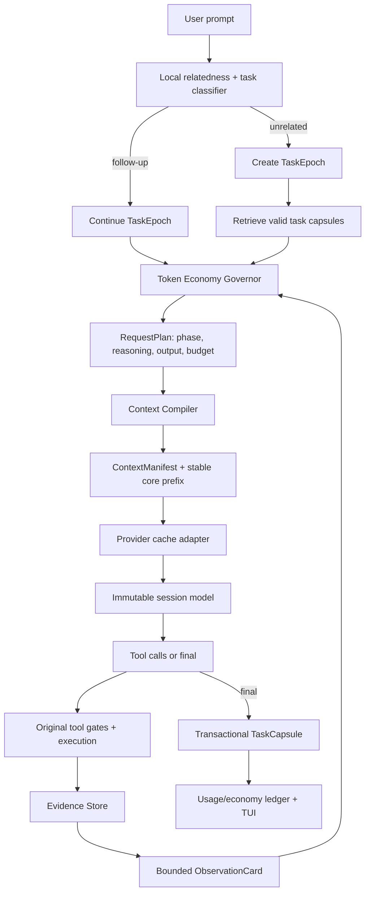

# Implementation Plan: Token Economy Overhaul

**Target Branch**: `014-token-economy-overhaul`
**Date**: 2026-07-22
**Spec**: [spec.md](spec.md)
**Research**: [research.md](research.md)
**Execution status**: Plan only; none of the overhaul below is claimed implemented

## Summary

Rework MuhiyaCode's economic control plane so a task consumes the minimum context and model work required for a correct result. The supplied session has a healthy 90.04% cache hit rate but still processed 494,156 input tokens and 19,810 output tokens for a 34,209-token live context. The architecture must stop treating cached replay as free.

The target system keeps the session's model immutable and outside the main execution context, while adding:

1. provider-exact per-request economy accounting and a shadow cost controller;
2. a phase state machine and phase-specific reasoning/output budgets;
3. content-addressed evidence storage with bounded observation cards;
4. task context epochs and relevant prior-task capsules inside one visible session;
5. a smaller universal prompt and direct core tool surface with deferred rare/MCP/skill tools;
6. provider-specific cache adapters, including an optional verified MiniMax Anthropic-compatible transport;
7. hybrid path/symbol/lexical retrieval and code-intelligence tools;
8. correctness-gated benchmarks, rollout modes, and explicit rollback.

This is an incremental seam-by-seam replacement, not a big-bang rewrite of the orchestrator.

### Competitive target: match and exceed Claude Code's efficiency pattern

Claude Code is the reference bar for deferred MCP tools, on-demand skills, context visualization, tool-output clearing, auto-compaction, code intelligence, and isolation of verbose work. MuhiyaCode's proposed advantages are more explicit and provider-neutral:

- automatic task epochs inside one visible session, instead of depending on the user to clear unrelated work;
- a quantitative replay-amplification and weighted-cost governor, instead of optimizing context pressure only;
- content-addressed raw evidence with exact range retrieval, rather than irreversible transcript trimming;
- provider-specific cache economics across MiniMax, DeepSeek, and generic gateways;
- phase-specific request/output/reasoning budgets with correctness overrides;
- estimated context attribution reconciled to exact provider totals;
- a stable application-level tool broker that defers capabilities even where the provider lacks native deferred tools.

The competitive claim is accepted only after the Phase 8 same-workload comparison. Architecture intent is not benchmark evidence.

## Technical Context

**Language/Version**: Go 1.26.5 (current `go.mod`)
**Primary dependencies**: Go standard library; existing Bubble Tea/Lip Gloss TUI stack; existing OpenAI-compatible gateway; new dependencies require a benchmarked justification
**Storage**: Existing `~/.muhiya` session/state layout, SQLite transcript store, JSONL usage records, atomic sidecars; new content-addressed evidence and capsule indexes
**Testing**: `go test ./... -count=1`, `go vet ./...`, staticcheck, govulncheck, race tests on CGO-capable runners, provider simulators, paid live canaries, execution-scored benchmark matrix
**Target platforms**: Windows, Linux, macOS terminal clients; provider endpoints for MiniMax, DeepSeek, and generic OpenAI-compatible gateways
**Project type**: Single Go CLI/TUI coding agent
**Current critical path**: `internal/orchestrator/turnloop.go` -> request assembly/history -> gateway -> tools -> persisted history/usage -> TUI
**Current stable wire prefix**: 22,005 bytes in the golden scenario
**Current system prompt**: 5,966 characters in the wire golden scenario
**Current relevant baselines**: diagnostic feature-011 trivial tasks used 7-10 turns and 59,927-89,240 input tokens; a new current baseline is mandatory
**Primary performance goals**: Spec SC-001 through SC-014
**Hard constraints**: correctness and safety non-regression; immutable session model; stable prefix; provider-required reasoning replay; honest usage reporting; backward-compatible state; no hidden tool/permission bypass
**Scale**: 12 workspace tools plus synthetic tools, skills, web, and arbitrary MCP definitions; sessions may span many unrelated tasks and million-token advertised windows

## Constitution Check

### Pre-research gate

| Principle | Result | Design response |
|---|---|---|
| I Correctness Before Optimization | PASS | Every token target is constrained by execution correctness, security/risk fixtures, and required-verification overrides |
| II Cache Efficiency Without Quality Loss | PASS | Total replay is reduced; universal rules and required evidence are protected; cache hit rate remains a constraint, not the only KPI |
| III Deterministic Stable Prefix | PASS | Core tools/system remain byte-stable; deferred capabilities use an application broker rather than top-level schema churn |
| IV Separation of Dynamic and Cached Content | PASS | Task phase, budget, retrieved capsules, and tool discovery live in task epoch/tail segments |
| V No Redundant Retransmission | PASS | Evidence virtualization, task epochs, dedupe, and range retrieval directly enforce it |
| VI Honest Measurement | PASS | Provider totals remain authoritative; local category splits are labeled estimated with residual reconciliation |
| VII Reference Architecture: DeepSeek Reasonix | PASS | Existing Reasonix research is retained; current DeepSeek cache documentation is added; no unsupported imitation |
| VIII Improve, Don't Rewrite | CONDITIONAL PASS | New components are introduced behind current interfaces and observe mode; complexity is justified below |
| IX Clean, Maintainable, Secure, Provider-Compatible | PASS | Generic transport preserved, broker reuses original schemas/gates, artifacts inherit containment/redaction |
| X Verified Improvements | PASS | Baseline freeze, repeated live runs, correctness rubrics, raw usage, and variance gates are Phase 0 and Phase 8 requirements |

### Post-design gate

PASS with the documented complexity exceptions. No unresolved clarification blocks execution. Provider-specific thresholds remain observe-mode experiment outputs and cannot be hard-coded as claims.

## Project Structure

### Documentation for this feature

```text
specs/014-token-economy-overhaul/
├── spec.md
├── plan.md
├── research.md
├── data-model.md
├── quickstart.md
├── contracts/
│   ├── token-economy.md
│   ├── context-compiler.md
│   ├── evidence-store.md
│   └── provider-cache.md
└── benchmarks/                       # created during implementation
    ├── BASELINE_SHA.txt
    ├── fixtures/
    ├── runs/{baseline,observe,balanced,aggressive}/
    ├── raw-usage/
    └── comparison.md
```

### Source code impact

```text
internal/contract/
├── cache.go                          # extend provider-truth usage records
├── types.go                          # task stats/context callbacks
└── economy.go                        # new shared economy types only if cross-package

internal/orchestrator/
├── turnloop.go                       # integrate phase/request planner; shrink, do not absorb new algorithms
├── classify.go / effort.go           # task envelope and local reasoning maximum
├── economy.go                        # aggregate budgets and decisions
├── requestplan.go                    # deterministic next-request policy
├── phases.go                         # execution state machine
├── contextmanifest.go                # request segment inventory
├── taskepoch.go                      # visible-session/context-epoch boundary
├── capsule.go / retrieval.go         # task capsules and selection
├── history.go / maintenance.go       # lossless ladder and deliberate checkpoints
├── definitions.go                    # core tools + stable broker
├── prompt.go                         # lean universal prompt composition
├── advisor.go / onboarding.go        # preserve selector; admission-control aux work
├── contextreport.go / usage.go       # exact totals and estimated attribution
└── *_test.go                         # traces, budgets, prefixes, recovery

internal/evidence/                    # new cohesive package
├── store.go / metadata.go / gc.go
├── observation.go
├── reduce_file.go / reduce_search.go
├── reduce_diff.go / reduce_process.go
├── reduce_json.go
└── *_test.go

internal/workspace/
├── registry.go                       # compact core/composite tools
├── files.go / patch.go / shell.go    # structured raw results and reducer inputs
├── inspect.go                        # bounded read-many/search/symbol composite
└── broker adapters                   # preserve original execution gates

internal/state/
├── paths.go / session.go             # artifact/capsule paths and records
├── artifacts.go / capsules.go        # atomic canonical stores
└── migration/recovery tests

internal/gateway/
├── provider.go                       # keep generic OpenAI path
├── anthropic.go                      # optional MiniMax-compatible transport
├── cacheprofile.go                   # capabilities + usage mappings
├── usage.go / model.go               # normalized accounting/profile selection
└── provider/cache tests

internal/tui/
├── format.go / actions.go            # replay amplification, request/category views
└── rendering tests

benchmarks/cachebench/                # extend existing harness rather than duplicate
scripts/                              # reproducible 014 before/after runner/report
docs/agent-design.md
docs/architecture.md
README.md
```

**Structure decision**: Keep orchestration policy in `internal/orchestrator`, raw evidence lifecycle in a new narrow `internal/evidence` package, provider semantics in `internal/gateway`, and persistence mechanics in `internal/state`. `turnloop.go` orchestrates these contracts but must not contain their implementations.

## Target architecture



### Core invariants

1. The model and upstream affinity are chosen before the first main request and do not change during the visible session.
2. Task epochs change provider-visible working history, not model identity.
3. Stable core tool/system bytes do not vary by task.
4. Rare tools load through a stable broker; original schemas and permissions remain authoritative.
5. Raw tool evidence is stored before reduction and remains addressable.
6. A context reset cannot commit before its durable capsule/checkpoint.
7. Provider usage totals remain exact and estimates remain labeled.
8. Correctness-required work can override budgets, but only through a recorded reason.

## Execution strategy

The work is split into independently reversible phases. Each phase must land behind `tokenEconomyMode=off|observe|balanced|aggressive`. The first three phases may ship with `observe` only. `balanced` becomes the default only in Phase 8.

### Phase 0 - Freeze the current truth and make waste measurable

**Objective**: Establish a valid same-model baseline and per-request attribution before changing behavior.

#### P0.1 Freeze and reproduce

1. Record the exact current Git SHA plus all dirty-tree inputs required to reproduce a binary. Do not use a SHA alone when uncommitted files affect it.
2. Build a frozen baseline binary and store its checksum, Go version, gateway config hash, model ID, effort, permission mode, prefix hashes, and benchmark fixture version.
3. Add an execution-scored tic-tac-toe fixture reproducing the user's scenario: clear greenfield request, one HTML/CSS/JS implementation variant and one existing-app UI variant. Rubric must test playable turns, win/draw detection, reset, accessibility baseline, and absence of unwanted dependencies.
4. Repair or replace the feature-011 runner path that emitted empty usage for later tasks. A baseline run with any missing provider usage is invalid, not zero.
5. Add task categories: greeting/chat, typo, comment, named-file CSS tweak, one-file bug, small UI, greenfield page/game, standard logic, failing test diagnosis, risky auth, large multi-file, long-log, MCP-unused, MCP-used, skill-unused, skill-used, follow-up chain, unrelated task transition.

**Files**: extend `benchmarks/cachebench`, reuse `internal/command/benchjson.go`, add `scripts/bench_014.ps1` and `.sh`, create `specs/014.../benchmarks/fixtures`.

**Done when**:

- Two baseline runs per provider/config complete with provider usage for every request.
- Repository-state and execution rubrics score every task.
- Raw provider usage is retained and totals reconcile with session usage.
- The supplied screenshot metrics are represented by the same report vocabulary.

#### P0.2 Add request-economy records

1. Extend `contract.UsageRecord` with nullable epoch, phase, transport, finish reason, retry linkage, cache creation/write, uncached input, manifest hash, and budget decision fields.
2. Preserve existing JSONL readers and old rows. Add migration/read-tolerance tests before writing new fields.
3. Normalize raw provider fields in `internal/gateway/usage.go`; do not derive absent values without profile proof.
4. Add exact main/aux request counts and `maxPromptTokens` aggregate.
5. Compute replay amplification only from provider-reported members.

**Done when**: Existing usage fixtures still pass; new MiniMax/DeepSeek/generic fixtures prove null/zero distinctions and replay math.

#### P0.3 Add `ContextManifest` in shadow mode

1. Refactor request assembly so each logical segment is registered once with bytes, source, stability class, and fingerprint.
2. Extend the existing exact tool-definition marshal reuse; do not reserialize independently for measurement.
3. Capture final wire hash through `StableRequestMessages` and transport serializer hooks without logging secret payloads.
4. Calibrate estimated segment tokens to exact provider prompt totals and add an explicit residual.
5. Persist manifests only in benchmark/debug mode by default; normal mode keeps aggregates to avoid state bloat.

**Done when**: Segment estimates plus residual exactly equal provider prompt totals; manifest generation changes no request bytes in a wire golden.

#### P0.4 Expose honest diagnostics

Add to `/context`, task stats, and machine JSON:

- cumulative versus live context
- main/aux requests
- replay amplification
- provider exact cache read/write/uncached/output
- estimated context categories and residual
- tokens by phase/retry/auxiliary type
- top three replay contributors

**Gate 0**: No behavior change. Full checks pass. A reviewer can explain the tic-tac-toe consumption request by request.

### Phase 1 - Immediate low-risk reductions

**Objective**: Cut obvious excess turns/output without changing context architecture.

#### P1.1 Introduce deterministic phase state

1. Add `ExecutionPhaseState` and transition tests from the contract.
2. Initially run it in shadow beside the existing loop; record where old behavior violates the proposed graph.
3. Once traces match successful flows, make the phase graph authoritative for tiny/small tasks only under `balanced`.
4. Keep existing failure breakers as backstops; map them to `recover` rather than delete them in the same change.
5. Decompose `turnloop.go` into small boundary helpers so phase planning, request assembly, provider call, outcome integration, and finalization are separately testable.

**Critical rule**: Do not replace a proven liveness guard until its fault-injection scenario passes through the new graph.

#### P1.2 Phase-specific reasoning

1. Stop passing `ReasoningForEffort(profile.Level)` blindly on every main request.
2. Implement the request-plan reasoning algorithm: global effort is a ceiling; phase/risk chooses the actual tier.
3. Tiny/small non-risky inspect/change/verify start low. Architecture/security/risky changes escalate with reason codes.
4. Preserve provider family mappings in `internal/gateway/model.go`.
5. Track reasoning tier by request and output savings.

**Tests**: table all effort/class/risk/phase combinations; provider profile adaptation; no mid-request/session prefix byte changes.

#### P1.3 Phase-specific output caps

1. Add provider-profile safe floors and experimental phase caps.
2. Cap tool-decision, mutation, verification, and final requests separately.
3. Reuse existing truncated-call protection. Add one `retryOf` bounded cap escalation.
4. Never execute partial tool JSON. Never double more than once.
5. Ensure shared context-window models reserve the actual per-request output cap once, using the unified context budget.

#### P1.4 Gate auxiliary calls

1. Preserve the pre-session model advisor exactly once, but include its expected value and usage in telemetry.
2. Replace model-generated onboarding for clear tasks with the local ambiguity rules and direct `ask_user` when a material choice is already identifiable.
3. Never call onboarding for chat/tiny or clearly scoped named-file/single-feature tasks.
4. Add an admission function shared by advisor/onboarding/compaction; no auxiliary work runs because a profile merely enables it.

#### P1.5 Remove avoidable loop turns

1. Make governor/converge/final control a replaceable current checkpoint rather than accumulating prose messages where possible.
2. Deduplicate identical failure/convergence notices by state code.
3. If the last response already contains a final answer, do not request a separate synthesis.
4. Permit deterministic final rendering only for factual mutation/check summaries; otherwise keep one bounded final request.
5. Revisit tasks.md creation: use the internal ledger for ordinary three-step work; create/update a repository `tasks.md` only when the user asks, an existing plan governs work, or the task is genuinely large and benefits from a durable visible checklist.
6. Tighten initial tiny/small soft request budgets using baseline p75/p95, not arbitrary comments.

**Gate 1**:

- >=30% median input reduction on trivial/small versus Phase 0.
- >=30% median output reduction.
- No correctness, completion, truncation, or provider-protocol regression.
- Prefix wire bytes unchanged except one deliberate prompt epoch with golden/release note.

### Phase 2 - Evidence virtualization and semantic reducers

**Objective**: Prevent raw tool payloads from becoming permanent replay weight.

#### P2.1 Content-addressed evidence store

1. Implement `internal/evidence` blob + metadata store according to `contracts/evidence-store.md`.
2. Reuse existing state path permissions, atomic replace helpers, redaction, and workspace containment.
3. Store raw bytes after secret filtering and before model-visible reduction.
4. Add artifact ownership, content hash, completeness, source fingerprint, reducer version, and retention.
5. Add crash tests at write/rename/metadata boundaries and mark-sweep GC tests.

#### P2.2 Observation-card protocol

1. Define one compact stable rendering with status, facts, excerpts, omission counts, and artifact handle.
2. Ensure exact excerpts are raw subsequences.
3. If artifact storage fails, fall back honestly to the existing bounded result; mark handle unavailable.
4. Teach history/inspection ledger to dedupe by artifact/content hash and source fingerprint.

#### P2.3 Reducers

Implement and golden-test in this order:

1. file read and search/list/glob;
2. edit/patch/diff;
3. Go test/build/vet;
4. npm/pnpm/yarn test/build/typecheck/lint;
5. pytest/unittest;
6. generic process output;
7. JSON/MCP/web.

For every recognized runner, parse both success and failure. An unrecognized format routes to the truthful generic reducer. Do not suppress warnings or skipped tests without counts.

#### P2.4 Artifact retrieval

1. Add `fetch_artifact` behind the stable broker initially.
2. Support exact line ranges or bounded match search.
3. Validate ownership, retention, and source staleness on every fetch.
4. Fetch results are also bounded cards; prevent recursive full-output flooding.

#### P2.5 Integrate tools gradually

1. Start with shell/test outputs in observe mode: produce cards but keep current result in requests; compare completeness.
2. Enforce for successful verbose checks first.
3. Enforce failure reducers after golden/fuzz coverage proves all failure facts remain.
4. Convert file/search/diff outputs last, because exact source evidence is correctness-sensitive.

**Gate 2**:

- Default inline tool-result caps meet SC-007.
- Every raw result is retrievable in integration tests.
- Long-log and failing-test tasks retain 100% rubric-required failure facts.
- Median prompt growth per tool turn falls >=50% on verbose fixtures.

### Phase 3 - Task epochs, capsules, and retrieval

**Objective**: Stop replaying unrelated prior tasks while keeping visible session continuity.

#### P3.1 Add task-epoch persistence

1. Add `TaskEpoch` state and backward-compatible session loading.
2. Existing sessions without epochs map all current history to legacy epoch 0 and remain functional.
3. New sessions open epoch 1 on first task.
4. Keep the same session model and upstream pin across epochs.
5. Persist epoch transition/capsule atomically before assembling reset context.

#### P3.2 Deterministic relatedness

1. Implement signals and thresholds from the context compiler contract.
2. Record shadow decisions on real multi-task sessions.
3. Build a labeled fixture set including corrections, pronouns, short continuations, same-file unrelated work, different-file related work, and explicit topic switches.
4. Tune thresholds from false-reset cost, not aggregate accuracy alone. False `new_epoch` is more dangerous than false `continue`.
5. Add hysteresis/cooldown to stop oscillation.

#### P3.3 Task capsule construction

1. Build exact fields from runtime ledgers: goal, file changes/fingerprints, checks, blockers, evidence refs.
2. Bound narrative outcome/decision text by class.
3. Canonicalize and sign/hash capsule; store immutable.
4. Reject capsule settlement if referenced required evidence is missing.
5. Index terms, paths, symbols, and dependencies as a rebuildable projection.

#### P3.4 Hybrid retrieval

1. Start with BM25-like lexical score implemented locally, exact path/symbol overlap, dependency edges, recency, and validity.
2. Use deterministic MMR selection under a token/item budget.
3. Do not add embeddings initially.
4. Validate source fingerprints; stale facts are historical and cannot direct a current edit without reacquisition.
5. Add explanation/debug output showing why each capsule was selected or excluded.

#### P3.5 Context epoch assembly

1. On `continue`, retain active epoch working context.
2. On safe `new_epoch`, assemble stable prefix + project root + selected capsules + new user goal.
3. Record a deliberate message-history invalidation and context revision while keeping core prefix hash.
4. In observe mode, serialize both keep/reset candidate manifests and predict savings without sending the reset.
5. Enforce only at settled task boundaries first; milestone resets come later.

#### P3.6 Resume and crash safety

1. Resume the latest open epoch with its last committed context/checkpoint.
2. If transition commit is incomplete, use the previous epoch/context.
3. Rebuild capsule index on corruption; never rebuild canonical capsule content from model guesses.

**Gate 3**:

- SC-010 relevant-fact retrieval is 100% on the benchmark rubric.
- Unrelated next-task first prompt is >=60% smaller.
- No model/upstream switch occurs.
- Cache reporting attributes the deliberate message reset correctly.

### Phase 4 - Lean prompt and deferred tool surface

**Objective**: Cut the 22,005-byte always-on wire prefix without losing capabilities.

#### P4.1 Tool-usage telemetry analysis

1. Aggregate direct tool frequency, task-class conditional frequency, schema bytes, successful calls, failed calls, and discovery opportunity from Phase 0-3 runs.
2. Rank tools by `expected saved discovery turns - repeated schema cost`.
3. Select the direct core from evidence. Candidate core is `inspect_workspace`, `apply_patch`, `run_shell`, `git_diff`, `ask_user`, plus broker operations.
4. Keep a direct edit primitive if benchmark evidence shows broker/composite patching reduces correctness.

#### P4.2 Stable tool broker

1. Implement `discover_tools(query, namespace, limit)` with compact descriptors.
2. Implement `invoke_tool(name,args)` as a stable schema.
3. Resolve the exact underlying definition and schema hash.
4. Validate input against the original schema before dispatch.
5. Run all existing liveness, permission, mutation approval, read-only, secret, audit, and MCP gates under the original canonical name.
6. Return the original tool's evidence reducer/card.
7. Prevent broker recursion and descriptor floods.

#### P4.3 Composite high-frequency inspection tool

Design `inspect_workspace` modes within one stable schema:

- `map`: bounded directory/file overview
- `search`: literal/regex with diverse matches
- `read`: multiple explicit path/range requests
- `symbol`: definition/reference/outline when index available

Limits are strict; one call can batch independent ranges. The tool must not guess a mutation target or silently read whole large files.

#### P4.4 Defer MCP and rare tools

1. MCP manager still discovers/authenticates surfaces outside model context.
2. Stable prefix gets zero full MCP schemas.
3. Broker descriptor index carries name, one-line purpose, availability, risk, and schema hash under a strict search result cap.
4. Invocation resolves the exact live session and existing MCP fingerprint/account.
5. Server refresh never changes core prefix.

#### P4.5 Skill economy

1. Replace the full always-on catalog prose with a bounded routing index or local shortlist in the task tail.
2. Add section-addressable skill reads where a skill supplies stable headings/anchors.
3. Support optional human-authored compact routing/critical-rule metadata at installation time.
4. Never use an LLM-generated lossy summary as the only copy of mandatory skill instructions.
5. Enforce per-task skill admission: benefit must exceed load cost; clear tiny tasks should normally load none.
6. Preserve user-explicit skill requests regardless of economic admission.

#### P4.6 Prompt rationalization

Audit every stable sentence against:

- universal across tasks?
- already enforced by runtime/tool schema?
- repeated in tool description?
- specialized enough for skill/task-tail placement?
- observed failure it prevents?

Target universal system prompt <=3,000 characters and total no-MCP/no-skill wire prefix <=10,000 bytes. Move tasks.md, detailed memory maintenance, rare recovery, and skill-selection instructions out of universal prefix where runtime/broker/task guidance can enforce them.

Perform one declared prompt epoch, update goldens once, and attach a rule-preservation matrix.

**Gate 4**:

- SC-006 achieved.
- Unused MCP/skills add <=256 bytes.
- Common-task request count does not rise from discovery.
- Tool/permission/security conformance remains 100%.

### Phase 5 - Provider cache adapters and explicit MiniMax path

**Objective**: Exploit verified provider cache capabilities without coupling core logic to one API.

#### P5.1 Capability matrix

1. Implement `ProviderCacheProfile` with conservative unknown behavior.
2. Version built-in profiles and include documentation source date.
3. Resolve transport before the first main request and freeze it with the model.
4. Expose profile and transport in context/benchmark reports.

#### P5.2 Refactor transport-neutral message model

1. Keep `contract.Message` canonical.
2. Move OpenAI replay/repair serialization behind an adapter interface.
3. Add wire snapshot tests proving current OpenAI bytes unchanged.
4. Add content-block support necessary for Anthropic thinking/text/tool-use/tool-result without forcing it into generic providers.

#### P5.3 MiniMax Anthropic-compatible adapter

1. Implement request/stream/error/usage parsing behind a disabled feature flag.
2. Replay complete assistant content blocks and signatures exactly within tool chains.
3. Add explicit cache controls only at verified breakpoints.
4. Normalize cache creation/read/uncached fields without collapsing them.
5. Preserve stream reset and retry semantics.
6. Never fall back to another transport mid-session; fail honestly or require a new session.

#### P5.4 Paid provider canaries

Run a matrix of:

- cold/warm two-turn chat
- multi-tool call
- long tool output + artifact fetch
- explicit breakpoint and TTL expiry
- truncated tool call
- provider retry/stream reset
- resume after idle
- task epoch transition
- cache usage accounting reconciliation

Compare OpenAI-compatible and Anthropic-compatible MiniMax on correctness, input/output, cache creation/read, credits, TTFT, and failures. Default to Anthropic path only if it is materially better and fully compatible.

#### P5.5 DeepSeek/generic regression

Verify no Anthropic controls leak; automatic caching, existing reasoning replay, and raw usage stay correct.

**Gate 5**: Transport selection is immutable and pre-main; all cache fields reconcile; live canaries pass twice; rollback is one configuration switch for new sessions.

### Phase 6 - Code intelligence and retrieval efficiency

**Objective**: Replace search-read-search chains with precise local navigation.

#### P6.1 Repository index

1. Build a lightweight incremental file/symbol/import index keyed by workspace and file fingerprints.
2. Start with exact paths, filenames, language, declarations, imports, and test associations.
3. Use language-native parsers from the standard library where available (Go AST); support optional LSP adapters without making them mandatory.
4. Update after successful mutations; external changes invalidate affected entries.
5. The index is a rebuildable projection and contains no secrets.

#### P6.2 Retrieval operations

Expose bounded `symbol`, `references`, `related_tests`, and `dependency_neighbors` through `inspect_workspace`. Return exact locations and small excerpts.

#### P6.3 Query planner

Use current goal/path/symbol signals to choose exact path -> symbol -> lexical search in that order. Do not make a model request to plan retrieval.

#### P6.4 Optional semantic evaluation

Only after exact retrieval benchmarks:

1. evaluate a local embedding index on tasks exact methods miss;
2. measure index cost, latency, binary size, privacy, and quality;
3. keep it optional and never the sole route to exact code evidence;
4. reject it if total system complexity outweighs request savings.

**Gate 6**: Median inspection tool calls fall >=35% on unfamiliar-repo fixtures with no target-file recall regression.

### Phase 7 - Adaptive context economics and milestone compaction

**Objective**: Turn shadow predictions into safe economic control for long tasks.

#### P7.1 Break-even controller

1. Implement keep/reset cost formulas with overflow-safe decimal/integer math.
2. Use provider-specific weights only when versioned and available.
3. Predict remaining requests from phase/milestone graph, not a free-form model estimate.
4. Add minimum savings margin, dependency confidence, and hysteresis.
5. Record predicted versus actual savings for calibration.

#### P7.2 Lossless eviction

At checkpoints, replace inactive observation cards with artifact references and exact retained facts. Provider-required active-chain blocks remain until chain completion.

#### P7.3 Milestone checkpointing

1. Define milestone boundaries for large/epic tasks from completed checklist groups or verified file clusters.
2. Build checkpoint from runtime ledgers.
3. Persist, then deliberate history replacement with invalidation.
4. Keep recent active evidence and unresolved failures.

#### P7.4 Query-aware semantic compaction

1. Run only after lossless ladder and economic gate.
2. Use a bounded auxiliary request with low/adaptive reasoning as required by provider.
3. Protect exact literals through structured fields and artifact refs.
4. Compare summary against required-fact checklist before commit.
5. Detect compaction thrashing; after two low-yield attempts, stop auto-compacting and require a new task epoch/user action.

#### P7.5 Aggressive mode

Enable tighter caps and more milestone resets only after balanced data. Aggressive mode may trade convenience/verbosity, never correctness/safety.

**Gate 7**: Standard/large replay amplification meets SC-009; no compaction fact-loss rubric failures; predicted savings calibration error is within declared band.

### Phase 8 - Hardening, comparison, and rollout

**Objective**: Prove the whole system and make balanced mode safe by default.

#### P8.1 Full benchmark matrix

For each supported provider/configuration:

- cold and warm
- two repeated runs
- low/medium/high effort where relevant
- short/standard/long task classes
- MCP/skills unused and used
- related/unrelated multi-task sessions
- failures, retries, truncation, resume, external changes

Report median, p75, p95, variance, and raw rows for:

- completion/correctness
- main/aux requests
- input/read/write/miss/output
- replay amplification
- credits/cost
- time to first token and wall time
- tool calls, duplicate evidence, failed retries
- prefix bytes and invalidations

#### P8.2 Competitive comparison

Run the same fixture intents through current Claude Code when legally/operationally available. Compare request/turn count, context growth, task result, and tool behavior. Do not claim token-price superiority across providers/models without normalized caveats. MuhiyaCode's release gates remain its own reproducible absolute budgets.

#### P8.3 Reliability gauntlet

- crash/power-loss injection for artifacts, capsules, epochs, and usage
- race tests
- network/stream retry with no duplicated output
- provider cache expiry/upstream flip
- Windows/Linux/macOS filesystem semantics
- secret/path/symlink containment
- corrupted/missing artifact and index recovery
- old-session resume and downgrade read compatibility

#### P8.4 Rollout

1. `off`: old assembly path, new readers tolerate records.
2. `observe`: all metrics and decisions, no request changes.
3. `balanced` opt-in canary: Phase 1-6 conservative enforcement.
4. Expand balanced to 10%, 25%, 50%, 100% only when rolling correctness and token gates hold.
5. `aggressive` remains opt-in until separate non-inferiority evidence.
6. Kill switch affects new requests immediately but preserves readable epoch/evidence state.

#### P8.5 Documentation and cleanup

Update architecture, agent design, context UI help, settings, provider notes, and benchmark reproduction. Remove old controller branches only after one release with balanced default and no rollback usage. Run clean-code guard on production changes and test guard if available for the large new test surface.

**Final gate**: All SC-001 through SC-014 pass; no open P0/P1 correctness or persistence finding; paid provider canaries and multi-OS CI pass; raw results are committed.

## File-by-file implementation map

| File/package | Required change | Must not happen |
|---|---|---|
| `internal/orchestrator/turnloop.go` | Delegate to phase planner/context compiler/evidence integration helpers | Add all new algorithms inline or create a second competing loop |
| `classify.go` | Produce task envelope/risk/relatedness signals; lower ceiling role | Add LLM classification or time-varying prompt prefix content |
| `effort.go` | Treat effort as maximum envelope; profile new budgets | Force high reasoning on every phase |
| `history.go` | Support task-epoch/checkpoint views and protected messages | Rewrite settled history without event/transaction |
| `maintenance.go` | Apply lossless ladder and break-even gate | Compact on percentage alone or loop compaction |
| `definitions.go` | Core direct tools + broker | Dynamically reorder core tools per request |
| `prompt.go` + `internal/instructions` | Universal rules only; one declared epoch | Delete safety/edit rules without replacement matrix |
| `usage.go` | Exact normalized totals, phase/epoch attribution | Convert missing cache fields to zero |
| `contextreport.go` | Cumulative/live/replay/category reporting | Present estimates as measured |
| `advisor.go` | Preserve once-only pre-main selection | Move model choice into task/main history |
| `onboarding.go` | Local admission and direct questions | Spend an LLM call for clear small tasks |
| `internal/evidence` | Canonical artifacts and deterministic reducers | Store blocked secrets or unowned global handles |
| `workspace/registry.go` | Composite inspect and broker adapters | Bypass original permission/schema checks |
| `gateway/provider.go` | Extract adapter interface, preserve OpenAI bytes | Change generic behavior while adding MiniMax transport |
| `gateway/anthropic.go` | MiniMax-compatible content blocks/cache controls | Assume full Anthropic feature parity |
| `state` | Atomic epoch/capsule/artifact storage | Make projection indexes canonical |
| `tui` | Honest economics | Use hit-rate color as sole success signal |

## Benchmark design and acceptance mathematics

### Required run pairing

For any claim, hold constant:

- model ID/version
- transport unless transport is the variable under test
- gateway/upstream policy
- effort
- fixture initial state
- permission mode
- prompt text
- benchmark binary/config hash

Run baseline and candidate at least twice. Use medians for primary targets and show every raw row.

### Correctness non-inferiority

Primary release decision:

```text
candidate_correctness >= baseline_correctness - 0.02
AND critical_risk_candidate_correctness == critical_risk_baseline_correctness
AND candidate_safety_violations == 0
```

If the fixture sample is too small for statistical confidence, require exact no-regression and enlarge the matrix rather than overstate significance.

### Savings

```text
input_reduction = 1 - candidate_prompt_tokens / baseline_prompt_tokens
output_reduction = 1 - candidate_output_tokens / baseline_output_tokens
weighted_reduction = 1 - candidate_weighted_cost / baseline_weighted_cost
replay_amplification = sum(main_prompt_tokens) / max(main_prompt_tokens)
```

Cache read reduction is not negative by itself. Interpret with miss/write/output and total cost.

### Attribution reconciliation

```text
estimated_segments + residual == provider_prompt_tokens
```

Residual must be visible. Calibration acceptance: absolute residual <=5% median and <=10% p95 after enough provider measurements; otherwise category charts are disabled rather than misleading.

## Risk register

| Risk | Severity | Prevention | Rollback |
|---|---|---|---|
| Context epoch drops needed fact | Critical | conservative thresholds, capsule validity, uncertain->retain/ask, correctness rubric | disable epoch enforcement; old context remains |
| Observation reducer hides failure | Critical | raw artifact, protected facts, typed goldens/fuzz, gradual enforcement | return bounded raw result |
| Tool broker weakens permissions | Critical | original schema/gate identity, security tests | keep full direct surface |
| MiniMax Anthropic incompatibility | High | disabled flag, paid parity canaries, no mid-session fallback | new sessions use OpenAI transport |
| Output cap truncates tool call | High | provider floors, non-execution, one escalation | restore prior caps per profile |
| Prompt slimming removes load-bearing rule | High | rule-preservation matrix, behavior fixtures, one epoch | restore golden/prompt epoch |
| Too many context resets hurt cache | High | break-even + hysteresis + observe calibration | task-boundary only/off |
| Artifact store increases disk/security risk | High | containment, redaction, permissions, GC, quotas | degraded bounded-output mode |
| Benchmark optimizes fixtures only | Medium | diverse real sessions, hidden holdout tasks, paid canaries | block default rollout |
| Index staleness directs wrong edit | High | fingerprints, mutation hooks, reacquire exact evidence | disable symbol index/fallback grep |
| Auxiliary cost moves rather than falls | Medium | all-stream accounting and admission | disable auxiliary feature |
| Complexity overwhelms maintenance | Medium | package seams, phase flags, remove shadow/legacy after proof | stop after high-value phases |

## Rollback plan

Every phase must be independently disableable for new requests:

- governor enforcement -> observe/off
- reducers -> bounded raw result
- task epochs -> legacy full-history view
- broker -> full direct tool definitions on a new stable-prefix epoch/new session
- MiniMax Anthropic -> OpenAI-compatible for new sessions
- symbol index -> grep/read fallback
- economic compaction -> pressure-only legacy behavior

Persistent artifacts/capsules remain readable after rollback. No rollback deletes data automatically. Prefix/tool transport changes require a new session rather than silent mid-session mutation.

## Complexity Tracking

| Complexity | Why needed | Simpler alternative rejected because |
|---|---|---|
| Task epochs inside a visible session | Unrelated transcript is the largest long-session replay source; user wants continuity and immutable model selection | Asking users to `/new` every time is unreliable and does not preserve relevant dependencies automatically |
| Content-addressed evidence store | Raw logs/reads must leave prompt without becoming irretrievable | Plain truncation loses exact diagnostics and violates correctness |
| Stable tool broker | MCP/rare schemas dominate prefix and cannot vary safely at top level | Dynamic top-level tool lists invalidate earliest cache tier; keeping all schemas defeats target |
| Optional Anthropic MiniMax transport | Explicit breakpoints and complete cache accounting may materially lower credits | OpenAI automatic cache alone cannot expose/control all documented cache members; change remains optional until proven |
| Hybrid retrieval/MMR | Relevant prior facts must survive epoch boundaries under a token budget | Recency-only summaries replay unrelated work and hide dependencies |
| Phase governor | Request count and output are primary multipliers | Prompt admonitions and high turn ceilings do not enforce economic convergence |

## Definition of done

The overhaul is complete only when:

1. All spec functional requirements have implementation and tests.
2. All SC-001 through SC-014 pass on committed raw results.
3. The tic-tac-toe reproduction meets the explicit input/output/request/credit budget.
4. Correctness and critical-risk fixtures are non-inferior.
5. Model/transport selection remains outside and immutable through the main session.
6. No unused MCP/skill configuration materially grows the prefix.
7. Every reduced observation is truthful and retrievable.
8. Every context reset is durable, attributable, and recoverable.
9. Cache reporting separates read/write/miss/output and explains lower total cache reads correctly.
10. Generic OpenAI-compatible and DeepSeek paths pass regression; MiniMax explicit path passes paid canaries if enabled.
11. Race, crash, security, multi-OS, static analysis, vulnerability, and full test gates pass.
12. Documentation, migration, rollback, and operator diagnostics are complete.

## Recommended implementation slices

Do not attempt the whole plan in one change. Use these reviewable slices:

1. `014-A`: benchmark repair + frozen baseline + tic-tac-toe fixture.
2. `014-B`: additive usage/economy records + replay amplification UI.
3. `014-C`: shadow context manifests and attribution.
4. `014-D`: phase-specific reasoning/output with truncation tests.
5. `014-E`: phase graph for tiny/small in observe then balanced.
6. `014-F`: evidence store core + generic observation contract.
7. `014-G`: process/test reducers and artifact fetch.
8. `014-H`: file/search/diff reducers.
9. `014-I`: task epoch persistence + capsules.
10. `014-J`: relatedness/retrieval shadow + enforcement at settled boundaries.
11. `014-K`: tool telemetry + stable broker.
12. `014-L`: composite inspect tool + MCP/skill deferral.
13. `014-M`: prompt rationalization and deliberate prefix epoch.
14. `014-N`: provider cache capability matrix.
15. `014-O`: MiniMax Anthropic-compatible experimental adapter.
16. `014-P`: repository symbol index and precise navigation.
17. `014-Q`: economic checkpoint/compaction controller.
18. `014-R`: full gauntlet, paid comparison, balanced-default rollout.

Each slice must include its own before/after evidence when it changes behavior. A later slice may be dropped if earlier slices already meet the target and the remaining complexity has poor marginal value.
